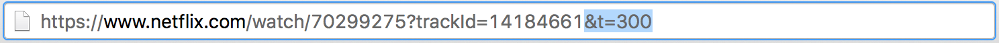
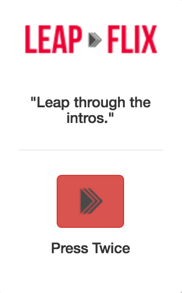
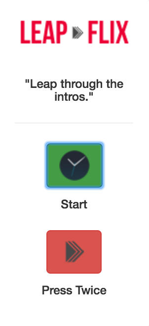
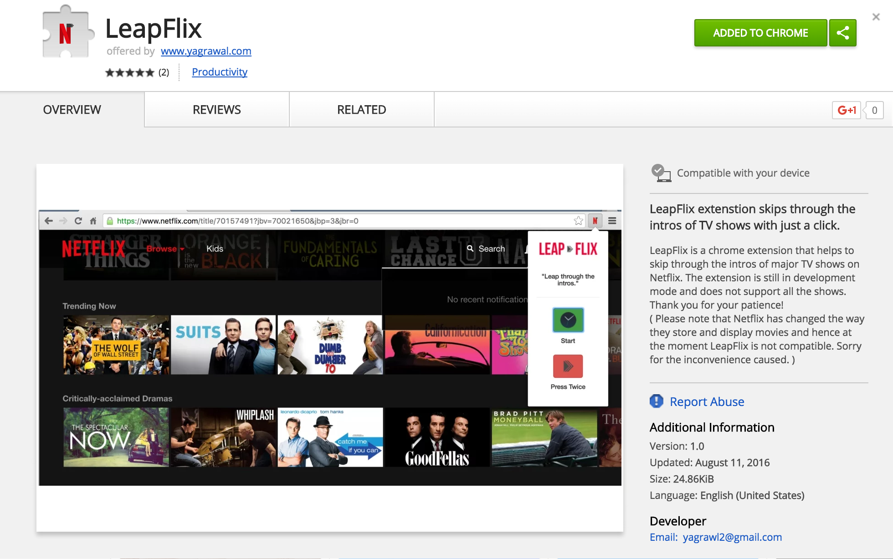
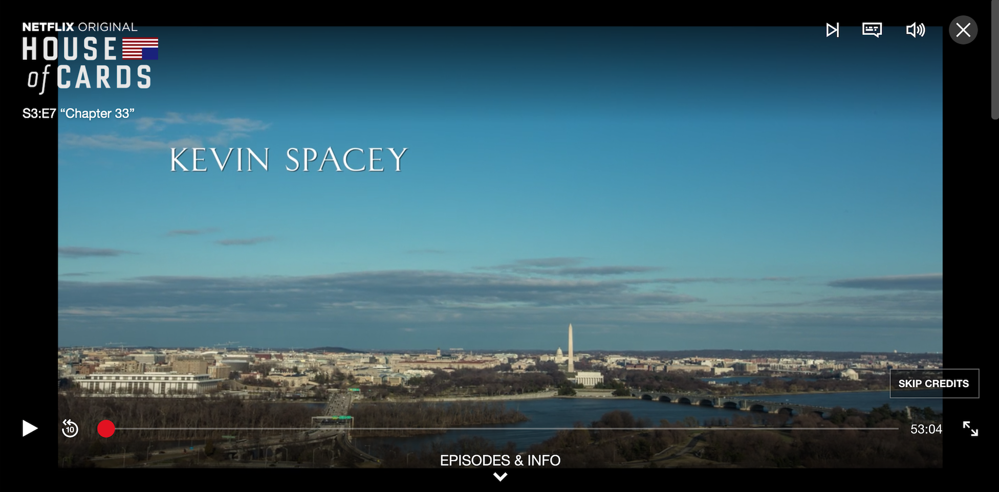

LeapFlix was designed to be a Chrome Extension which would skip through intros of popular TV shows on Netflix. Some shows have cold opening and terribly long intros. House of cards has a 90 second video of time lapses from Washington which gets a little boring to watch while binging, so I thought this was required.

Since I watch this in Chrome, building a chrome extension seemed like an obvious choice. I researched the topic further and got to a forum which suggested appending a '&t=300' at the end of the current URL to make the video skip by 5 minutes. It all seemed getting a bit more clear. I had to make an extension which would grad the URL and then would append the required amount of time as per the show. Seems pretty straightforward and easy. There was just one catch. I didn't know how to make a Chrome Extension.

## Setup

Before starting anything, I went straight to Affinity Designer and made myself a logo. Design is my first preference. People do judge a book by it's cover so whatever the app does or does not do, it has got to look good. In this case, it quite didn't look that good, but I had to make do. Then I started working on the tutorial and did the basic steps of making popup.html and popup.js. I worked on the basic design which wasn't anything too special - just the logo and a button. Now that I had the basic setup completed, it was time to actually figure out how to make all this work.

## Implementation

Now I tried testing it out on House of Cards because that's one of my favorite shows. After the click of the button, the extension would get the URL of the active tab and then append '&t=96' at the end and finally reload it.

The first episode I played did not have a cold opening and so my extension worked perfectly. I skipped through the intro and reloaded exactly when the episode starts. The extension was working! Awesome! Well, not so much. When I tried testing it out on the very next episode, I waited till the intro began (This episode had a cold opening) so when it did I launched the extension and waited for it to reload. It just took me to 1 minute 36 seconds down the episode instead of skipping the intro. The time parameter obviously loads from t = 0.

I obviously needed to somehow monitor the time from the beginning to when the intro starts so the first thing that came to my mind is adding a clock button which should be started as soon as the episode does. That also required looking up stuff online but it worked out quickly.

Challenges

After some research I found out how Netflix actually works. The sources I used are not too reliable because Netflix doesn't release any of this information officially. Since Netflix has such a huge library, it is physically impossible for an individual to go through every thing so instead of loading the entire library and requiring large amounts of memory and processing time, Netflix uses something called a [Sparse Matrix](https://en.wikipedia.org/wiki/Sparse_matrix).

So a sparse matrix as shown below is a matrix that contains a majority of zeros. So let's just say that each video title in the Netflix library is a number other than 0. I learn about all this in my linear algebra class but I never thought I would get to see this used in real life.

Instead of carrying the entire matrix information, Sparse matrix just carries the information of the location where a number is non-zero thus saving considerable amount of processing effort. Also, these positions keep on changing each session so the trackID is nothing more than the position of the Title in a particular session for that particular user. Basically, my entire procedure of finding the show based on URL was flawed and hence the extension failed to serve it's purpose. This was an entire weekend worth of work that resulted into nothing, but it did teach me a lot. It taught how to make a basic chrome extension and get an insight on how Netflix might be working.

I updated the Chrome Web Store info of the extension to 'outdated' and I apologize to the 15 something people that installed it on the first day before the update.

## Update

Checkout the bottom right corner. Netflix has finally introduced a 'skip credits' button making LeapFlix obsolete. It still was a good experience and I learnt a lot about working with Chrome Extensions in the process. I look forward to working with a new chrome extension idea in the future.

## Try it out

[Github](https://github.com/yagrawl/LeapFlix)
