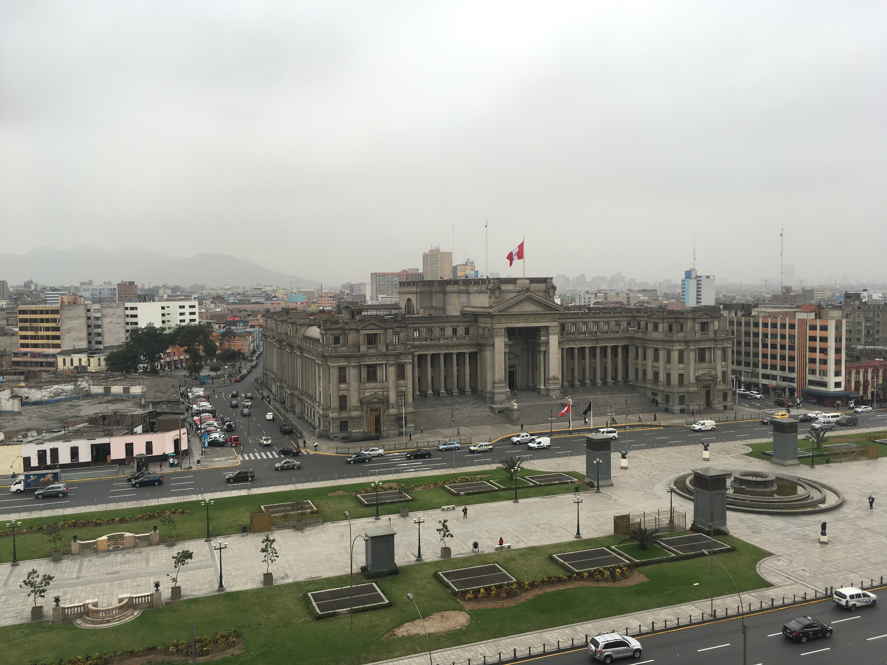
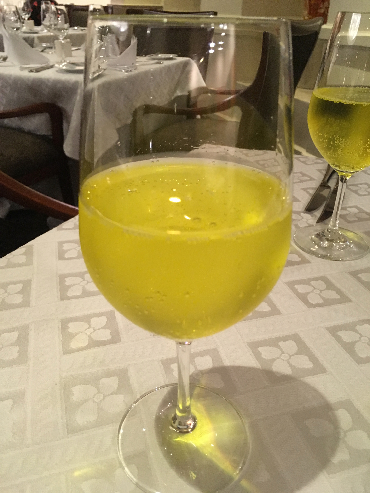
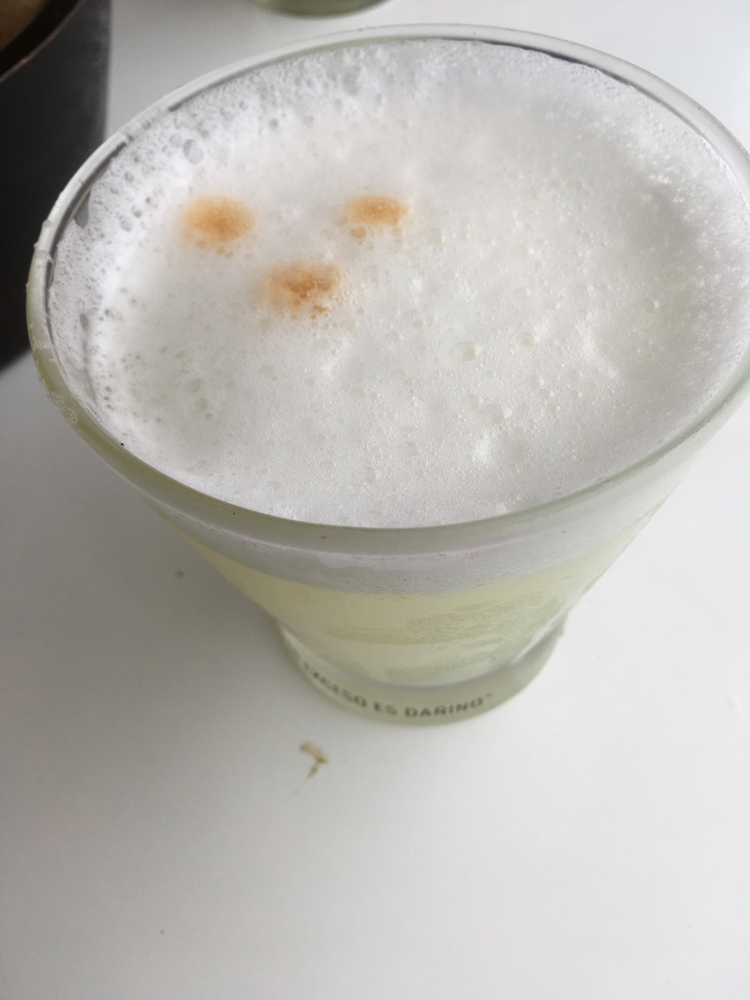
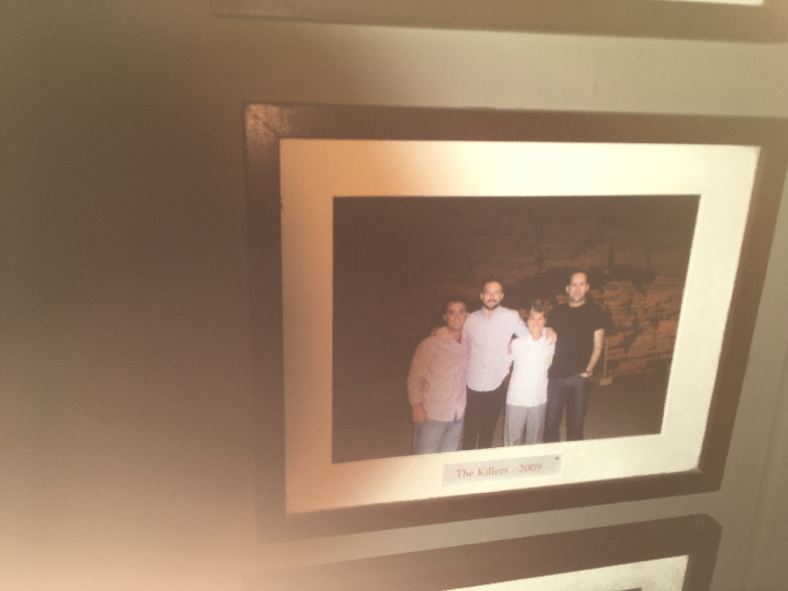
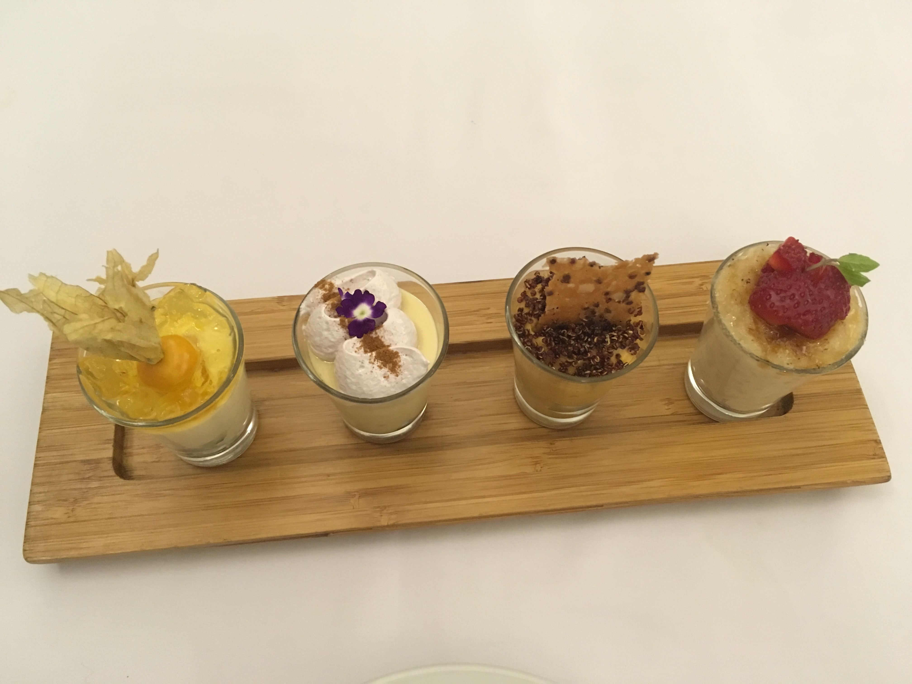
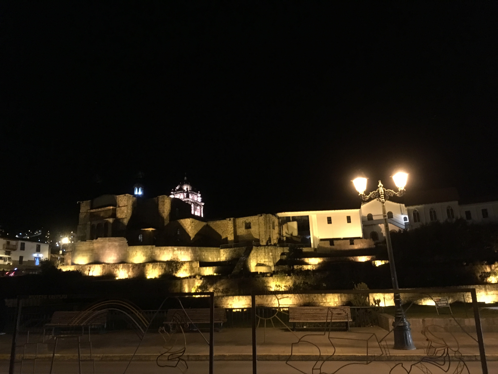

After my internship at Mastercard ended, I had a couple weeks before my fall
semester started. I had always wanted to go to South America and this seemed
like the perfect time for the first trip to this continent. The plan was to go
to Bolivia, Peru and Colombia.

On 12th of August, I flew from Chicago O'Hare. The flight had a couple
connections Chicago -> Houston -> Lima -> La Paz. The flight from Houston to
Lima was delayed by a few hours and I missed my connection to La Paz. The airline
staff provided a hotel for overnight stay in Lima and business class tickets to
La Paz for the next day. I decided to skip Bolivia and just stay in Peru for a
longer time because I was already a day short and it didn't seem worth it to go
to a country like Bolivia just for 3 days.

The hotel was right next to some government building in Lima.

The day I went, there was a protest. I think it was the teachers protesting
against low wages but I could be wrong. My Spanish literacy is nonexistent. The
dinner was complimentary by the hotel and there I found my new favorite soft
drink - Inca Cola. It tastes kind of like a cream soda but much better.

The next day I went on a food tour and they started with a drink at
[_La Trastienda_](https://www.thefork.com.pe/restaurante/la-trastienda-r491339), a restaurant in the Barranco district of Lima. They served the
traditional Pisco sour. I saw the bartender put some egg whites into the flask
and I expected it to taste like crap but it is surprisingly delicious. Also, it
is a legit Pisco sour only if it has those 3 dots of Angostura Bitters on top.
Chile has a different version of Pisco than Peru and the origins are disputed
to this day.

Next I made some Ceviche with plantains and fish at
[_ámaz_](http://www.amaz.com.pe/). It is essentially
[_bhel_](https://en.wikipedia.org/wiki/Bhelpuri) but with fish instead of puffed
rice. The last stop on the tour was at some place for desserts and they hosted
a bunch of famous people - including 'The Killers'.

After eating the desserts, I roamed a bit in the Barranco district which is
considered to be the Bohemian epicenter of Lima. They have beautiful street art.

The Airbnb I stayed at in Lima was in the Miraflores district, right next to
the coast and it was really beautiful. The next few days in Lima were spent
visiting parks and tourist attractions and eating the local cuisine.

Interesting fact, in Peru they call Chinese food _Chifa_ which roughly
translates to 'cooking rice' in Cantonese. A guide told me that the language
barrier was the cause of this nomenclature. Some local at some point pointed
towards fried rice and asked what it was and the Chinese migrants said _Chifa_
because well, it was fried rice and then the local thought that this kind of food was
called _Chifa_ and that is how the name stuck. I don't know if I believe this particular
etymology.

The next stop in Peru was Macchu Picchu. You need to book tickets before you go
to Macchu Picchu and booking it off that website is truly a hassle. That
website's UX is so bad that it almost seems intentional to prevent people from
booking tickets to avoid overcrowding and pollution of this wonder of the world.

I flew to Cuzco and had a train booked to go all the way to Macchu Picchu city.
What I didn't realize was that this train stop was at least an hour and a half
away from the airport. I didn't have an option so I quickly booked an Uber. My
train ride back was closer to the city but this part of the trip required a
taxi. The driver asked me when I was going to come back and I told him that my
train reached Cuzco sometime in the evening without giving him an exact time. He
told me to keep his number and call him when I get back. I didn't save that
number cause well why won't I find an Uber?

The train ride was really nice and relaxing. It was beautiful and when I
reached the town I quickly ate something and passed out at the hostel. The next
day I woke up at 3 in the morning and headed to hike up to Macchu Picchu. On the
way to the starting gate there is a towering mountain in front and above that a
clear sky with a billion stars visible. It is one of the most beautiful things I
have ever seen in my life.

The hike itself was okay. The first couple hours were in the dark with people
using the flashes on the phone to see the steps. Finally at about 7 I reached the summit.
The guide gave us a quick tour and then I got to catch a beautiful sunrise
which is apparently rare because it is mostly covered with fog.

The hike back made me realize how beautiful the hike itself was. I couldn't see
anything at night. I also went into this river. The water was incredibly
refreshing.

Then I got back on the train and reached Cuzco. I realized there were
literally no Ubers available at the time and I didn't know what to do. I walked
outside the station and I found the same driver carrying a board with my name on it.
He knew that I won't be able to find a ride to wherever I wanted to go so he
waited till the evening train came. On the way back I told him that I was
flying from Cuzco the next morning. He was visibly sad and told me that he would
quickly take me to see the touristy things before dropping me at the Airbnb so I
don't miss out on what his city has to offer. This and other such interactions
made me feel like Peruvians genuinely want you to have a great time in their
country.

After this, I was off to Bogota.
