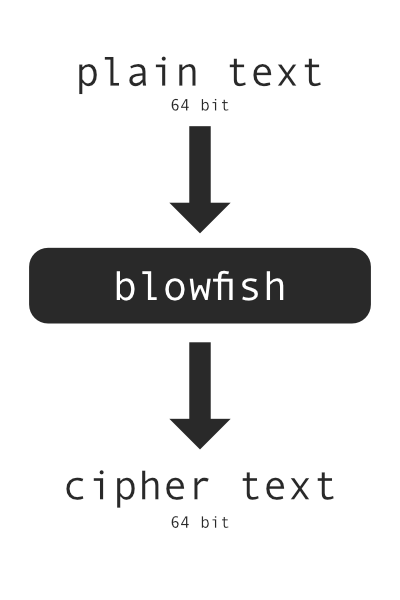
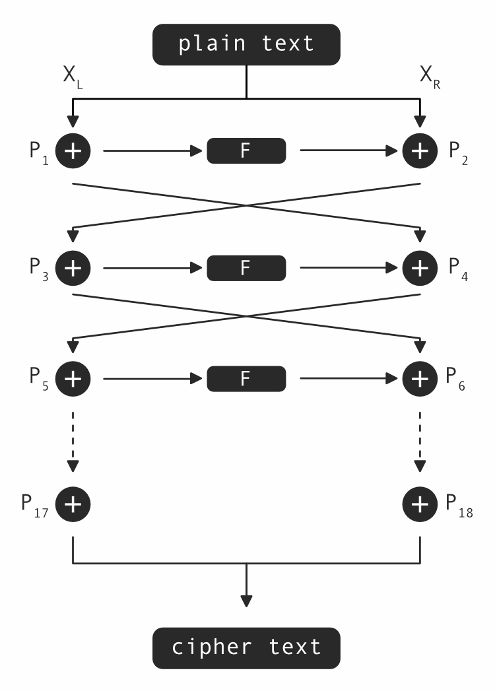
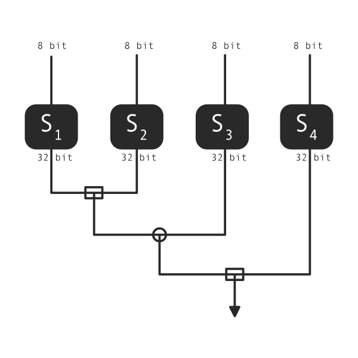
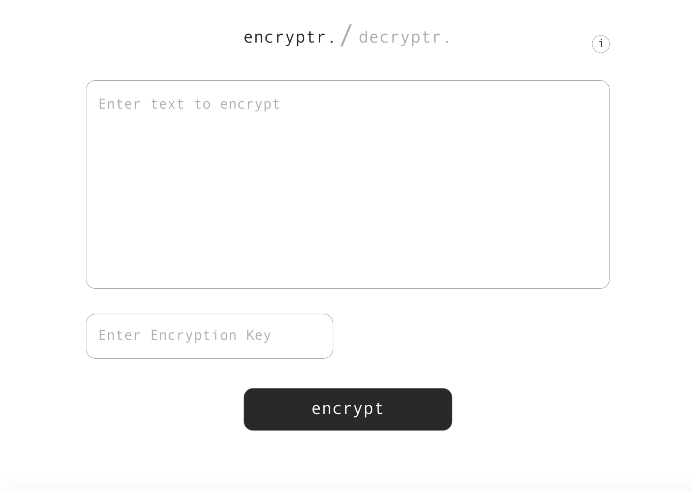
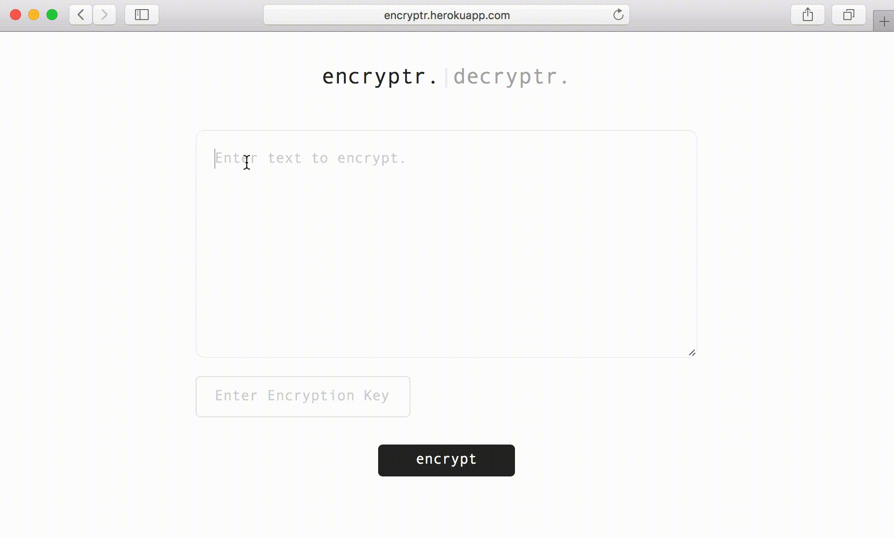

I was always fascinated by encryption and I wanted to know more about it so I decided to make a web application which would allow encrytion and decryption with a key. It is written in node.js and uses ejs templating and css for frontend. Mostly, this was for me to review.

## Research

I read up on what really is required for encryption and how the blowfish algorithm works. So from what I understood, blowfish algorithm goes something like this:

Diving a little bit deeper into the algorithm, I learnt more about how its round structure worked. We use 18 keys in blowfish. So the plain text of 64 bit is divided into two parts of 32 bits each. The left part XL will be XORed with the first key, and then the output is sent both towards the right side and down and then the output is again XORed with the right part XR. This keeps on trickling down and swapped till 16 keys and then the final two keys are processed without swapping. Then finally, they are combined again to return the cipher.

So what exactly is F? Well, the 32 bit input is further divided into 4 parts of 8 bits each and treated the following way.

## Design

Initially I spent a few hours deciding what the web application would would look like. I used sketch to design the prototype. The design was fairly simple. The only purpose was to encrypt/decrypt so I tried to make it stand out. I just used #292929 and white color for the entire website to make it simplistic. This is what the design looked like.

## Implementation

So I initially set up the node app and wrote the frontend and then instead of actually implementing the algorithm I used the crypto library for nodejs. I added some more functionality such as touch to copy and then just added some animation to text and here's how it looks and works as of now.

## Try it out

[Website](https://encryptr.herokuapp.com/)  
[Github](https://github.com/yagrawl/encryptr)  
