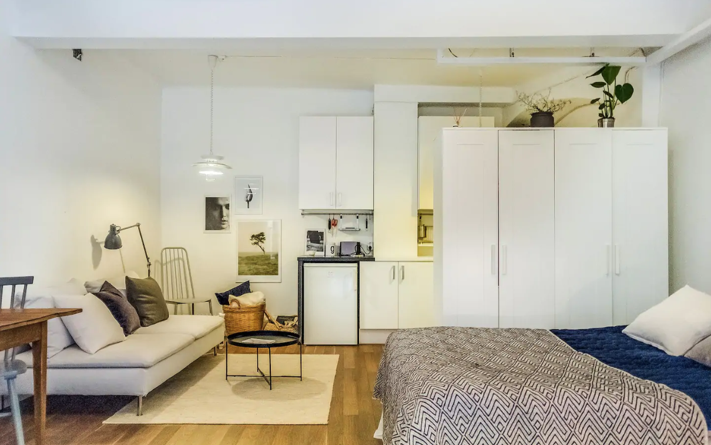
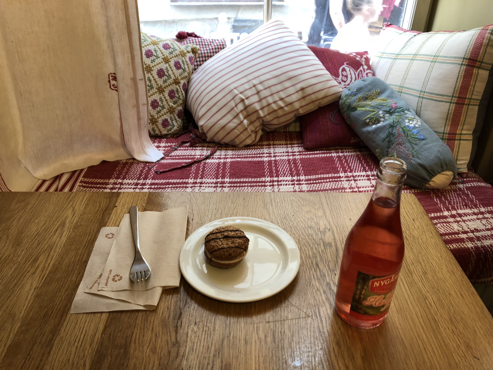
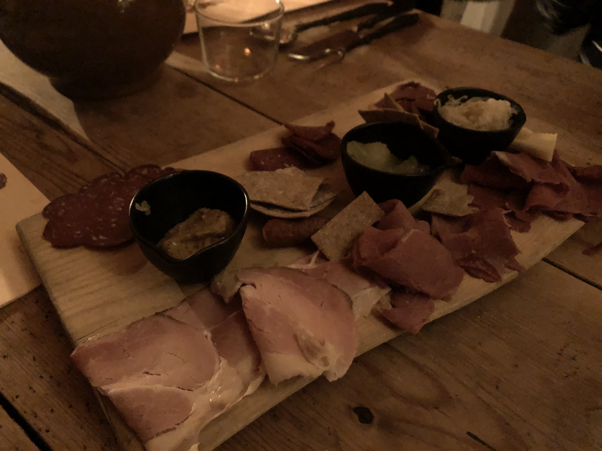
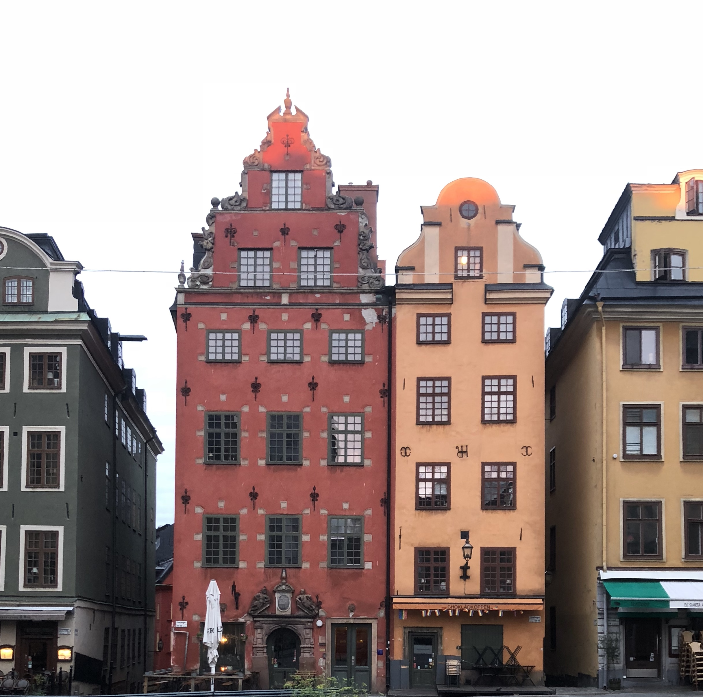
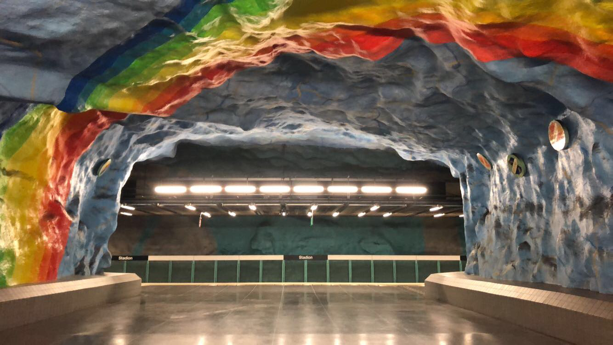
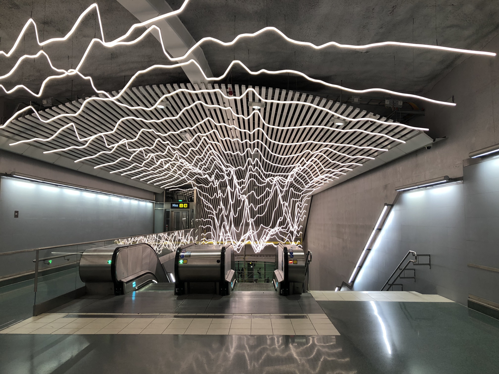
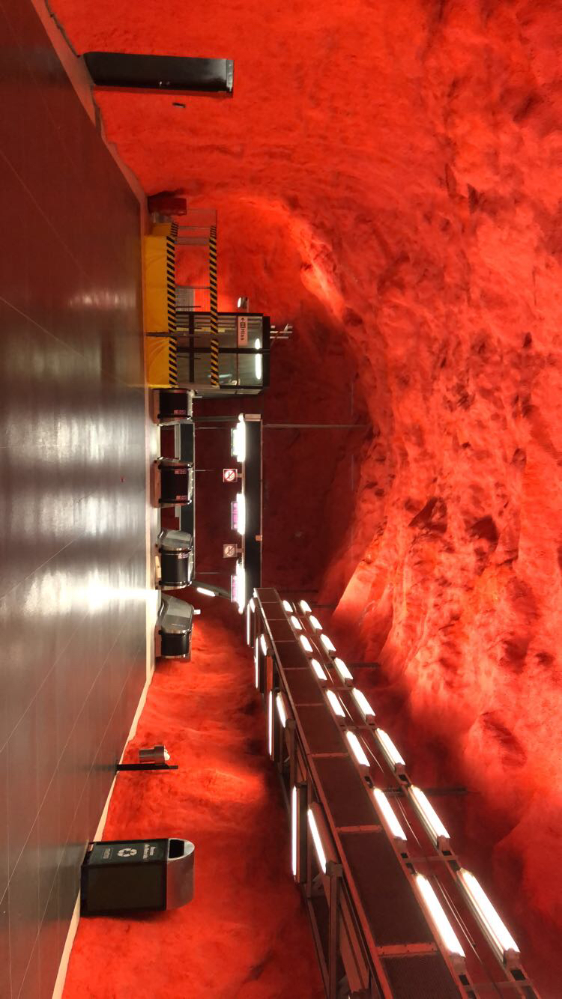
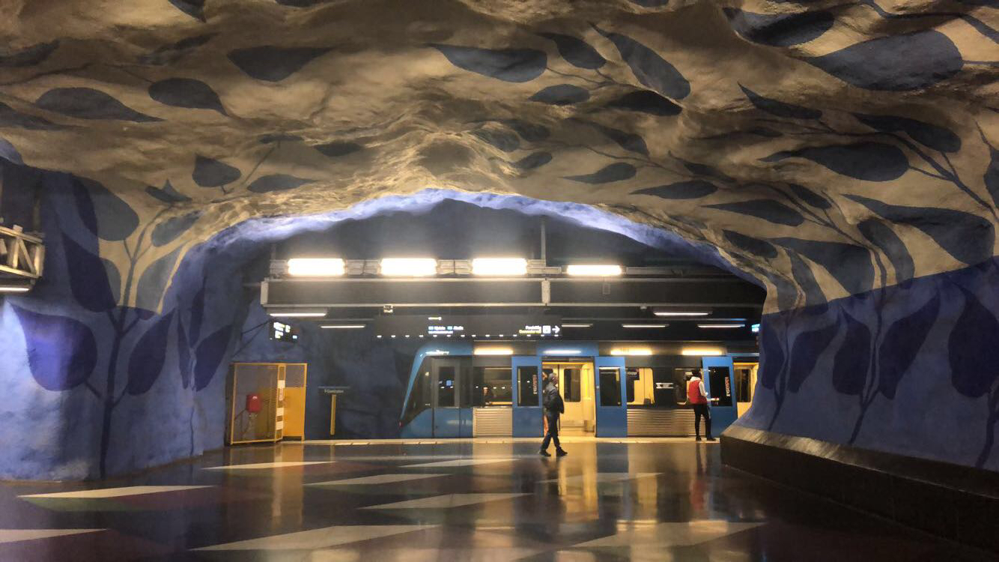
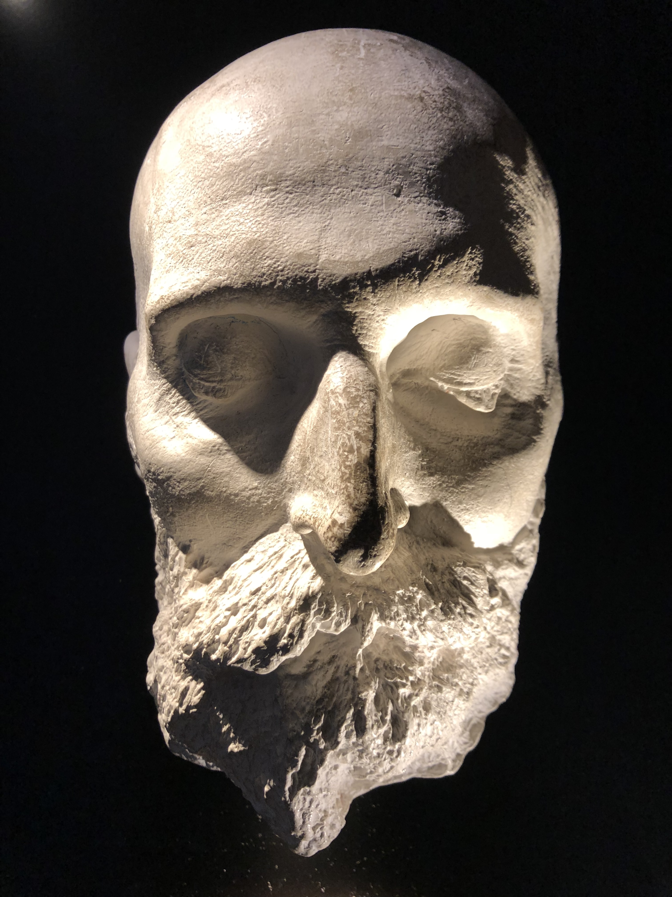
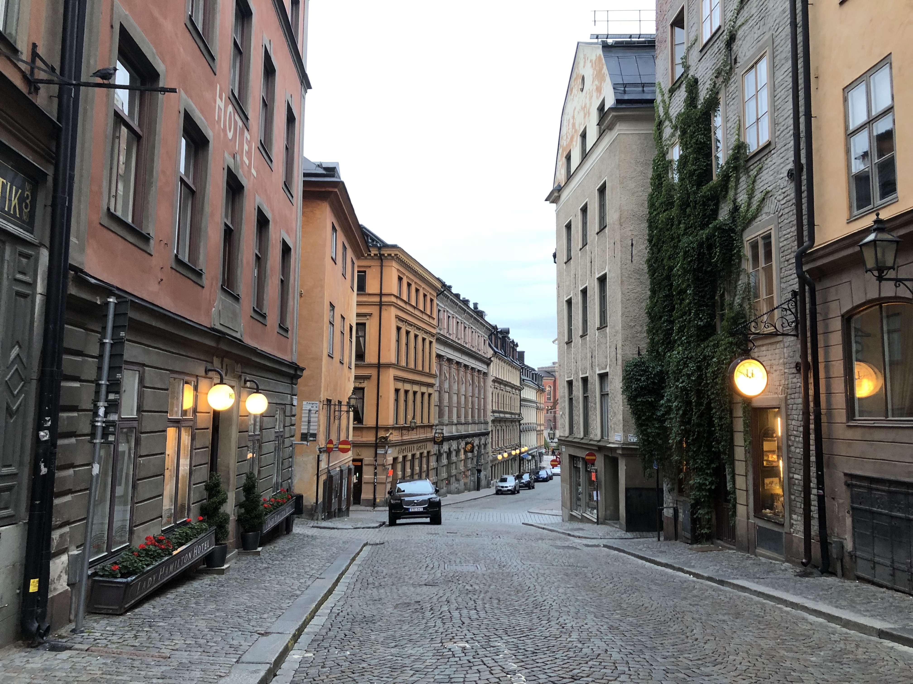

Stockholm, Sweden is one of the most beautiful city on this planet but doesn't necessarily come up on top of the list of places to visit in Europe. After my internship at Braintree, I was planning on a short trip to a couple places in Europe with my friends. I really wanted to go to Rome but since the Schengen visa appointments are pretty scare in the US I so couldn't find one for Italy.

Schengen visa requires that the country you get it from is the place where you stay the longest during your visit. After scouring for appointments from all Schengen area countries, we decided to compromise and go to Stockholm in Sweden and I am really glad that happened.

Stockholm is beautiful and it feels like a place from both the past and the future at the same time. As soon as I landed I headed over to our Airbnb in Gamla Stan. It was a beautiful little place full of Scandinavian design elements. I love Scandinavian design - it provides an instant feeling of _hygge_ or _mysig_ in this instance.  

My absolute favorite thing about Sweden is the concept of _fika_. _Fika_ roughly translates to 'A coffee & cake break' but it is so much more than that. It is supposed to be the time of the day when Swedes slow down, take a break and notice the beauty of life. You can do it anywhere and with anyone or no one. The important thing is to take that time out and pause. Unlike other places in the world, coffee happens more and more 'to go' as a fuel for the rest of the day. But our body works differently than a machine. A pause is more of a fuel than a caffeine shot. Naturally, Stockholm is a big dessert place and there were a lot of cute little cafés serving coffee and cakes.

Later at night I went to a Viking Bar where they served Mead and some raw cold cuts. Elk, Reindeer and Moose tasted really gamey and quite honestly I am not a fan.

Gamla Stan, where our Airbnb was, is really pretty and probably the most touristy place in Stockholm. This building was literally a block away from where we stayed.

Another really interesting thing about Stockholm is that it is the home to the longest art gallery in the world. A lot of metro stations in Stockholm have art installations and I would highly recommend taking a day to just hop from one station to another, looking at the installations. I didn't quite get to do a lot of them because it was towards the end of our trip but I did get to see a few.

I also went to a _Thirty Seconds to Mars_ concert at Gröna Lund, the first ever IKEA store, the Nobel Museum, the Stockholm Palace and a bunch of other really neat places.

I can't wait to go back and see what else Stockholm and Sweden has to offer.

