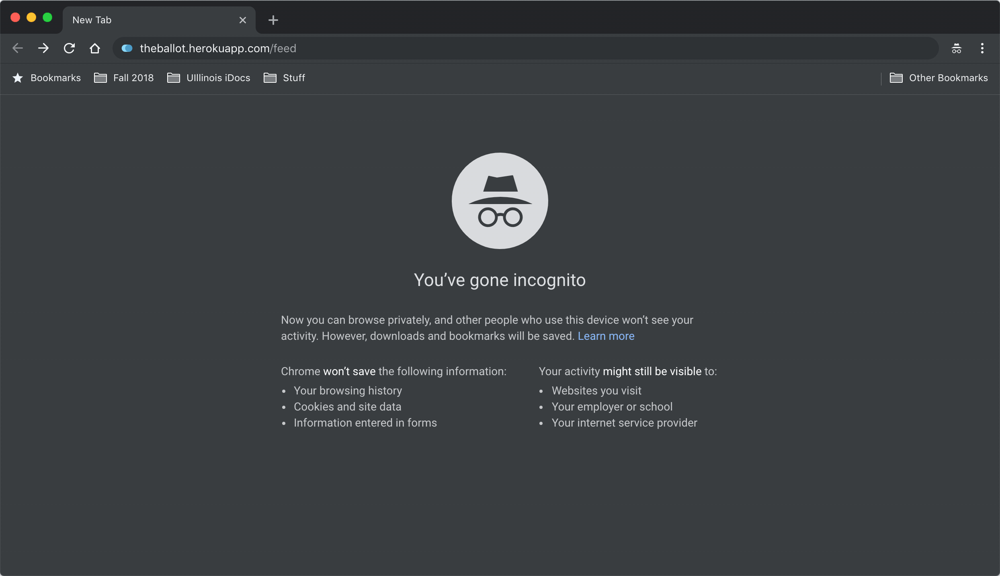

This was a project for a college course and I wrote a report as part of the submission.

The idea behind this project was to create a portal that allowed users to create polls and share them on their social networks in order to gather a crowdsourced opinion. Apart from that, the other goal of the project was to focus on the social aspect where people can vote on polls on a feed and also be able to see data on their polls. A few other features were also added that enhanced the experience.

The main goal was to make sure that a user can vote without having to login in order to encourage engagement and also make sure that each user gets only one vote. A wide range of metadata is collected just from the platform where the request originated. For eg. the IP address provides further information on the user’s location. In addition to that, device data and browser data and timestamp at when each event was recorded. There's a statistics platform which includes all the stats like number of polls created, number of votes, number of events, number of distinct IPs, Browser data, device data, endpoints accessed, then data on how the poll attributes were entered, timeline of event creation and poll creation, division of tags and finally map of where the events occurred.

Another feature was to decide tags based on a custom trained NLP model on DialogFlow.

## Usefulness

The very simple purpose of the app is for a user to be able to get a crowdsourced opinion on a question. The news feed function is both a source of information and fun. There are multiple narrow scoped uses for this application. For eg, crowdsourcing is a very important part of Human-Computer Interaction and there is extensive scope in the research for how people respond/provide feedback depending on different stimuli offered. I also added a feature where the creator of the poll can set poll behavior. For example - showing the status of the vote before the voter decides on a vote and see how popular vote sways the result as compared to a blind poll. Another important area of use could be corporations asking for feedback from their users to help them decide areas to focus on based on demand.

There are some websites which have some overlap to what I planned to achieve. Doodle is the first result on a quick Google search on the idea and they provide a polling service to coordinate meetings which is very different from this idea. The other websites that overlap are overly complicated and their designs seem like they haven't been updated since 2006 (when the use of Marquee wasn't ironic). I personally used the website to settle debates about whether Pineapple goes on Pizza and what the best operating system was.

## Data

Since the core of the project is surrounded by data, the application aims at collecting as much data as possible whenever users vote or create polls. At a high level, the application consists of the following data:

-   Poll data such as the question, options, poll creation time, IP address of the creator, the expiration time of the poll and a unique poll_id per poll.
-   Voters IP address, timestamp, and the option selected.
-   Users name, unique user_id, email id, and the profile picture from facebook.
-   Data regarding application usage. For example, endpoints accessed, browser used, operating system, operating system version etc. Tags assigned per poll depending on the question using DialogFlow.

## Data flow

The following steps show the flow of data on the website :

After the /create endpoint is accessed, the user is asked to log in to be able to create a poll. On clicking the login button oAuth is performed by Facebook and the API endpoint checks if the user already exists in the database. If they don’t the user details like name, email and a link to the profile picture is inserted into the database and the log_count is set to one. If they already exist in the database, the log count is updated by one.

Once the user is logged in, they are granted access to the create a poll screen. There are two steps to the form. First, the important details like ‘Question’ and the ‘Options’ are asked. A minimum of two options are required and a maximum of four are allowed. The second part has attribute details like feed privacy, analytics privacy and how long the poll needs to be active.

After the create button is clicked a post API call is made to the backend where I generate a random unique six-character id to represent the poll. The IP address is obtained from express and the creator id is added from Facebook id. The poll creation timestamp comes from the current time accessed by `Date.now()` in JavaScript. After the details are inserted in the database, a poll link is generated and shown to the user in order to be able to share it on their social networks.

On the link, the poll can be accessed. Each time the link is accessed, the polls table is queried for the poll_id and all the details are rendered on the page.

When the poll is inserted the question is processed through a custom trained NLP model on DialogFlow and based on that a tag is decided. In this case ‘Movies’. It is inserted in the ‘Tags’ table along with the confidence on the tag as decided by the NLP model. Before voting, the activity table is queried to check if the user’s IP has already voted on this current poll. More details about checking individual unique vote are mentioned in the Advanced Functions section. After making sure that the user hasn’t voted on the poll, the render screen appears and waits for an option to be clicked.

When an option is selected, the user's details like the IP address, the timestamp, poll_id, and the selected option are recorded in the activity table and then the table is queried to find all activity on that poll so far to display a pie chart.

Other features include the feed, the search, and the platform data which is generated using the data obtained from the browser, IP address, device and timestamps of when the events occur.

## Voting

One of the main goals for this project was to allow voting without logging in. If login is mandated to vote it becomes easier to account for uniqueness but since I wanted to allow voting without logging in, I needed to account for a lot of things to ensure uniqueness.

There are a few layers to each vote. Consider a scenario when a user first votes on a poll. After the vote is added, I use the browser’s persistent storage to log the poll_id and their selection. Next, I log in the IP address of the user and the poll_id in the activity table. Now there are a few possible ways for a user to be able to vote on the same poll again just based on these checks. If a user switches their network for example from their work to home, their IP address changes and so they would technically be allowed to vote again. Also, if a user uses a VPN to port their IP address to some other location they could technically be able to vote again.

To account for these I used the following measures :

-   The persistent browser storage is accessed to check if the poll_id for the user in play has already been voted on. If yes, then even though the network has been switched, the poll shows that it has already been voted on.
-   To crack down on VPN I followed what Netflix does. I used a service called ‘IPHub’ which keeps a running record of popular VPNs. Before a user can access a poll I run the IP address through IPHub’s API and find if the user is using a VPN. If they are, then I show a message saying VPN is being used and to vote on a poll they would need to switch it off.

Another challenge I have is to account for incognito mode. Incognito mode prevents access to the same local storage as for the non-incognito mode and so all the checks for the network switch will be lost. In order to prevent multiple votes on the same poll from a user, I restrict voting on incognito mode. For this, I needed to be able to detect if a browser is being used in incognito mode. Another challenge here was that each browser is built differently so checking for incognito mode needed to be done in different ways based on what the browser was. For example, in Google Chrome on the `desktopwindow.requestFileSystem` returns false. After accounting for that, if the poll or feed is accessed in incognito mode, the website will detect that the user is browsing in incognito mode and display a message instructing the user to switch back to normal mode in order to vote.

Finally as an additional check, for the users that did log in, I kept a running count of all the IP addresses they have logged in with. This allowed me to check if a user is voting on another poll by switching browsers if they were on another one of their commonly used IP addresses.

Also, I could make the feed personalized to a logged in user by showing them the polls that they haven’t voted on yet by joining the activity table and IPs table. Even for users that haven’t logged in, the feed can be tailored to their IP address based on if a vote has been logged in the activity table for that particular IP would be shown last.

I also created an event logger from scratch which accessed data about the browser and the user’s device. From the IP address I was able to obtain a user’s geographical location and finally, I logged in the time when it occurred. These loggers were placed in the constructors of various routes which were likely to be accessed the most and when hit, the event logger posted data to the events table.

All the extensive data I collected combined with the various tables in my database to find out all the statistics that would be important from a developer’s point of view.

The platform stats page shows :

-   Main Counts
    -   Total Votes
    -   Total Polls
    -   Total Events
    -   Total IPs
-   Device Data
-   Browser Data
-   OS Data
-   Endpoint Data
-   Poll Attributes Data
    -   Feed Privacy
    -   Number of Options
    -   Analytics Privacy
    -   Expiration Time
-   Returning v/s One-Time Users
-   Timelines
    -   Polls Created v/s Day
    -   Events Created v/s Day
    -   Votes v/s Day
-   Tag Data
-   Location Data

Challenges

I faced a lot of challenges during the course of this project. Initially, most of the challenges were because I had not worked with React before and understanding it and getting it to do what I wanted was hard. Also deploying the app to cPanel was annoying because its interface is archaic so I moved to Heroku instead. Another problem I faced was with deploying the react app with a node backend using the express framework. The server was running on port 5000 and react ran on port 3000. Getting both the ports to communicate required adding a proxy to the React which took some time to figure out.

After the template app was successfully deployed the form was the next challenge. I wanted the UI to be as seamless as possible while supporting thorough input validation so that the database doesn’t store corrupt data. These were mostly frontend based challenges that were cleared by reading articles online. Another problem I had was with the MySQL npm package I used. It requires the input in a certain way - for eg., table names need to be enveloped by apostrophes (‘poll’). If a user Added an apostrophe in their question or options, MySQL would throw a syntax error. To account for this I used RegEx to replace every apostrophe in the input with "§" and then replace it back again before displaying it on the frontend.

Figuring out all the aspects of a unique vote without having to log in was challenging and I needed to do a lot of research on how browser APIs worked to be able to detect incognito mode and also how tech companies like Netflix detect VPNs in order to follow suit for my application. Logging through Facebook also caused significant grief. Since their data breach, they have only made oAuth accessible on SSL. I hosted our app using a dyno plan in order to add Facebook login.

Another challenge was to create an embed endpoint in order to be able to embed a ballot poll anywhere on any website. This occurred because `<i frame>` basically embeds a webpage within another and for my case, I had a persistent login head from the `Route.js` page. It wouldn’t have context on another page and the app would crash. To account for this I added a handler function which was passed to the embed component on react and in the constructor I called the function which changed state in the parent. This allowed me to be able to embed polls within other websites.

## Try it out

[Website](https://ballt.herokuapp.com/)  
[Github](https://github.com/yagrawl/ballot)  
[Demo](https://youtu.be/UsVOjNbTrYs)  
