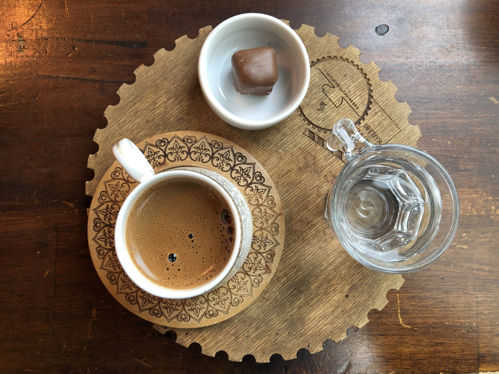
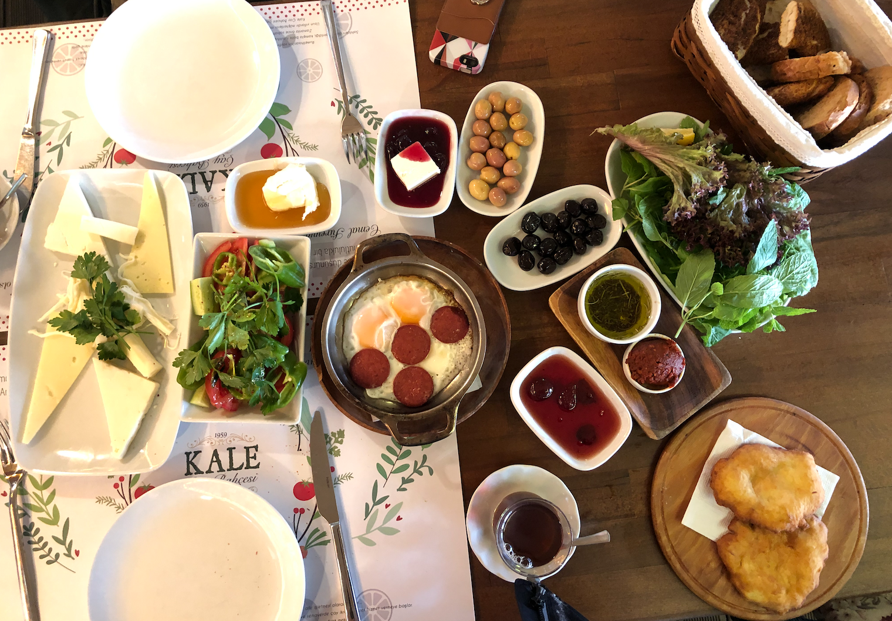
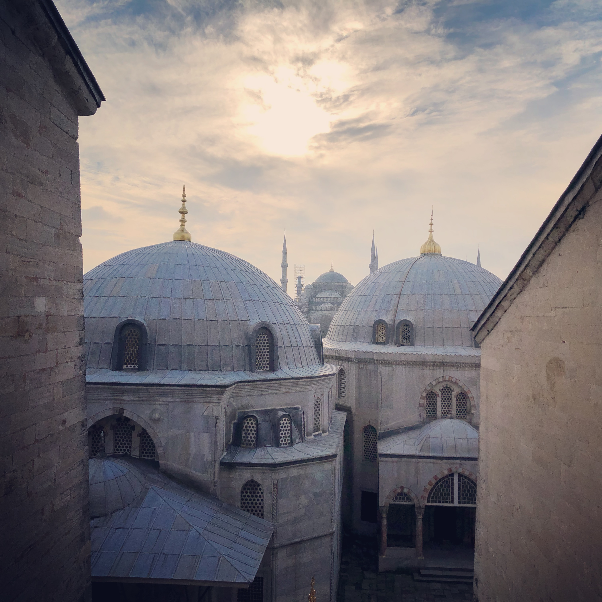
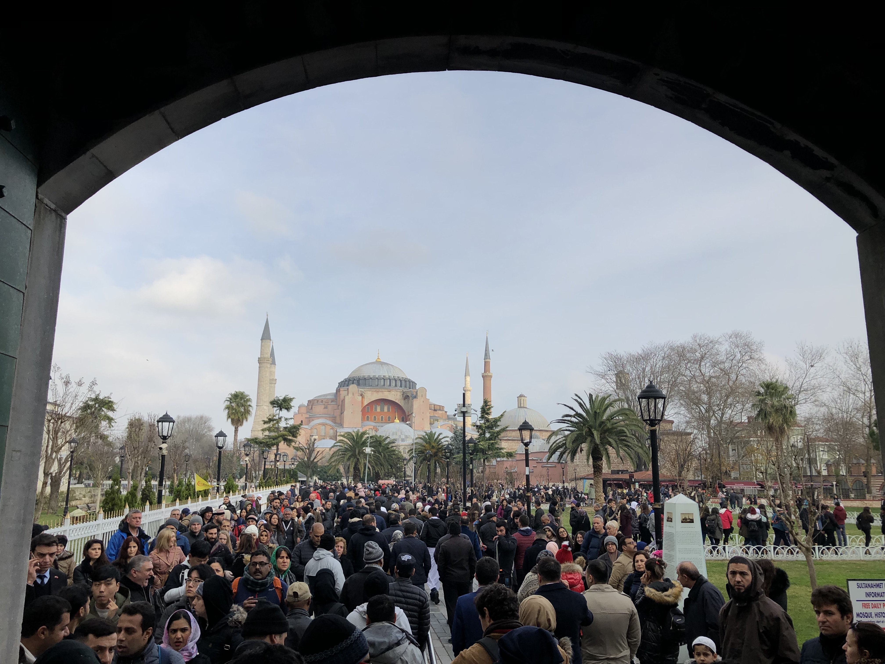
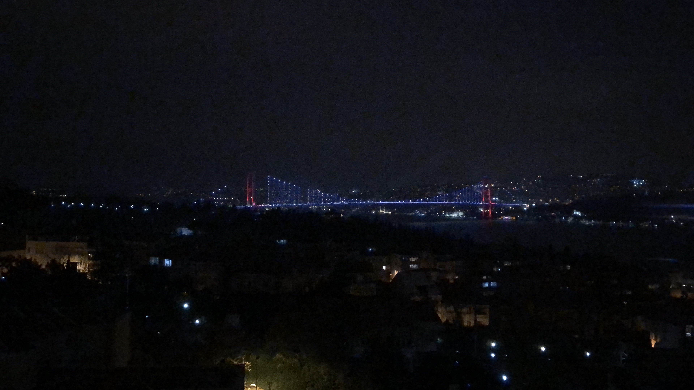

After I graduated from college, I decided to take a 3 day layover in Istanbul
before I headed home. I landed at the airport and went straight to the hotel I
was staying it. It was pretty cold and dark and I was tired with all the
traveling so I called it a day.

The next day I woke up and to a place that served Turkish coffee. Turks seem to
take their breakfast very seriously and I would highly recommend trying as many
different breakfast food as possible.

The breakfast itself is a bunch of things and they all taste incredible. This is
one of the places off Anthony Bourdain's 'No Reservations'.

Later I went to see the Hagia Sofia and the Blue Mosque. The Mosque was still
under construction from the inside.

Hagia Sofia looks beautiful but it was too crowded and just felt like a lot of
effort to go through to see inside. I skipped that part of the tour.

I also went to the Grand Bazaar and I spent hours roaming around looking at all
the pretty things. I got a few souvenirs and stuff to take back with me. Highly
highly recommended!

I visited a few more places here and there but I mostly stayed in the European
side of Istanbul. Oh also worth mentioning, Istanbul is the only city in the
world which spans two continents. Here's a bridge that connects Europe and Asia.

 
