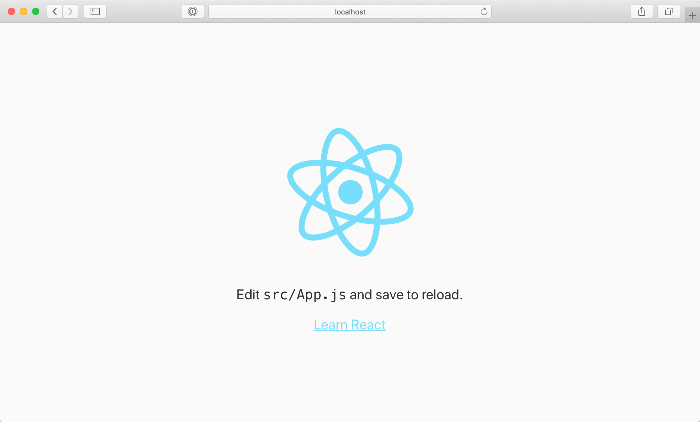
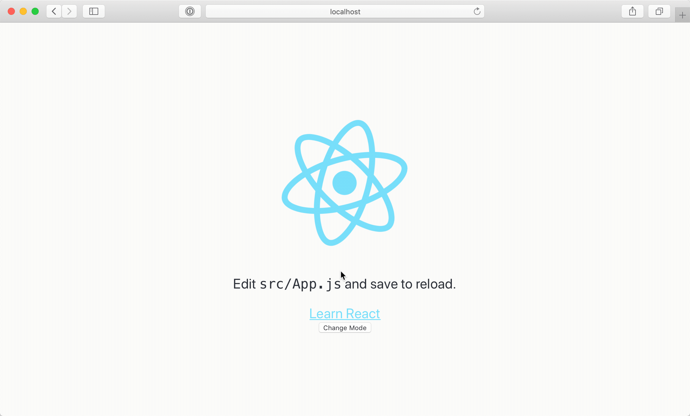

In this article I have tried to explain my method of adding dark mode to a
react app created using `create-react-app` and SCSS. This is my method and by no
means do I claim it to be the best possible way of adding dark-mode to your
react app.

The end goal is to add a dark mode button component which can be added anywhere
in the project which on click switches to dark mode and back. It also keeps
track of a users' preference using `localStorage` - so if a user returns to the
website using the same browser, the previously selected mode will directly be
applied.

Let's get started.

As per the official [documentation](https://facebook.github.io/create-react-app/docs/getting-started), carry out the following steps:

```bash
npx create-react-app dark-mode
cd dark-mode
npm start
```

This will launch the react app on `localhost:3000` and it should look like this.


Now that we have the react app set up, we can start adding the dark mode. First, we will remove the styles set in `App.css`. Remove line 12 `background-color: #282c34;` and line 19 `color: white;`.

This is what it should look like:



As mentioned in the title, we will use SCSS so that it is easy to scale the styling when you want to add more dark mode featured styles instead of merely flipping text and background.

```bash
npm install node-sass --save
# or
yarn add node-sass
```

Create a new file and name it `style.scss`. This is where we will add our color schemes for light and dark mode. Add the following snippet to the file.

```css
$background-color-dark: #292A32;
$background-color-light: #FBFAF8;
$complimentary-color-dark: #393B43;
$complimentary-color-light: #FEFFFF;

body {
  background-color: $background-color-light;
  color: $background-color-dark;
}

body.dark-mode {
  background-color: $background-color-dark;
  color: $background-color-light;
}
```

Create another file called `DarkModeToggle.js`.This will be the main component where we will implement the dark mode toggle.

Add the following code to that file:

```js
import React, { Component } from 'react';

import './style.scss';

class DarkModeToggle extends Component {
  constructor(props) {
    super(props);

    if(JSON.parse(localStorage.getItem('DARK_MODE')) === true) {
      document.body.classList.add('dark-mode');
    }

    this.state = {
      darkMode: JSON.parse(localStorage.getItem('DARK_MODE'))
    }

    this.handleModeChange = this.handleModeChange.bind(this);
  }

  handleModeChange() {
    if(!this.state.darkMode) {
      document.body.classList.add('dark-mode');
    } else {
      document.body.classList.remove('dark-mode');
    }

    this.setState({
      darkMode: (!this.state.darkMode)
    });
    localStorage.setItem('DARK_MODE', !this.state.darkMode);
  }

  render() {
    return (
      <button onClick={this.handleModeChange}>Change Mode</button>
    );
  }
}

export default DarkModeToggle;
```

Now, include this new `DarkModeToggle` component within the `App.js`. Include this component right below 'Learn React'.

```js
import React from 'react';
import logo from './logo.svg';
import './App.css';

import DarkModeToggle from './DarkModeToggle';

function App() {
  return (
    <div className="App">
      <header className="App-header">
        
        <p>
          Edit <code>src/App.js</code> and save to reload.
        </p>
        <a
          className="App-link"
          href="https://reactjs.org"
          target="_blank"
          rel="noopener noreferrer"
        >
          Learn React
        </a>
        <DarkModeToggle/>
      </header>
    </div>
  );
}

export default App;
```

Now we have a very basic dark mode working. We can add more specific styles to dark mode in the `style.scss`.



Here's the [source](https://github.com/yagrawl/dark-mode) & [demo](https://yagrawl.github.io/dark-mode/).
