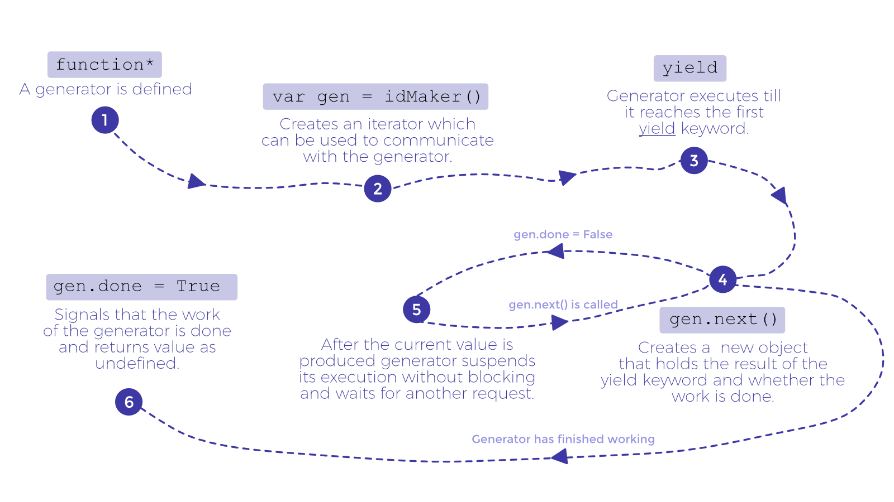
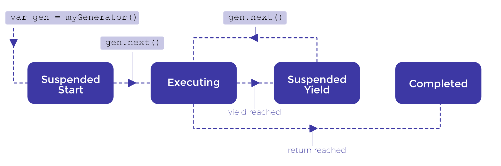
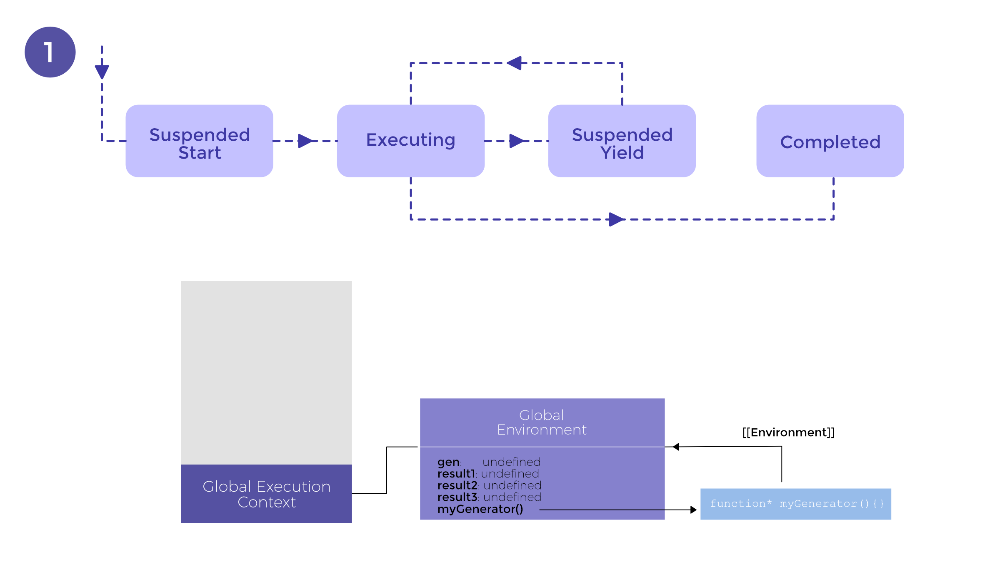
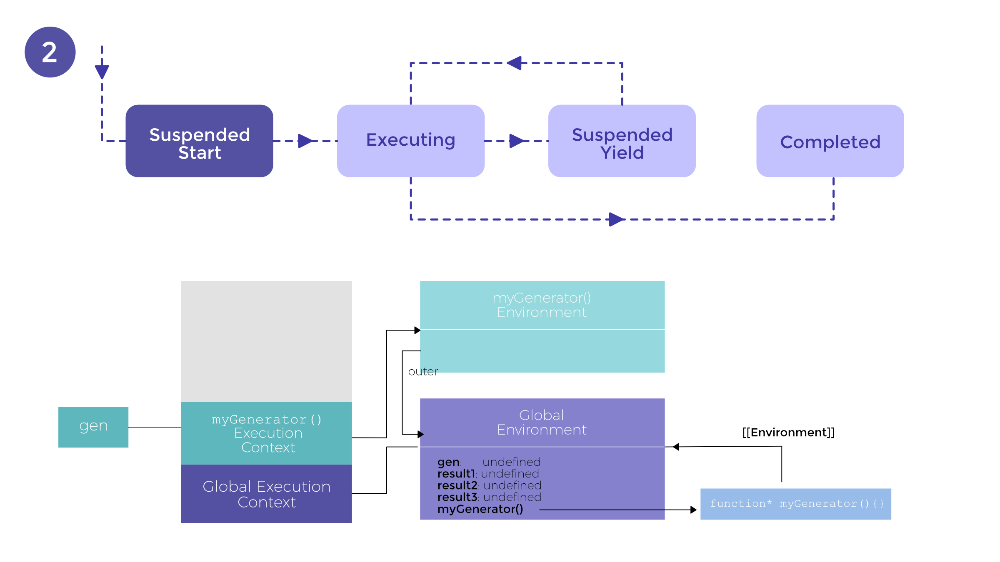
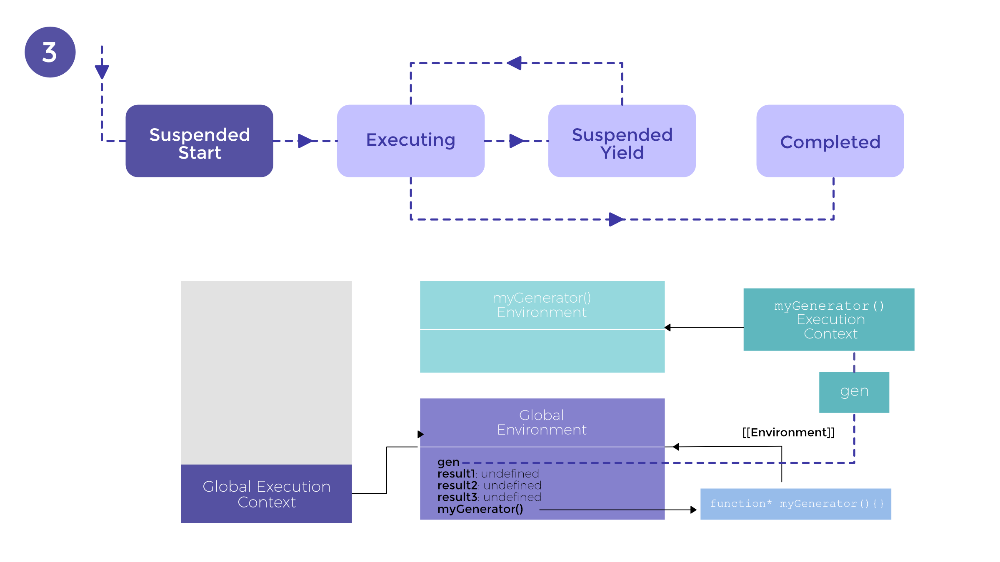
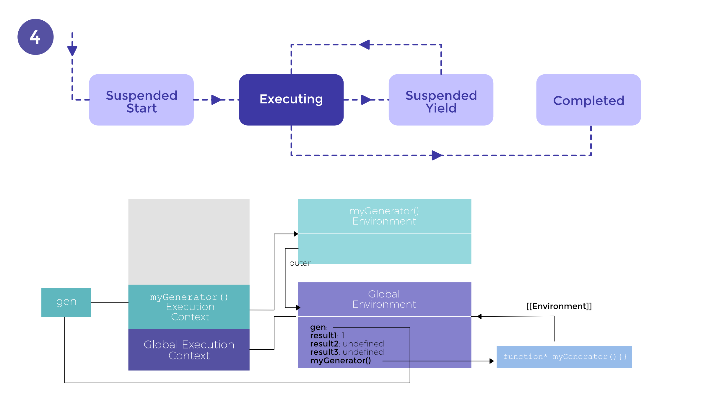
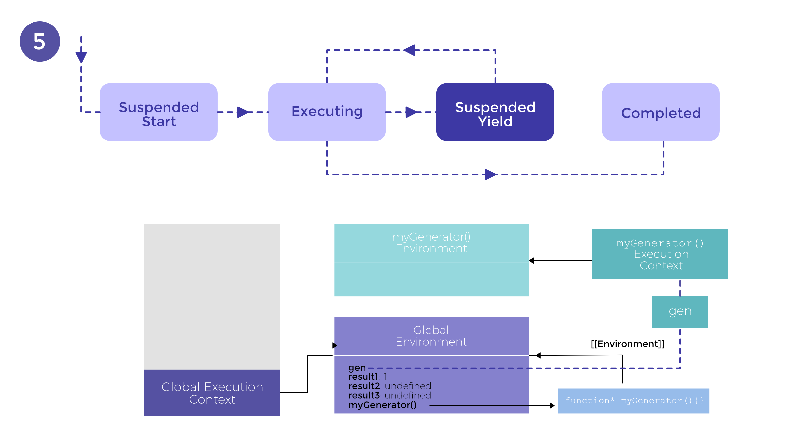

Generators are a cutting edge addition to ES6 JavaScript. Async code is harder
to manage with JavaScript’s single threaded execution model and Generators and
Promises are welcome inclusions in the JS arsenal. Let’s explore Generators in
detail in this article.

## Generators

Generators are special types of functions in the sense that unlike a
traditional function generators produce multiple values on a per request basis
while suspending their execution between these requests. During the pre-ES6
era, objects written as iterators served this purpose but the thing with those
objects is that they are harder to maintain mostly because of the challenges in
sustaining the internal state. Generators solve this problem by maintaining
their own state.

## How are generators implemented?

Look at the code snippet from the official MDN documentation below to just see
that it follows almost a similar syntax as a function but with some interesting
differences.

```js
function* idMaker() {
  var index = 0;
  while(true)
    yield index++;
}

var gen = idMaker();

console.log(gen.next().value); // 0
console.log(gen.next().value); // 1
console.log(gen.next().value); // 2
// ...`
```

The  `function*` and  `yield` keywords are unique to a generator. Generators
are defined by adding an `*` at the end of a function keyword. This enables us
to use the yield keyword within the body of the generator to produce values on
request. Let’s breakdown the snippet line by line.

On **line 1**, we use the  `function*` to create a generator. **Line 4** uses
the  `yield` keyword which produces a value on request. At **Line 7**, we call
the generator function. Calling a generator function doesn’t execute it,
instead it creates an iterator object which helps us interact with the
generator. Follow the flowchart below to understand how it works.



NOTE : In the code chunk we used, it would never reach `gen.done = True` since
it is inside an infinite loop.

## Behind the Scenes — Generator’s inner workings

The beginning of the article mentions how generators are ‘special’ functions in
the sense that they can suspend their execution.
A generator has the following states :

-   Suspended Start
-   Executing
-   Suspended Yield
-   Completed

Consider an easier code snippet to understand the states and execution context
of the generator function.

```javascript
function* myGenerator() {
  yield '1';
  yield '2';
}

var gen = myGenerator();

const result1 = gen.next();
// result1 = {value = '1'; done = false}
const result2 = gen.next();
// result2 = {value = '2'; done = false}
const result3 = gen.next();
// result3 = {value = undefined; done = true}`
```

**Line 1** declares a generator which has two  `yield` statements in it. On
**line 6**, an iterator object is created which executes the generator to the
point of it’s first  `yield` statement. After that, at **line 8**, **line 10**
and **line 12**, generator is activated and a value is requested.



As soon as the iterator is created, generator goes into a suspended start state.
After the first `gen.next()` the generator goes into execution mode and after
finishing the  `yield` request, suspends its execution. When it gets another
`gen.next()` it executes and after being done with that request, it goes into a
suspended  `yield`. This cyclic process continues till we reach the return
statement or till no more code is left to execute. At that point the generator
goes into a completed state.

## Execution Context and Generators

To better understand the inner workings of generators, we’ll have to analyze
how it affects the execution context. Take another look at code snippet 2
because the execution context below would be drawn based on that.

Figure 1 is a snapshot of how the execution context and the lexical
environments would look before Line 6 in code snippet 2. If you need to read up
on how execution contexts and lexical environments work, read my article on [variable hoisting](/blog/hoisting-in-javascript/).

In Step 1, the global context executes and because of variable hoisting we
have the ‘result’ variables and the `gen` object initialized to `undefined`.



As **line 6** executes, an iterator object is created and the generator goes
into a suspended start state. See Figure 2.



After **line 6**, the generator context is popped off the execution stack but
isn’t discarded because `gen` keeps a reference to it. This is still at the
point before any of the  `yield` statements are executed. See Figure 3 and
follow the dotted line in the environment to see how `myGeneration` is kept
active despite of being popped off the stack.



When the first call to `gen.next()` is made in the global execution context, unlike regular functions, generators reactivate the matching execution context. The `myGenerator()`
context is placed on the top of the stack to continue its execution from the
point it left off.



After it returns an object to return with the `value` property and the `done`
property, it is again popped off the stack but not discarded since `gen` holds
a reference to it. This time the generator goes into a suspended yield state
and patiently waits till another request is made. Figure 5 shows a snapshot
of how the context/environment look like at this stage.



After another call is made to `gen.next()`, the state reverts back to execution
and we see a similar picture as in figure 4. This goes on till the value passed
to `result.done` is `true`, signaling that the generator has completed its
execution.

Hopefully that provides a little insight into what generators are and how
they work in JavaScript.
