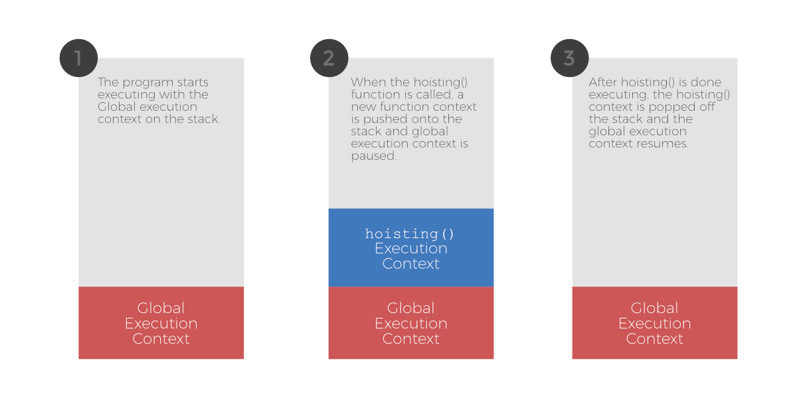
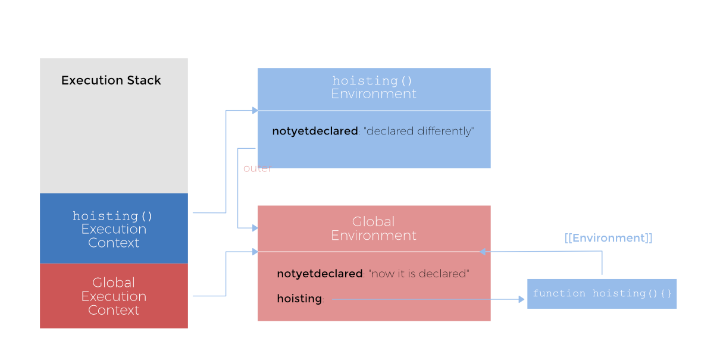

The term _Hoisting_ is used in a lot of JavaScript blogs to explain identifier
resolution. Using the literal meaning of the word as a metaphor, hoisting is
employed to explain how Variables and Function declarations are ‘lifted’ to the
top of a function or a global scope.

While this does provide a basic understanding of how JavaScript scoping works,
a deeper dive helps to build a stronger foundation.

To understand the fundamentals better, let’s recap on what exactly hoisting
means. Also, as a reminder, JS is an interpreted language which means that
unlike compiled languages JS code runs line by line.

Consider the following example.

```js
console.log(notyetdeclared);
// prints out 'undefined'

var notyetdeclared = 'now it is declared';

hoisting();

function hoisting(){
  console.log(notyetdeclared);
  // prints out 'undefined'

  var notyetdeclared = 'declared differently';

  console.log(notyetdeclared);
  // prints out 'declared differently'
}
```

After overanalyzing the code sample above, there are several questions that
jump up.

-   How is the function being accessed before declaration on **line 6**?
-   How did **line 1** not throw an error since at this point no variable called
    `notyetdeclared` exists?
-   Why is **line 9** printing `undefined` when `notyetdeclared` has already been
    declared in the global scope?

Javascript is extremely logical and all of this weirdness has a clear
explanation.

Starting from the very top, when code is executed in Javascript, an _execution_
context is set up. There are two major types of execution contexts in
JS — _Global execution context_ and _Function execution context_. Since
Javascript is based on a single threaded execution model, only one piece of
code can be executed at a time. For our code, the process is as follows :



This process is self explanatory but doesn’t really explain the anomalies we
saw during the execution of the code sample. While the execution context keeps
track of the execution of the code, Lexical environment keeps track of the
mapping of identifiers to specific variables. Lexical environment basically is
an internal implementation of the JavaScript scoping mechanism. Generally, the
lexical environment is associated with a specific structure of the JavaScript
code for example a function or a block of code like a `for` loop. Whenever a
function is created, a reference to the lexical environment in which it was
created is passed in an internal property named `[[Environment]]`.

Covered by all this jargon is a simple and an extremely logical concept. Lets
break it down. Lexical environment is a fancy name for something that keeps
track of variables and functions within a block of code. In addition to keeping
track of local variables, function declarations and parameters, each lexical
environment keeps track of its parent lexical environment. So the Javascript
Engine’s resolution of the above code sample would look something like this:



To resolve an identifier within a lexical environment, the JS engine checks
the current environment for a reference. If no reference is found, it moves on
to the outer environment by using `[[Environment]]`. This goes on until either
the identifier is resolved or a ‘not defined’ error is thrown.

Basically, the execution of JS code happens in two phases. The first phase
registers all the variables and function declarations within the current
lexical environment. After that is done, the second phase — Javascript execution
begins!

So to elaborate on the first phase: it works in two steps.

1.  The current code is ‘scanned’ for function declarations. Function
    expressions and arrow functions are skipped. For every function that is
    discovered a new function is created and bound to the environment with the
    function’s name. If the identifier name already exists, its value is
    overwritten.

2.  Then the current environment is scanned for variables. Variables defined
    with `var` and placed outside other functions are found and an identifier is
    registered with its value initialized to `undefined`. If an identifier exists,
    the value is left untouched.

Note : `let` and `const` are block variables and have a slightly different
treatment than `var`. More on that in another article.

Now that you have a basic idea of what a lexical environment is, lets get back
to our sample code and deal with the questions.

When the global context is set up, the environment is scanned and the
`hoisting()` function is attached to an identifier. Then in the next step, the
variable `notyetdeclared` is registered and its value is initialized to
`undefined` per the steps.

_How is the function being accessed before declaration on ~~line 6~~?_

The `hoisting()` function is already registered to an identifier in phase 1 and
when the JS code starts executing in the global context in phase 2, it looks up
the lexical environment for `hoisting` and finds the function even before its
definition.

_How did ~~line 1~~ not throw an error since at this point no variable
called `notyetdeclared` exists?_

Similarly, `notyetdeclared` is registered to an identifier and initialized to
`undefined` in phase 1 and hence no error is thrown.

Finally,

_Why is ~~line 9~~ printing `undefined` when `notyetdeclared` has already been
declared in the global scope?_

Now we are in the `hoisting` environment. In phase 1, `notyetdeclared` is
registered and initialized to `undefined` because in this lexical environment
the variable `notyetdeclared` has not been registered yet. If **line 12** did
not contain the `var` keyword, this would have been a different story.

Hopefully it is clear now that hoisting in JS is a simplistic view and
technically the functions and variables aren’t moved anywhere.
