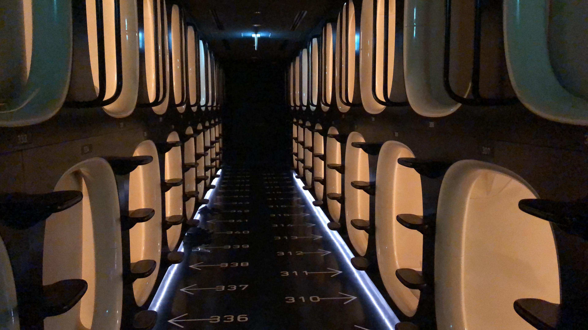
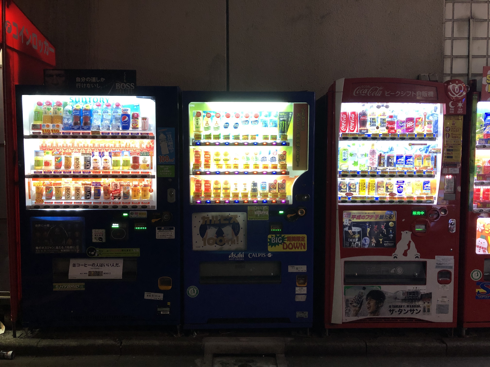
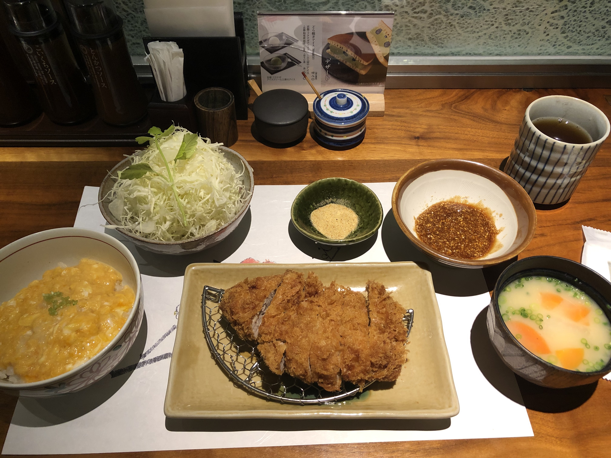
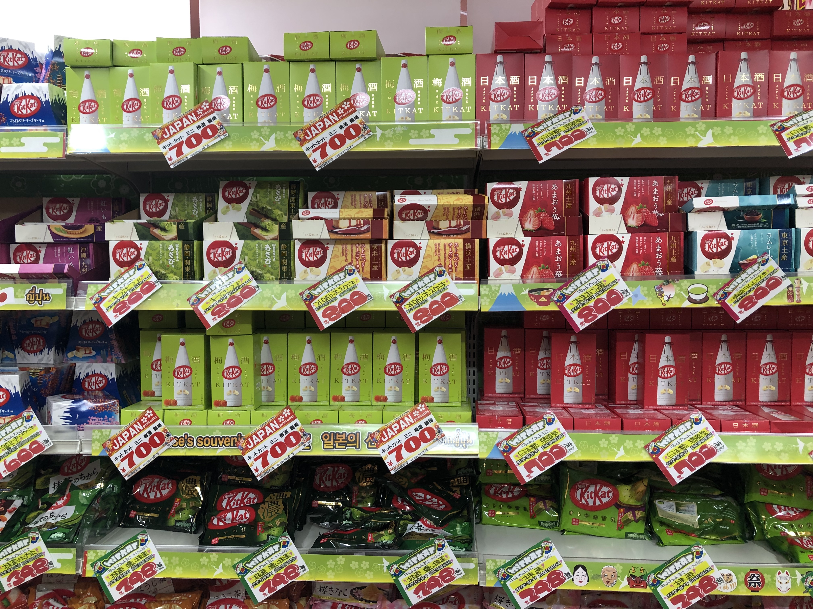
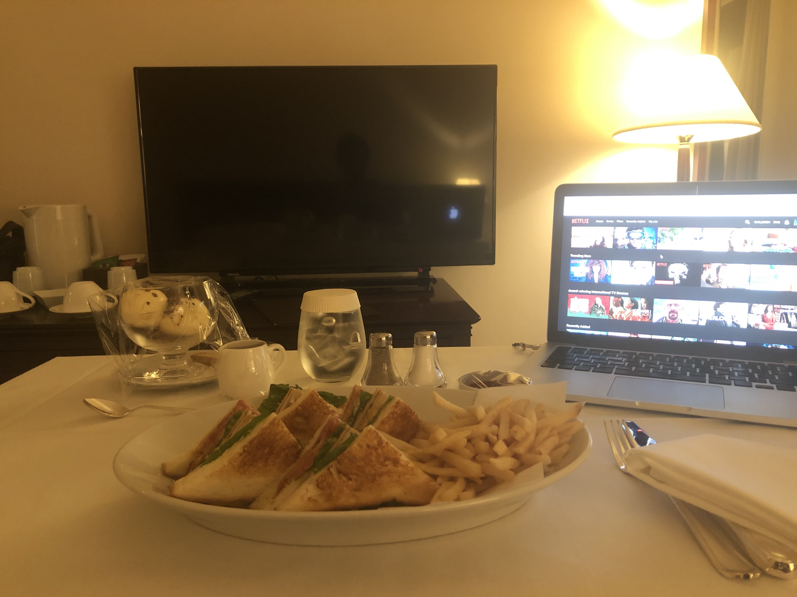

After graduating from college and before starting work full-time I decided to
travel a bit. On my way to San Francisco to start the job I decided to take a
layover in Tokyo for a few days. This was my first ever experience traveling
alone.

The very first night, I decided to stay in a capsule hotel to experience what
that is like. (Also, I was going to arrive at about 9 PM and didn't feel like
spending a whole lot on a hotel to just sleep.)

This place is called 9Hours and its in Shinjuku's Korea town. After I lugged my
huge overweight bag from HND on two different trains and a couple of stations
with no escalators, I was very glad to have a quick and easy check-in. I stuffed
my things in the lockers, showered and went out for a walk.

I saw a bunch of vending machines just lying outside and that was interesting. I
also got a bunch of snacks from the 7 Eleven and most of it was amazing. I then
called it a night and that was about it for day 1.

The next day I moved to the Hyatt Regency in Shinjuku and I asked for a room on
a higher floor. The receptionist was very nice and gave me a room on the 19th
floor. After settling in I decided to get some lunch. It is always daunting to
go out and eat alone but I was in Tokyo and there was no way I was going to
order in.

I went to a Tonkatsu restaurant called Katsukura. It had almost an hour of
waiting time. I guess that feels like a norm with good Japanese restaurants.
The food was amazing. I couldn't do much after that lunch so I came back to the
room and napped for a bit.

In the evening I had an _Airbnb experience_ booked to walk around in Shibuya.
The tour was fun and very informative. I got to see the busiest crosswalk which
apparently wasn't as busy as it usually is cause it was some public holiday.
I also went to one of the biggest Don Quixote. There are a bunch of Kit-Kats.
Japan is famous for its different Kit-Kat flavors. Apparently Kit-Kat
coincidentally translates to "You'll surely win".

I decided to go to Akihabara and see what the fuss was about. I never got into
Anime but that place was highly recommended. I went into a Pachinko parlor and
well I started playing the game. I definitely didn't plan it out because there
wasn't a way to switch language on it so I was just randomly pulling levers.
Suddenly the machine started blaring and I freaked out. What freaked me out
even more was that no one batted an eye to even look up what the confused Indian
kid did to the machine to make it scream so loudly. I kept a pachinko ball as a
keepsake. Hope that is allowed.

I roamed around a little bit more and got back to my room a little late so just
decided to order some room service. That ends day 2.

