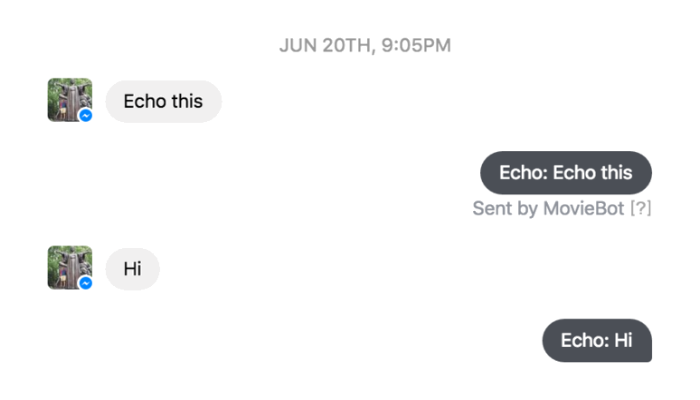
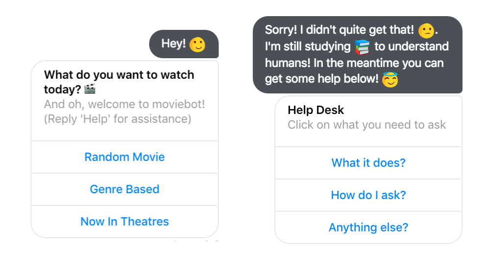
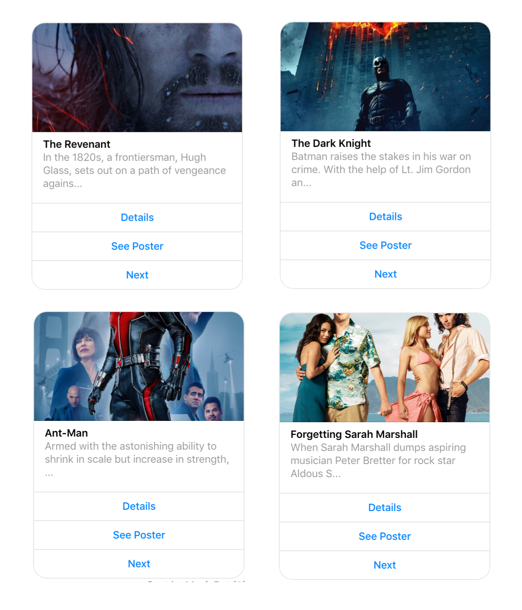
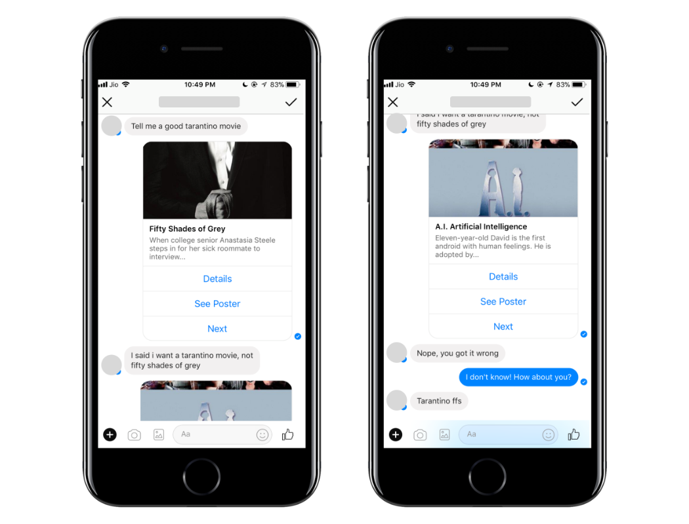
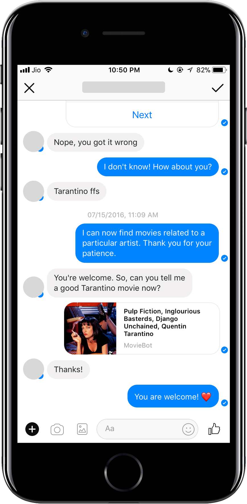
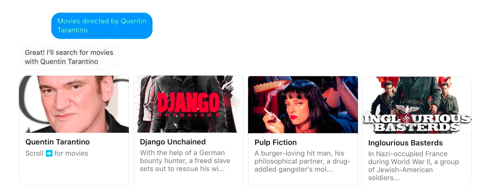
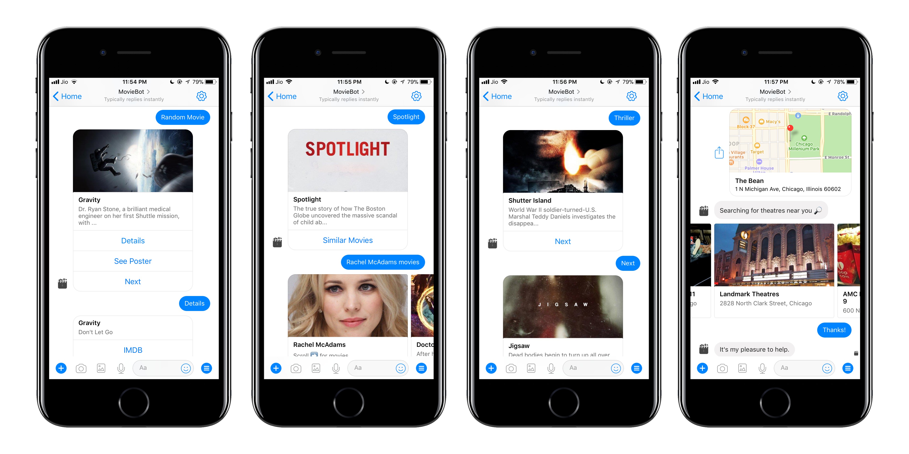

I love watching movies. I have watched most of the IMDb top 250 and many of the popular ones, so it becomes really hard to find a new movie to watch. I hate to waste my time on an uninteresting movie and also despise trying to search for a good movie to watch so I thought of making something that would solve the problem. A couple of months ago, Facebook released the messenger platform and I was definitely interested. I decided to give this interface a try.

## Setup

I began with the basics. Making a Facebook page, setting up Webhooks, etc by simply following the documentation. Now I had a functioning but useless bot that returned back whatever was sent. That's it! I apparently started this on June 20th, 2016. So facebook requires all its communications with the messenger bot be done over a secure network. The easiest way to set that up was using nodeJs hosted on heroku.

Having had no prior experience in JavaScript it all came down to figuring out how things actually worked. I started working with the documentation and tried to send hard-coded image links and templates to make sure I actually knew how it was working. After trying, testing and reading, I finally figured out how to use all the basic tricks to send messages and templates. Now I had to actually have it send movie information using TMDb API. That took me a few days because I had never used an API before this. After a lot of trial and error I suddenly had a movie name that wasn't hardcoded, sent from the bot.

## Implementation

Now I could actually begin using the bot. I was using random numbers to create random movieIDs to get information from the API. That was not a good way to work through the API because most of the times the API wouldn't return anything and when it did, it was a weird movie from the 1940s. That was a small hurdle though. I was using `Math.floor((Math.random() * 1000) + 1)`, then I just changed to a 'popular; movies API and kept using random numbers. I then implemented 'random' movies, genre based search and the movies playing in theaters. All these were handled by `postbacks` instead of user inputs. I made sure I had a certain flow to the bot so that it would invite minimum interaction with the user's actual input. I didn't have any NLP capabilities added to the bot and if the input wasn't in the switch statements I was using, it would fail.

I was essentially working on a bunch of if-else and switch statements. For example, If the user input 'Hi' or, 'Hey' my bot would return 'Hey!' but if someone were to say 'Hii', my bot would crash! I didn't actually figure this out until I gave this to a friend of mine to try. I tried to add a 'Help desk' that would be returned if the input wasn't a predefined statement. Now that I look at it with fresh eyes, the 'Help Desk' message I used was clunky, intimidating and plain useless. However, at this point I had the basic functionality.

## Progress

The 'Genre Based' search however was horrible. It was a giant clunky list of major genres. It was annoying to look at and difficult to select from but that's all I knew at that moment.

## Problems

I later figured out how to implement the bot on Watson's conversation API. The 'Genre Based' box was gone. A simple, 'Horror movie' input from the user would do it. I thought it was going well, until some days later there was this particular case.

One of my users wanted to watch a Tarantino movie. Well, my bot wasn't ready to understand or execute any of that. I figured that even if I didn't understand something, I won't throw out 'Help Desk' messages because they are annoying, so I kept on suggesting random movies. This definitely might have ticked them off. TLDR; My bot was sweared at.

I implemented 'People Based Search'. I had to add a ton of people as entities to train Watson on when to Search for people. The API returned top 3 movies after a search query. Error handling was the toughest part because the API wasn't too forgiving. If a random search term was passed, the API would fail and so did the code. After this, I had similar encounters where a user would ask for something my bot couldn't do and I would find out about another new feature to implement.

## Features

## Statistics

I've learnt a lot of things with this project. I started from scratch and now I have a little experience with JavaScript and using APIs. I am not scared to my bones when I see the documentation anymore and I can find a new movie recommendation easily. The numbers below are the unique conversations by the bot in the last 28 days as of July 2016.

The next step for this bot would be to implement a database so it could handle accounts of each user and ask for a list of movies they have already seen and liked and then based on that data -- provide a movie suggestion that the user is bound to like.

## Try it out

[Messenger](http://m.me/moviebots)  
[Github](https://github.com/yagrawl/moviebot)  
[Demo](https://www.youtube.com/watch?v=pelad-hQSFY)   
