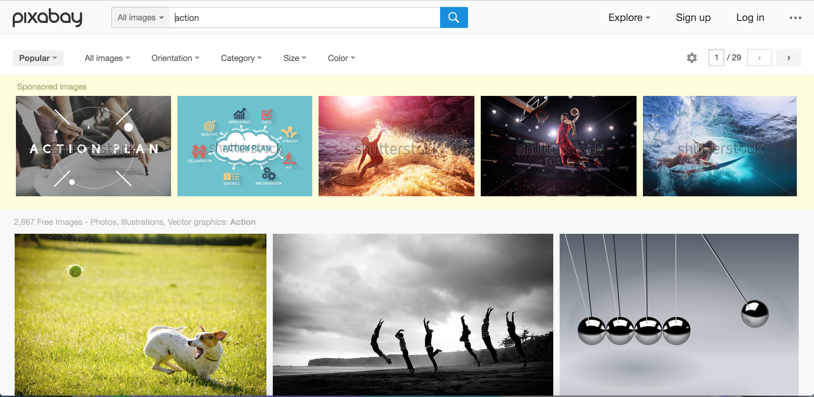
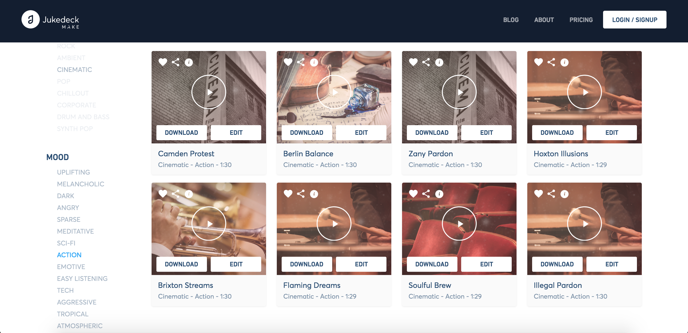
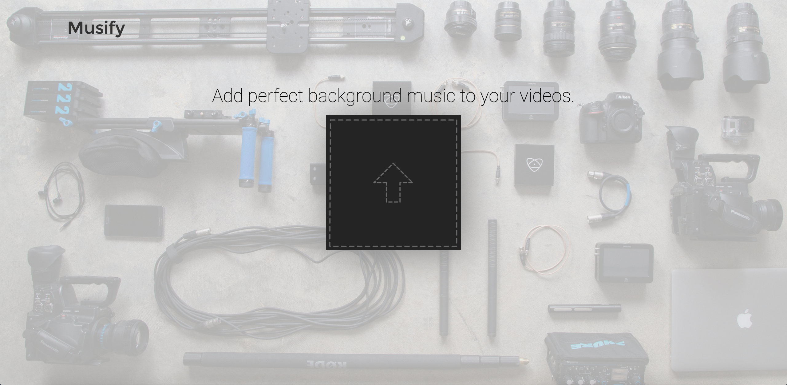

This is a project that me and a couple other people worked on at WildHacks 2016 hosted at Northwestern University. We decided to go for 'The best use of Clarifai's API' and went through a few ideas before finalizing one. The basic idea of our project was to provide background music for videos. Quite simply the videos would be passed through our own custom trained Clarifai agent and decide on a mood. Clarifai is an Artificial Intelligence with a Vision. Basically it's an image and video recognition API. We decided to work with a custom model and trained it on the images we scraped using Pixabay. We landed on 4 different categories for the video emotions - Action, Sad, Happy, Calm.

## Setup



We obviously needed to train our agent on a huge dataset. Now this being a hackathon project, we needed to do it quickly. Scraping a free stock photo website seemed like the way to go. Since the entire project was in python, I used `BeautifulSoup` to scrape and download all the images in categories such as action, sad, happy and calm off of Pixabay. We later uploaded this to our custom agent on Clarifai. After uploading upwards of 1000 images in each category, our agent started giving out stable responses.


## Implementation

One quick glance at our code makes it crystal clear that this was a hackathon project. We used a bunch of python libraries as we required. For example, we used `pydub` to manipulate sound according to video specifications.

```python
import imageio
from upload import sendImages
import binascii
from pydub import AudioSegment
from splice import splice
import sys
import pafy

def analyze(infile, outfile):
	filename = infile
	vid = imageio.get_reader(filename,  'ffmpeg')
	length =  vid.get_length()
	fps = vid.get_meta_data()['fps']
	images = []
	for num in range(0, length, int(5*fps)):
		try:
			frame = vid.get_data(num)
			images.append(imageio.core.util.asarray(frame))
		except RuntimeError:
			print('bad frame')

	images_bytes = []
	for i in range(len(images)):
		file_name = "temp/" + str(i)
		images_bytes.append(imageio.imwrite(imageio.RETURN_BYTES, images[i], "jpg"))

	base64 = []
	for image in images_bytes:
		base64.append(binascii.b2a_base64(image))
	rs = []
	for i in range(0,len(base64), 128):
		if len(base64) - i < 128:
			rs += [sendImages(base64[i:])]
		else:
			rs += [sendImages(base64[i:i+128])]

	print('--'*48)
	# the below is a list of n maps of labeled concepts and probabilities
	# for m images.
	word_counts = {}
	concept_counts = {}
	for r in rs:
		for image in r['outputs']:
			concepts = (image['data']['concepts'])
			word = ''
			value = 0.0
			for concept in concepts:
				#print(concept['id'], concept['value'])
				if concept['value'] > value:
					value = concept['value']
					word = concept['id']
				word_counts[concept['id']] = word_counts.get(concept['id'], 0) + concept['value']
			concept_counts[word] = concept_counts.get(word, 0) + 1
			#print (concept_counts[word])

	def argmax(concept_counts):
		return max(concept_counts.iterkeys(), key=(lambda key: concept_counts[key]))
	mx = argmax(concept_counts)
	#from word counts, determine if we want double words
	if(mx == 'action'):
		songf = ("songs/AA.mp3")
	elif(mx == 'happy'):
		songf = ("songs/HH.mp3")
	elif(mx == 'sad'):
		songf = ("songs/SS.mp3")
	elif(mx == 'calm'):
		songf = ("songs/CC.mp3")
	other = ''
	if(mx == 'sad' or mx == 'happy'):
		ratio = word_counts['calm']/word_counts['action']
		if ratio > 2:
			songf = songf[:6] + 'C' + songf[7:]
		elif 1/ratio > 2:
			songf = songf[:6] + 'A' + songf[7:]
	else:
		ratio = word_counts['sad']/word_counts['happy']
		if ratio > 2:
			songf = songf[:7] + 'S' + songf[8:]
		elif 1/ratio > 2:
			songf = songf[:7] + 'H' + songf[8:]

	song = AudioSegment.from_mp3(songf)

	vidLen = int(length/fps)
	songLen = int(song.duration_seconds)
	vidSong = song

	while(songLen < vidLen):
		vidSong += song
		songLen = int(vidSong.duration_seconds)

	if(songLen >= vidLen):
		vidSong = vidSong[:vidLen*1000]

	vidSong.export('temp.mp3', format="mp3")
	splice(filename, "temp.mp3", outfile)

def getfrurl(inurl):
	vid = pafy.new(inurl)
	video = vid.getbest()
	video.download(filepath='curvid')
	return 'curvid'

def main():
	if sys.argv[1] == '-u':
		analyze(getfrurl(sys.argv[2]), sys.argv[3])
	else:
		analyze(sys.argv[1], sys.argv[2])
if __name__ == '__main__':
	main()
```

Finally one of the main aspects of our project was to actually find the music suited to the video. We obviously didn't have enough time nor the skills to come up with a machine learning algorithm to actually make music on the fly so we relied on JukeDeck's music library. JukeDeck has an abundance of pre-made music sorted by similar titles as we had originally decided on. We built our own database and used that to add it to our videos. JukeDeck doesn't have a public API at the moment so we emailed the people there but since it was a weekend, we didn't hear back from them.



When we did hear back from them, the response wasn't what we were hoping for. Maybe someday they will make their API public.


## Result

Before :

<iframe src="https://www.youtube.com/embed/Yq2-oM5AkEU" frameborder="0" allow="accelerometer; autoplay; encrypted-media; gyroscope; picture-in-picture" allowfullscreen class="responsive-iframe"></iframe>

After :

<iframe src="https://www.youtube.com/embed/8kGR5jMhrDo" frameborder="0" allow="accelerometer; autoplay; encrypted-media; gyroscope; picture-in-picture" allowfullscreen class="responsive-iframe"></iframe>

## What's Next?

We also tried to design a proper front-end for the client side of the app but we didn't have enough time so we just submitted it as a command line interface.



I'm looking to make this into a fully functional webapp with more tags for videos and proper jukeDeck integration. Meanwhile try out the project below.

## Try it out

[Github](https://github.com/yagrawl/wildhacks2016)  
[Clarifai Blog](http://blog.clarifai.com/clarifai-featured-hack-musify-finds-the-perfect-background-music-for-your-videos/)  
[Devpost](https://devpost.com/software/musify-gr1zj6)  
