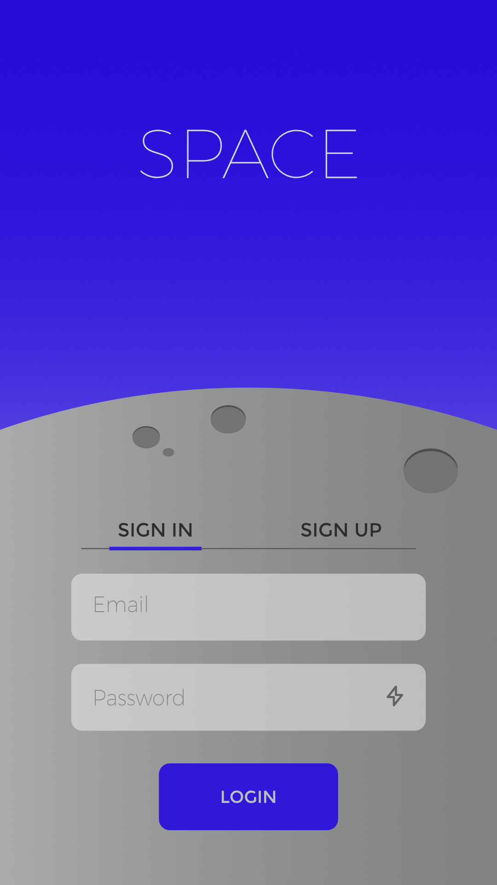
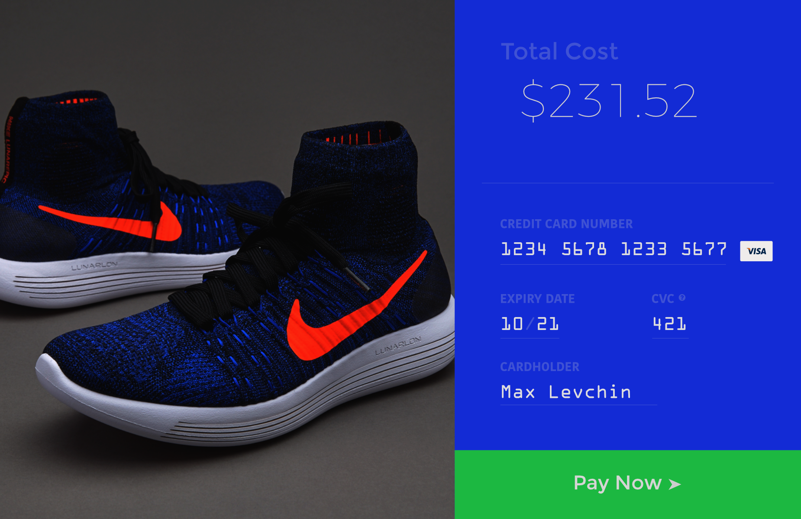
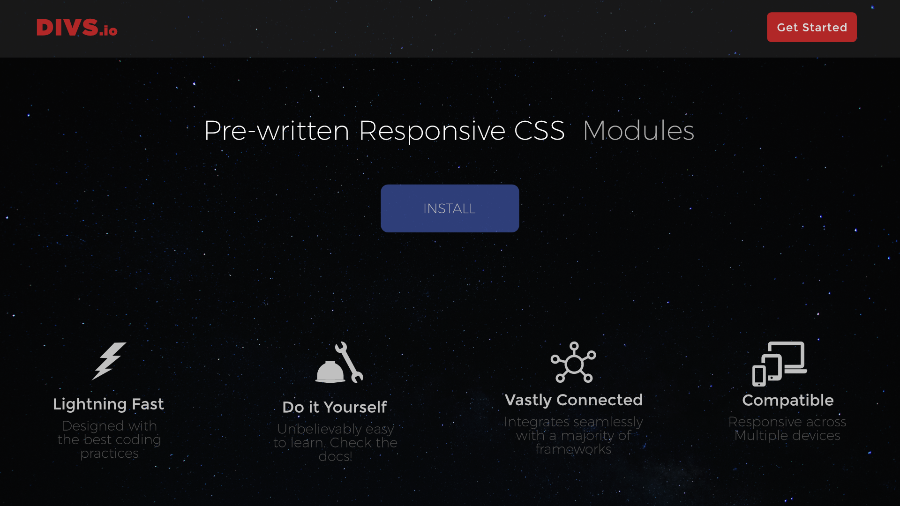
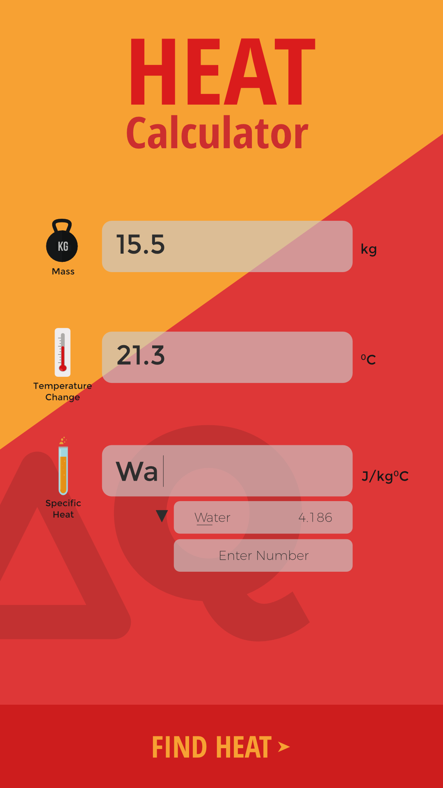
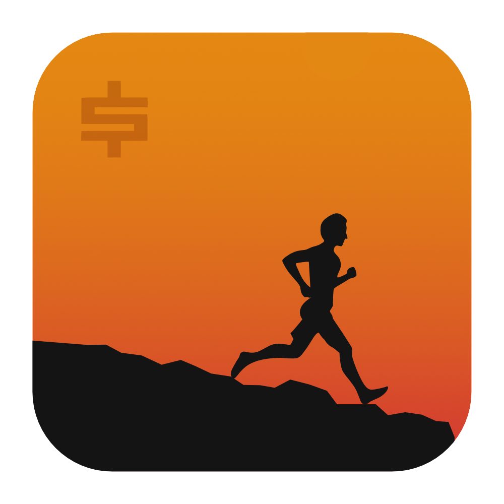
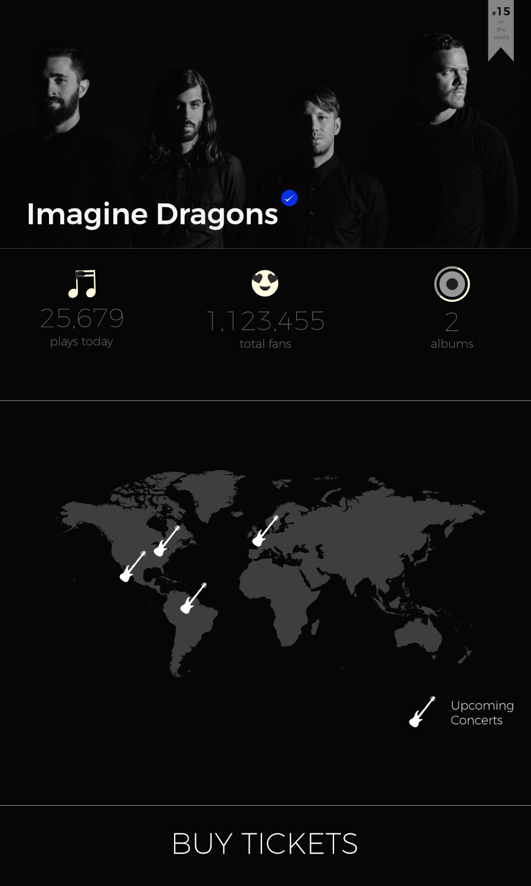
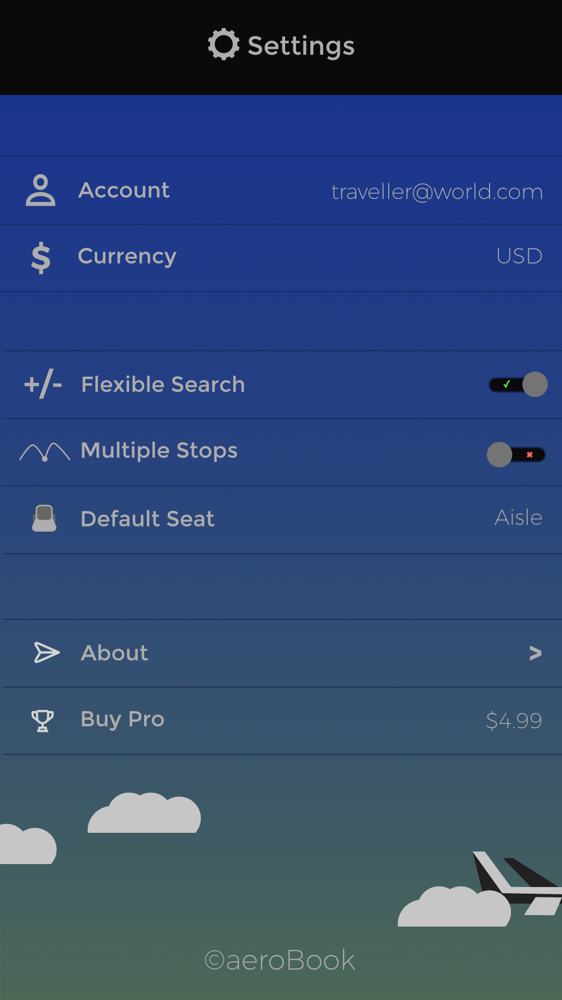
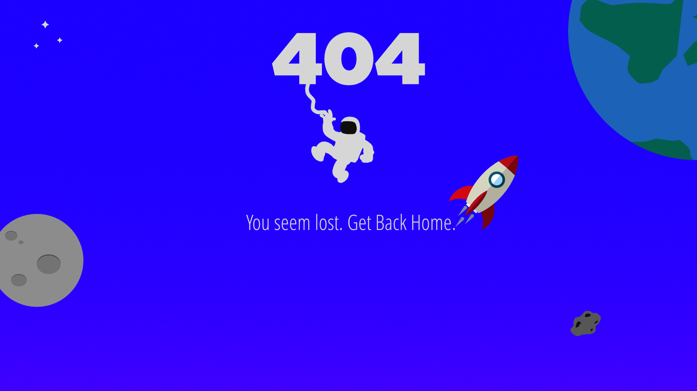
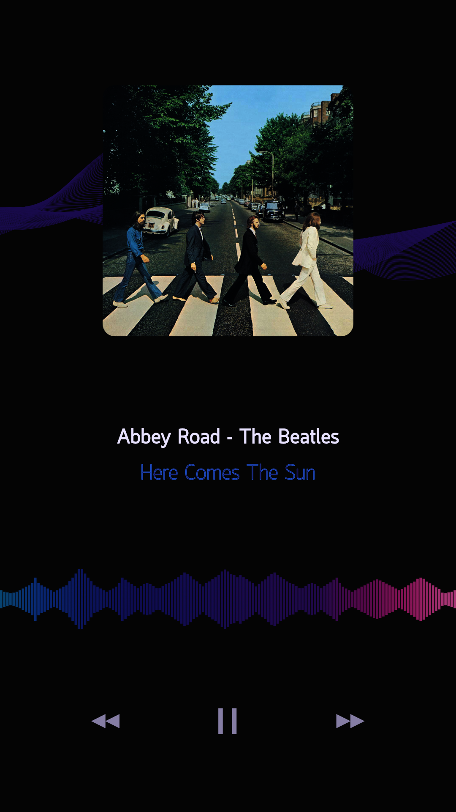
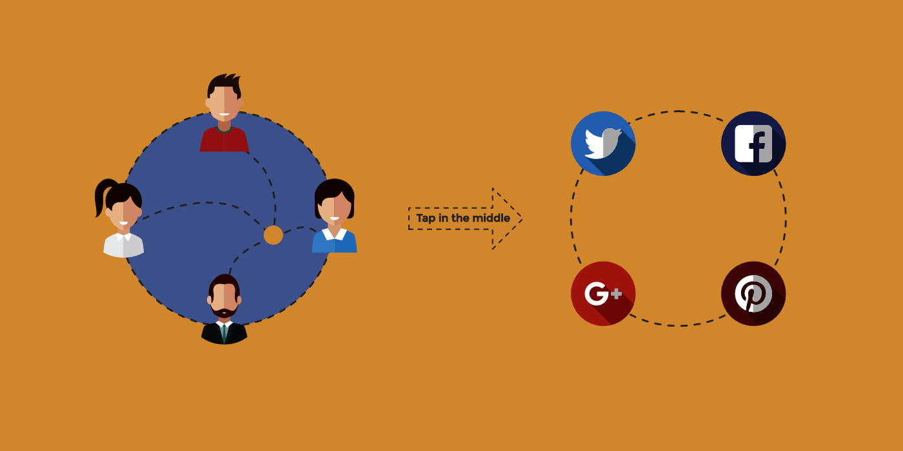

The Daily UI challenge, as the name suggests, is a 100 day long user interface design challenge. Each day, a new prompt is sent to be designed so as to challenge, motivate and inspire.

I'm very interested in User Interface Interaction. I've already taken CS 465 - UI Design and I'm planning on taking ARTD 313 - Digital Design Interaction in the Spring of 2017 at the University of Illinois at Urbana-Champaign. Below are a few of my designs to the prompts.

## Day 1

**Prompt** Design a sign up page, modal, form, app screen, etc.  
**Design Approach** Inspired by the idea of space, I tried to incorporate light colors with some grpahics relating to the topic.

## Day 2

**Prompt** Design a credit card checkout form or page. Don't forget the important elements such as the numbers, dates, security numbers, etc.  
**Design Approach** I like running and shoes were the most obvious choice for a product. I love the font credit card companies use to print numbers on the card so I thought that would be intuitive to the user.

## Day 3

**Prompt** Landing Page. Hint: What's the main focus? Is it for a book, an album, a mobile app, a product? Consider important landing page elements (call-to-actions, clarity, etc.)  
**Design Approach** I was trying to learn meteorJS at the moment so I tried to basically replicate that on a similar idea.

## Day 4

**Prompt** Design a calculator. Standard, scientific, or specialty calculator for something such as a mortgage? Is it for a phone, a tablet, a web app? (It's up to you!)  
**Design Approach** I was taking PHYS 213 and we were just taught about heat transfer so that was the first thing that came to my mind. I tried to use heat specific colors to better enhance the experience.

## Day 5

**Prompt** Design an app icon. What best represents the brand or product? Or is it incredibly unique? Does it look great at a distance and does it stand out when put on your home screen alongside other apps?  
**Design Approach** I had an idea about making a run based betting app, so this basically serves as an app icon for that.

## Day 6

**Prompt** Design a user profile and be mindful of the most important data, names, imagery, placement, etc. Is it for a serious profile? A social profile? (It's up to you!)  
**Design Approach** I tried to make a user profile for a band instead because I browsed through dribble for this challenge and almost every other person had the same thing.

## Day 7

**Prompt** Design settings for something. Is it for security or privacy settings? Game settings? What is it and what's important? (It's up to you!)  
**Design Approach** This is a weird settings app for a plane reservation app. It has a lot of uncommon features but the UI is kind of similar to the iPhone settings app.

## Day 8

**Prompt** Design a 404 page. Does it suit the brand's style? Is it user-friendly? (It's up to you!)  
**Design Approach** Building on to the Space theme from Challenge #01, this is kind of a lost in space design. Same colors with graphics to emphasize the purpose.

## Day 9

**Prompt** Design a music player. Consider the controls, placements, imagery such as the artist or album cover, etc.  
**Design Approach** The design is pretty standard actually, just with a voice form according to the status of the song. The bright colors seem up with the dark background.

## Day 10

**Prompt** Design a social share button/icon and be mindful of the size, imagery, placement, and purpose for sharing. (As always, it's up to you!)  
**Design Approach** I thought of making this one interactive because no one wants to see a bunch of share signs at each post. I don't really have much knowledge of interaction design using Framer or Sketch, so that's what I stopped here to get an idea of those skills.

## Conclusion

At this point, I realized that I need to read into how interaction design works and how exactly to use tools like [Framer](https://www.framer.com/) to better understand interaction design.
