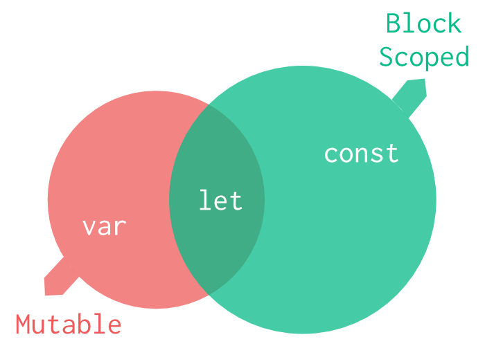
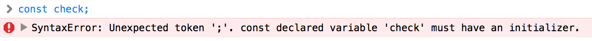
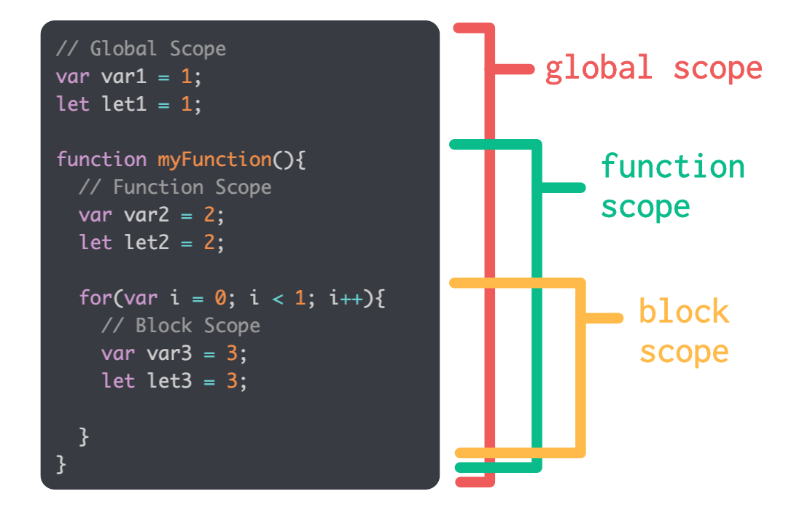
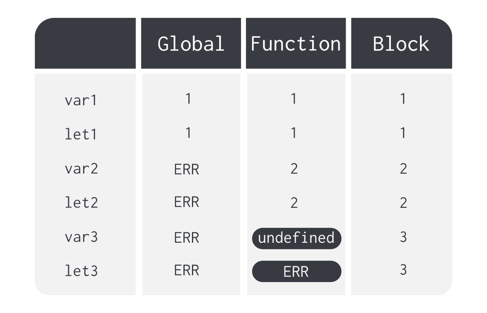

Before ES6, `var` was the only keyword used to declare variables in JavaScript.
Unlike other languages like C, variables do not need to use different keywords
based on their type. For example in C, integers undergo a different treatment
as compared to strings but in JS we don’t need to specify the type of the
variable when declaring it. JavaScript is a loosely typed language and this
makes it simple to use but onerous to understand. More on that in another
article.

With ES6 JavaScript introduced two other variable declaration keywords —`let`
and `const`. Since JS follows a dynamic typing system, what’s the difference
between these keywords?



If we were to divide variable declaration types based on their characteristics,
the Venn diagram above could be used a simplistic view.

Based on mutability, `const` is on one side and `var` & `let` on the other.
Based on scoping, `var` is on one side and `let` & `const` on the other. Let’s
explore this further.

## Mutability

A `const` variable is just like any other variable with some exceptions.

-   Need to initialize the value when declared. It throws an error otherwise.



-   A new value can’t be assigned afterward. Not very _variable_, is it?
    However we can still change its properties. Check out the gist below to see
    this more clearly. (Look into immutable.js for truly immutable datatypes).

```js
// Mutable properties of a const variable.
const check = {};
check.property = "value";

// This is totally fine.
// Also, if it is an array, it can be modified.

const check2 = [];
// check2.length = 0
check2.push(1);
// check2.length = 1`
```

Needless to say, `var` and `let` are 'normal' variables which do not need to be
initialized when declaring and can also be changed after initializing.

## Scope

The `var` falls under a different basket when scoping is considered. Unlike
`let` & `const`, the `var` is defined to the closest function or global lexical
environment. Consider the following code sample below.

```js
// Global Scope
var var1 = 1;
let let1 = 1;

function myFunction(){
  // Function Scope
  var var2 = 2;
  let let2 = 2;

  for(var i = 0; i < 1; i++){
    // Block Scope
    var var3 = 3;
    let let3 = 3;

  }
}
```

Basically in every scope there’s a variable initialized using `var` and
a variable initialized using `let`. Just to reiterate, these are the lexical
environments of the above code sample.



As mentioned earlier, `var` ignores the blocks and is defined to the closest
function or global scope. `let` and `const` on the other hand are block scoped
variables. We have a total of 6 variables defined across 3 scopes. Checking the
value of each variable across every scope gives us the following result.



The highlighted cells show block scoping in action. `var3` and `let3` were both
defined within a `for` loop which serves as a block scope. Since `var` is
defined to the closest function or lexical environment, it ignores the block
and can be accessed within function scope. Since it hasn’t been initialized by
the time we are outside of the block scope but inside the function scope, its
value is `undefined`. `let` on the other hand is a block scoped variable and
isn’t accessible outside of the block lexical environment it is defined in.
Read more about lexical environments and variable hoisting [here](/hoisting-in-javascript/).

## What to use and when?

There isn’t a solid argument for why anyone should keep using `var` anymore in
ES6 JavaScript with the advent of the new and improved `let` and `const`.
If the value doesn’t need to be reassigned or to reference a fixed value, use
`const` so that the code doesn’t get bogged down with seemingly arbitrary
values. If a variable might need to be reassigned, use `let`.
