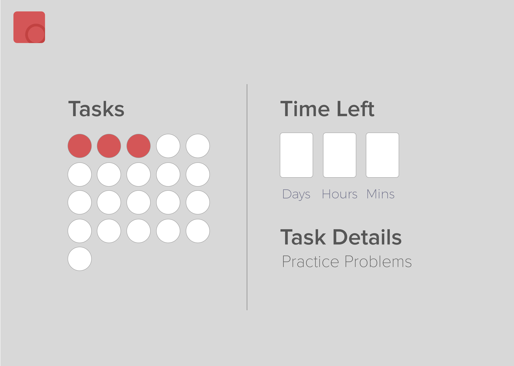
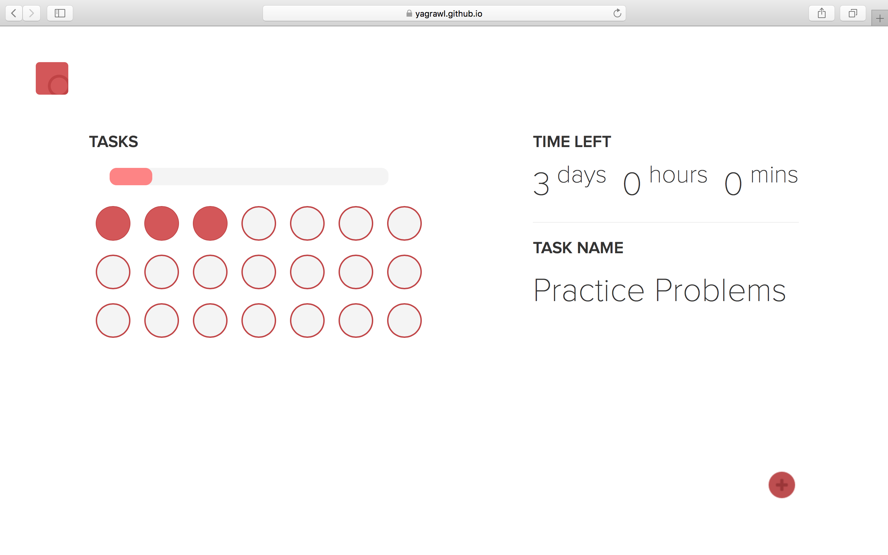

Whenever I had a few chapters to read for example, I used to draw circles on a piece of paper and cross them out as I finished each chapter. Just something that got me to work and I used to do it every time. I thought of making it into a web application so I could practice my frontend skills. I wanted to focus on the frontend and didn't really want to bother with database so it was written in HTML, CSS and Vanilla JavaScript. The first step was obviously design.

## Design

I made a high-fidelity prototype in Sketch and that was my guideline to build the app.

## Implementation

The Implementation was driven just like the design and it did make it pretty straight forward. I'll ask the user to name the task, how many tasks and how long they have to do it. After that, I wrote Javascript to make the interface as shown above. The final design was just like the design albeit with a few more addition and small changes like background color and font.

I changed the background to white and the font from Montserrat to Proxima Nova. I liked the red, so the colors are the same. I also added a progress bar which will be complete after all the tasks are done. I also added some animations to the click using animate.css, such as bouncy tasks and rotating logos.

## Storage

I didn't want to use a database or add log in and things like that because this was supposed to be for me to practice frontend. But then again, I needed it to be functional. I used the browser's local storage to save the data of completed tasks and the time and the name of the tasks. On load I'll check if local storage is defined and recreate the interface with the completed tasks. Otherwise the setup questionnaire is presented. Here's a video of how that works.

## Try it out

[Website](https://yagrawl.github.io/task)
[Github](https://github.com/yagrawl/task)
