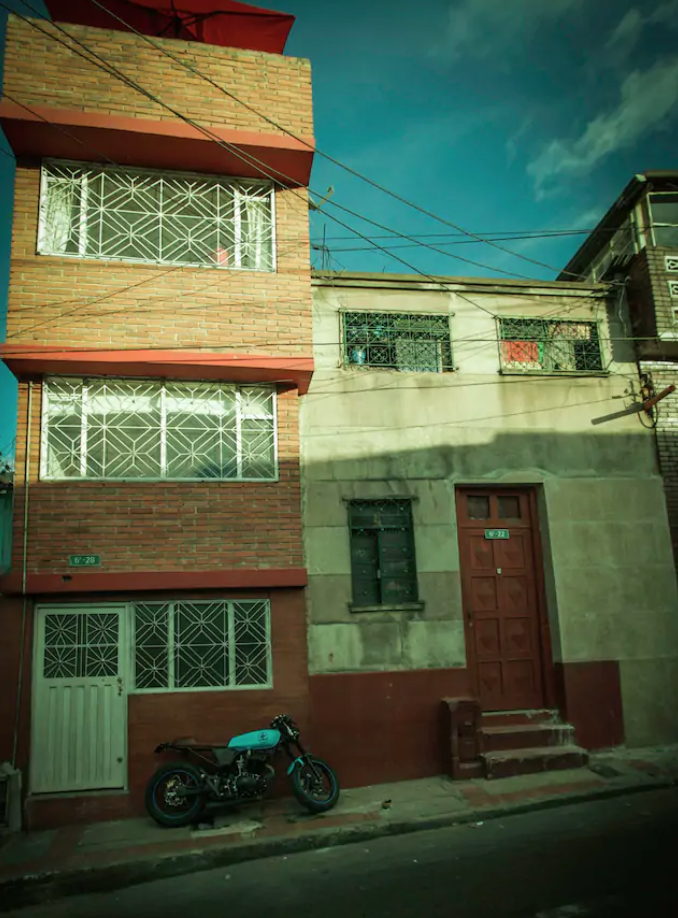
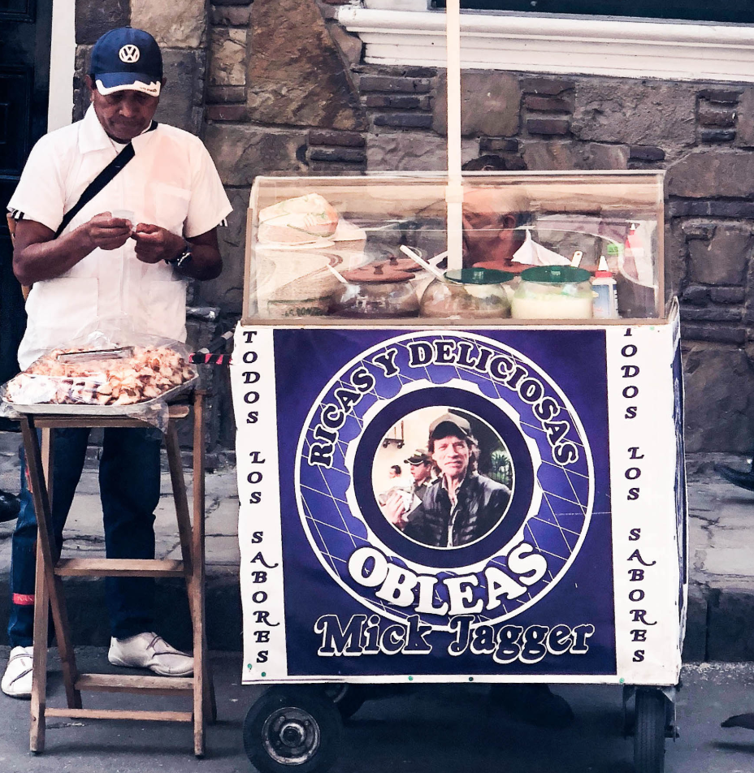
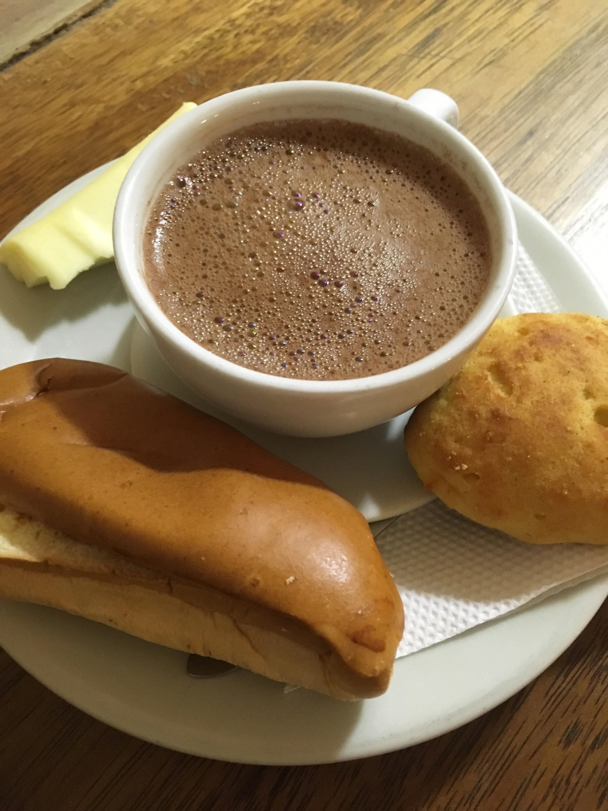
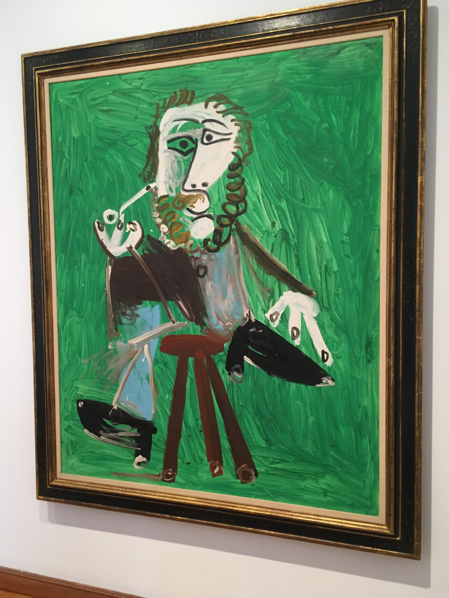
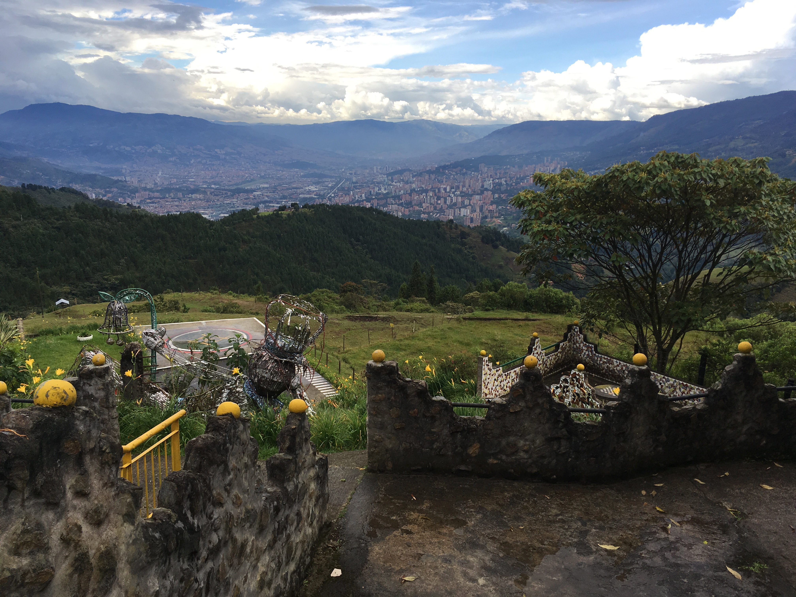
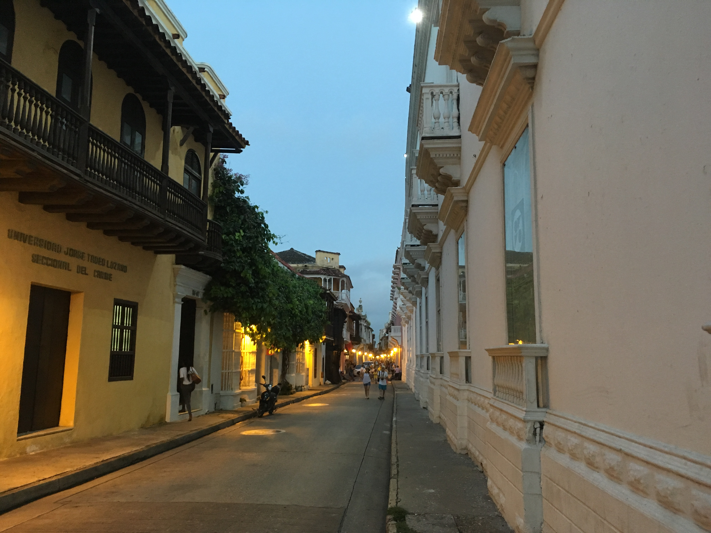

I flew to Bogotá, Colombia from Peru. I got into an Uber and headed to the Airbnb.
It was really cheap, had great reviews and seemed to be located at the center
of the city. The uber driver asked me if I was sure if the airbnb was legit
because according to him that area was sketchy, also, in the photos, the building
looked run down from the outside. I was a little skeptical about Colombia to
begin with, given its history and this definitely wasn't helping.

I got to the Airbnb and it was indeed really nice from the inside and so were
the hosts. A little bit after dropping me, the uber driver texted me and asked
if I was safe and again this is just one instance of how nice I felt people
were to tourists in South America.

It was some public holiday so I went to the main square with the airbnb hosts
and walked around taking in the artists putting up their shows and eating the
street food. Apparently, Mick Jagger at some point ate an _Oblea_ (Thin wafers
  sandwiching dulce de leche) from a street vendor in Bogotá and now every
  other cart claims Mick Jagger ate from their cart.

Another thing I would highly recommend in Bogota is to get _chucula y almojábanas_ which
is basically hot chocolate with cheese and soft bread at [_La Puerta Falsa_](https://www.lonelyplanet.com/colombia/bogota/restaurants/la-puerta-falsa/a/poi-eat/419079/363308) located just off the _Plaza de Bolívar_.

Another restaurant I would very highly recommend is [_El Bembe_](https://www.tripadvisor.com/Restaurant_Review-g294074-d3780825-Reviews-El_Bembe-Bogota.html). I had one of
the best meals of my life at this place.

I spent a couple more days visiting museums, art galleries, eating and well
then I headed over to Medellín.

I just had a day in Medellín and I wanted to make the most out of it. I am a
huge fan of the Netflix series _Narcos_ and I wanted to take a tour of the sites
related to the show. The guide took me to _La Cathedral_ which was the prison
Pablo Escobar built for himself.

I also saw Escobar's grave and a bunch of other places. I then ate some dinner
and prepared to head to Cartagena the next day.

Cartagena is a place where people come to relax. It is incredibly beautiful!

After a couple more days in Cartagena, I headed back to Chicago.
