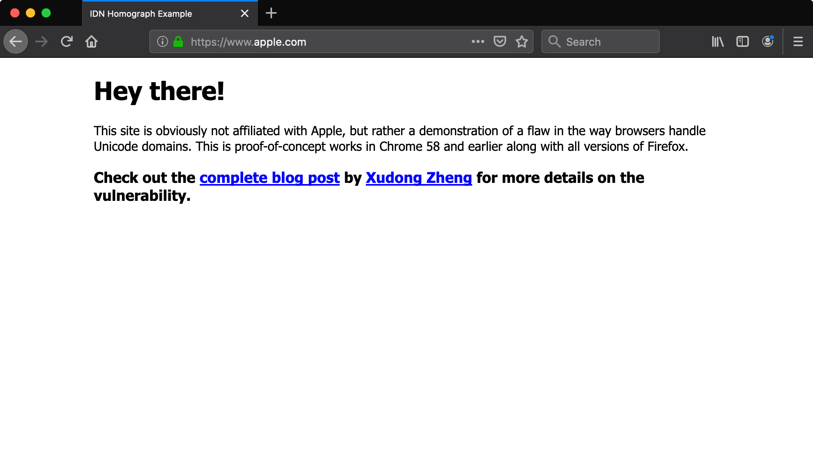
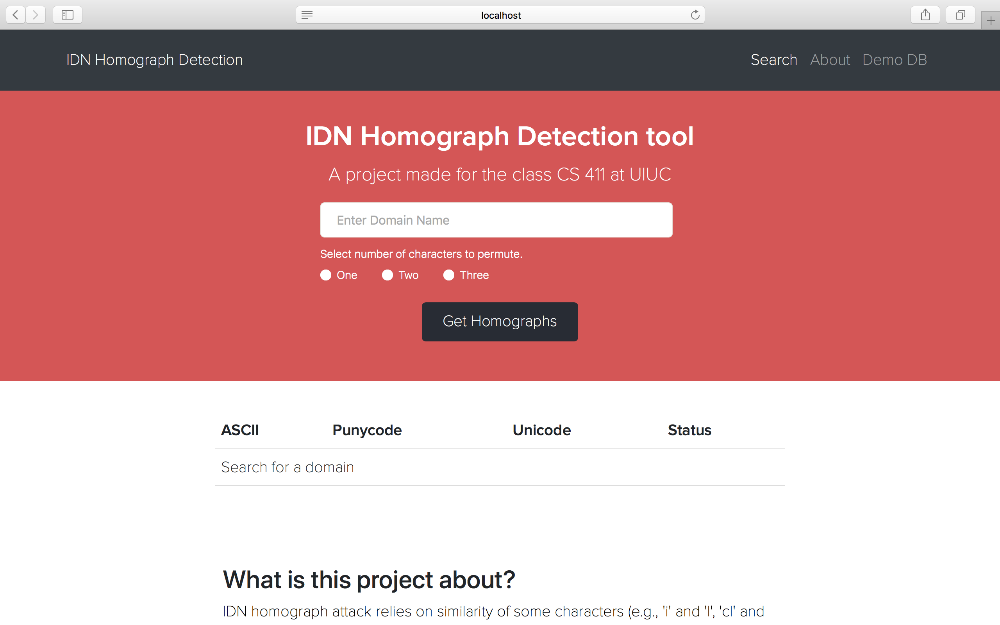
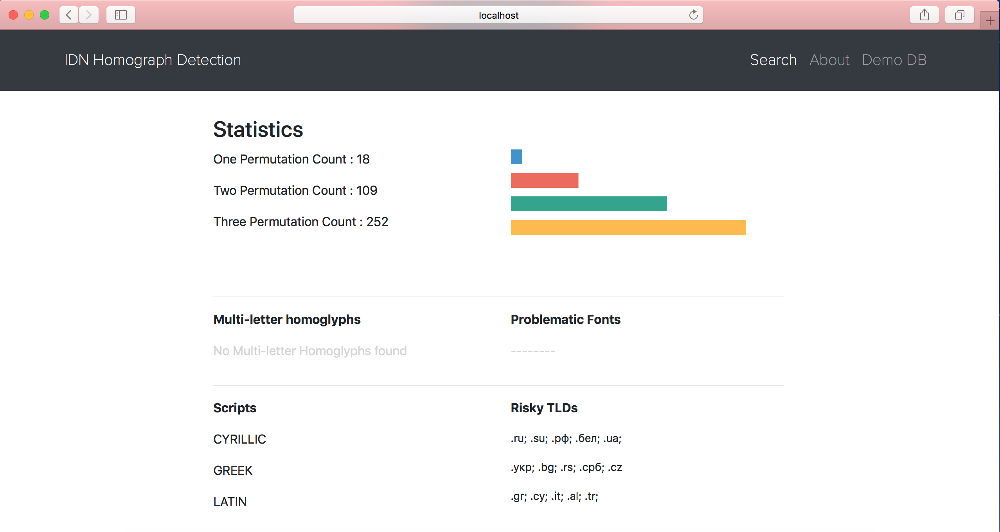
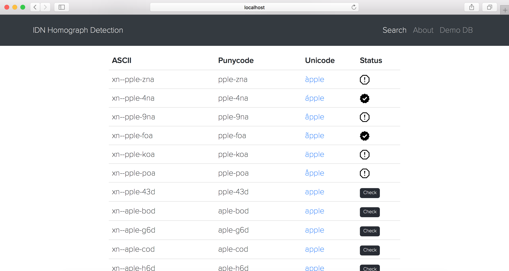

I was taking a database class in the Fall of 2017 and as part of the course I had to work in a group of 4 on a database related project. A team-member introduced me to the problems with IDN homographs. So what exactly is the issue with IDN homographs? According to wikipedia, 'The internationalized domain name (IDN) homograph attack is a way a malicious party may deceive computer users about what remote system they are communicating with, by exploiting the fact that many different characters look alike, (i.e., they are homographs, hence the term for the attack). For example, a regular user of example.com may be lured to click a link where the Latin A is replaced with the Cyrillic A.'

Try this [link](https://www.xn--80ak6aa92e.com/) for example. Don't worry it is safe. In Google chrome today (as of November 2017), it shows up in its original Cyrillic form but try Firefox, it looks exactly like apple.com. It even has an SSL certificate.

What happens if someone does that to chase.com -- changing the 'a' to Cyrillic, and recreating the frontend. The account information of an unaware user is comprised that easy. There has actually been an attack which was discovered in September of 2017 where hackers used a homograph of adobe.com to deliver betabot trojan.

## Setup

Hopefully I have convinced you that this is a huge problem. Solution? Well, the browsers could start displaying Punycode. Chrome and Opera already do that. For the homographs that do exist which might be accessed by browsers that don't have this functionality as of now, companies need to make sure that their domains aren't attacked. A database to list all the possible homographs of a url and check if it is already registered and that is what we decided to build for this class.

## Implementation

We contacted Verisign to get the data for the existing .com TLDs. That was a 10 GB plus file. I wrote a parser that separated out all the Cyrillic domains and the domains with commonly messed up letter combinations like rn -> m. Since this class was a 4 month course and every person on the team had a full course load, we didn't aim too high. Just a simple search engine for existing homographs and ways to find their information. My main responsibility was the frontend and UI. This was the finished product we came up with.

The landing screen had a big search bar in the middle to make it obvious what the purpose was. You could also choose the number of permutations of characters because each permutation adds a huge number of homographs.

After a domain is searched, apple.com here for example, the details about that domain are displayed. Number of possible homographs, which scripts it might have problems in, existance of multi letter homographs and problematic fonts for them and based on scripts, a list of risky TLDs.

Finally the list was displayed in a table form where each possible homograph was shown in its punycode, ASCII and unicode form. You could check the status to see if a domain was already registered and it would call our database and confirm. My main contribution to this project was the UI and the frontend. In addition to that I also worked on the APIs and the parsers for sorting out the Verisign data. This was a problem that I had never faced before but I do understand its impact and I hope that all the major browsers get this fixed.

## Try it out

[Github](https://github.com/yagrawl/Homograph)
