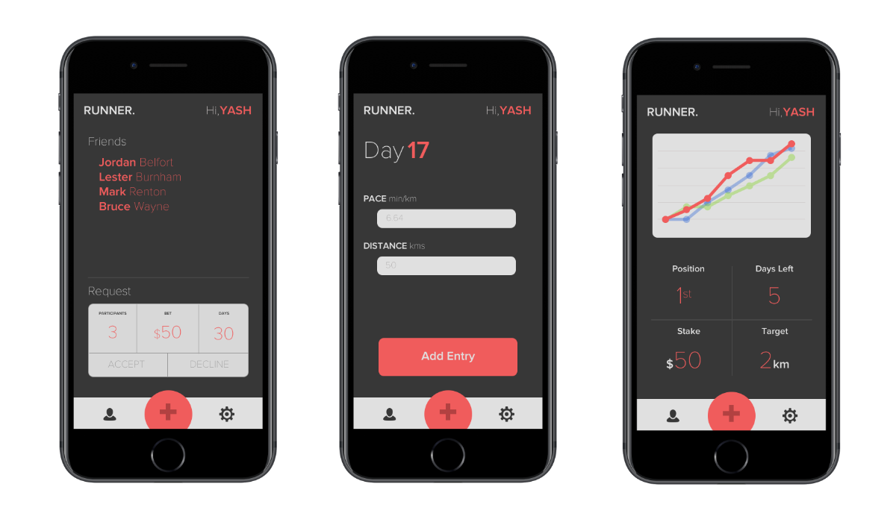
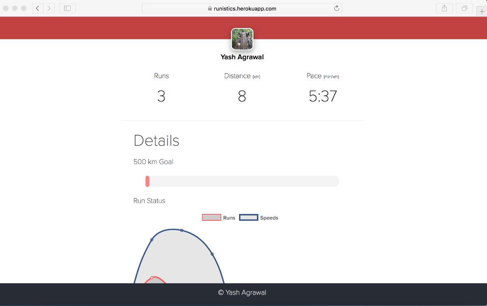
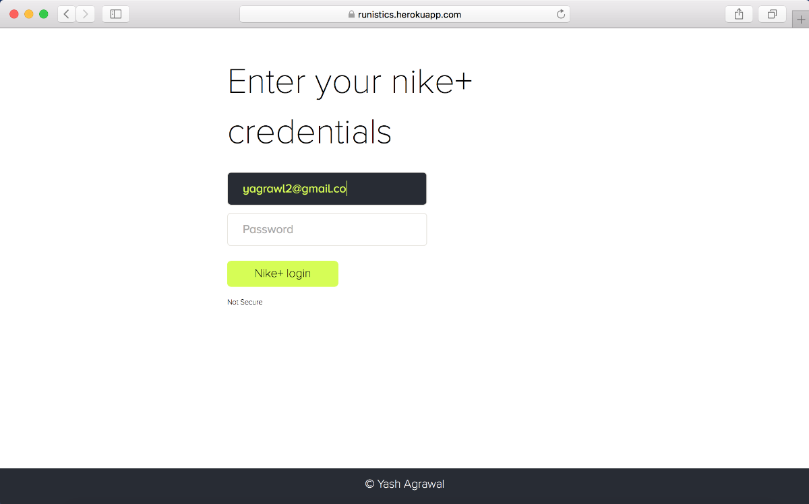

I like running but I'm not too motivated to do it everyday. I thought it would be a great idea to bet with people for a fixed duration of time. Whoever runs the most wins. Very simple concept and could have easily been done by straight up just keeping track of runs in a month and paying in person but this way, I could practice some full stack web development. There were also a lot of challenges involved, and this is still an in-progress app. Here's the process:

## Research

So, the application was supposed to do the following things:

-   Connect friends and set up a bet.
-   Keep track of the runs in that duration.
-   Notify users of the status.

Pretty straightforward. But, there were a lot of problems. Since I live in Champaign, IL it gets brutally cold in winters and running outside is not an option. So there are a fair amount of runs that happen indoor on the treadmill. The two options I was looking at were Nike+ and Strava. Strava has no support for indoor runs so Nike+ was the obvious choice to track. Further problems came in when I realized that Nike+ doesn't have a public api. In fact there are no existing developer documents about this thing. That was a huge challenge. I also kept in mind that I was doing this as a fun project for me and a couple other friends so my priority was getting the job done. Even if I could create a manual input form application, that should solve the problem.

## Design

I spent a few hours on designing how the app would look like. Initially I wanted it to be an app because Nike+ is an app and its just easier to enter data on a phone than on the computer.

So basically, users create an account with the app. I am no longer using Strava or Nike+. After they are logged in, they are prompted to add a few friends. Setting up a bet is again very straightforward. They just add the people they want on the bet, duration and the money. After they are added, the users get a notification and an option to either accept or reject the bet. Once a bet has started, the stats are shown in the far right screen. All the required information is visible at a glance. The data is added manually where a user will be notified everyday at a certain time to enter run data manually which could be tracked by either Nike+ or directly from the treadmill. Full disclosure - the finished (sort of) product looks nothing like the design. Not that it has bad UI, but I went in a different direction as the app progressed.

## Implementation

At this point I have realized that adding data manually isn't really feasible. Also another big pivotal point was that we decided not to compete with each other anymore. Last time I was doing it, I increased by average mileage by more than 300% within 5 days and suffered a terrible case of Runner's Knee. Now, I decided that the competition would be with a target. For example, 500 kms a year is a decent target. I now wanted to pivot the app based on the target. Strava has a great public API so I decided to use that. I used NodeJs with a mongoDB database, Express and the frontend was written in EJS. The finished product looks something like this.

Initially after going through the entire process of authorization and getting a token from Strava, I wanted to get some running data right out the bat with the same API call so I used a promise and generated the basic landing screen. The details button gets all the run data after 1st Jan 2018 UNIX epoch time. I used chartjs to create line graphs of speeds and runs. There's a progress bar which would be filled up at 500 kms. Now since the basic app was done, I still had another problem with getting the runs into strava in the first place. It still doesn't record treadmill runs like Nike+ does and manual input is a chore. There had to be a better way.

## Challenges

Getting runs into strava automatically was indeed a challenge because Nike+ has such a closed system. Sure there are a couple of websites that help with run transfers at a minimal charge but at times even they didn't work. I ended up adding another additional login page.

I plan use a headless browser, log in to Nike+ with the credentials and scrape all the runs and use the Strava post API to add these activities and create graphs. Or I could remove Strava out all together and just use the scraping to get all the data. There are more challenges because I can't just store log in information in plain text. I'll need to encrypt it. Work in progress.

## Try it out

[Website](https://runistics.herokuapp.com/)
