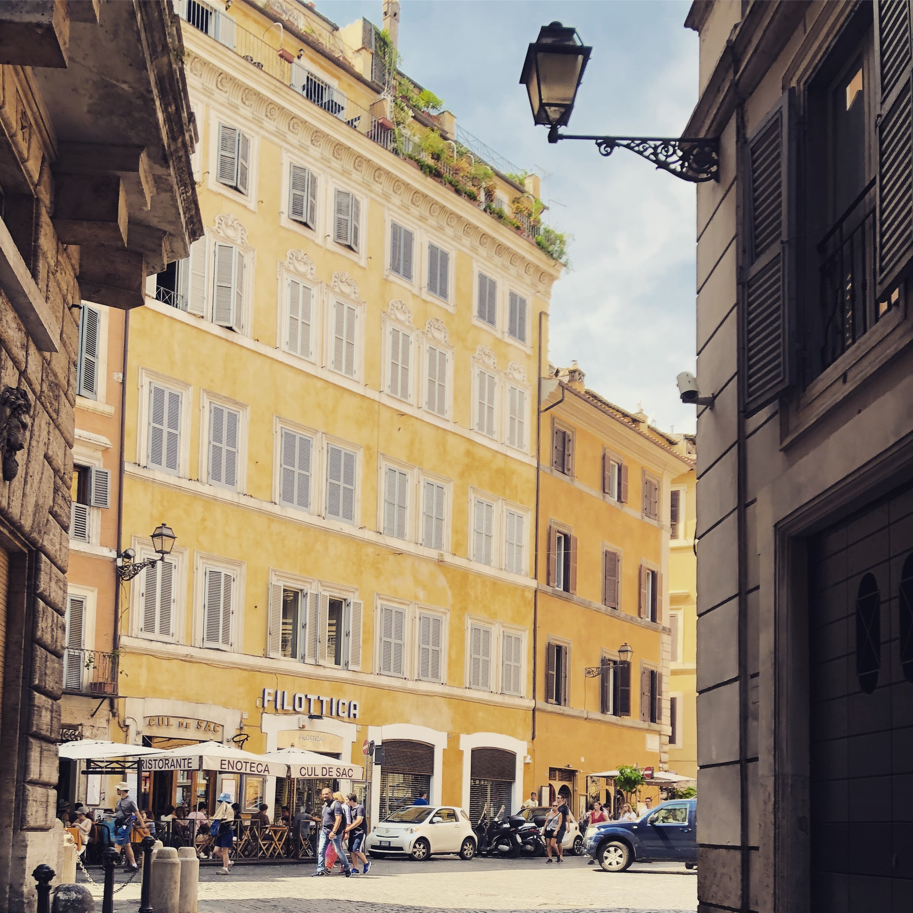
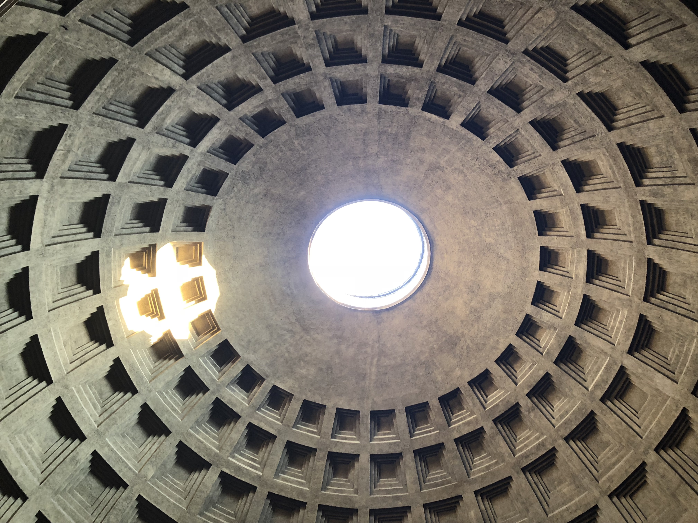
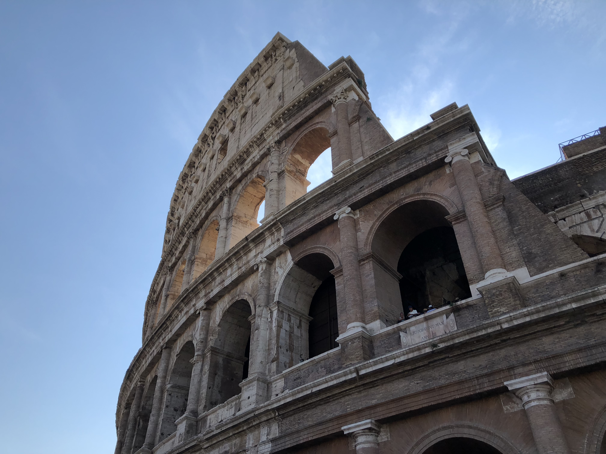
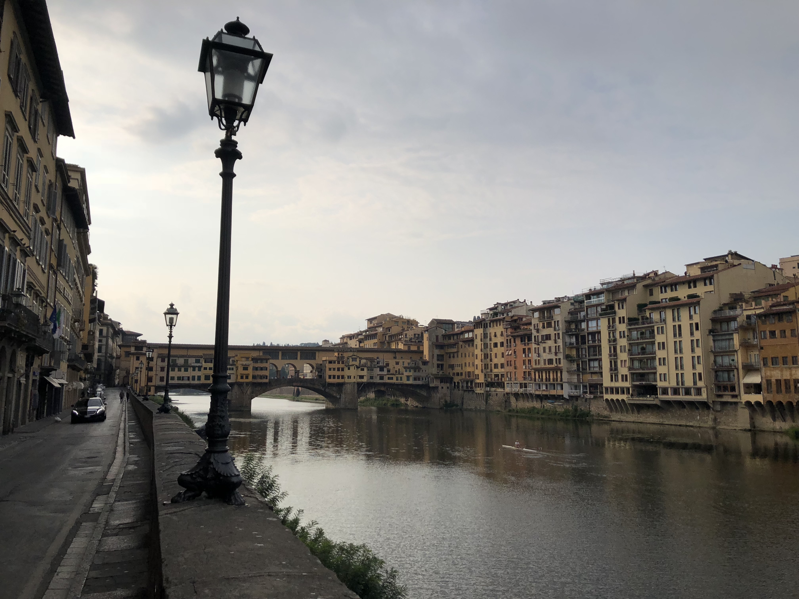

After Stockholm, I flew to Rome. Getting to the Airbnb was a little more hectic than I would have liked. As soon as I landed, I realized that my phone plan wasn't working. I got a new one as quickly as I could find because I had to run and catch a train. Obviously, the card takes around 2 hours to get activated so well, it was useless. I got on the train and apparently, it was the wrong one.

I got off at the station and in broken Italian, I kept asking for directions,
while dragging my luggage on my back and thirty minutes later I reached my Airbnb. Despite that hiccup, I was in Italy for only about three and a half days and I wanted to make the most out of it.

After that, I ate a whole lot of Pizza and Gelato. It was obviously amazing! I walked around the city a little bit and honestly, after a while, it starts feeling like a theme park. Most cities have one old building with ancient architecture which has become a tourist attraction over time. Part of its charm is that it withstood the test of time, while buildings around it collapsed, it stayed up. In Rome, every other building is old and ancient and good enough to attract a huge tourist crowd just to see that one building.

One of the most interesting buildings I saw in Rome (apart from the Colosseum, obviously) was the Pantheon.

The next day I went on a tour of the Colosseum. There are a lot of interesting things about the Colosseum and I recommend everyone to read more about it.

For the rest of my time in Italy, I attended a Pasta making class where I made pasta from scratch without a machine. I ate a bunch of pizza, pasta, and gelato, and drank a whole lot of cappuccino and espresso.

I would highly recommend [Angelino ai Fori](https://www.yelp.com/biz/angelino-ai-fori-roma-4)
for Iced Coffee, [Pompi](https://barpompi.it/) for Tiramisu
and [Frigidarium](https://www.yelp.com/biz/frigidarium-roma) for Gelato.

The third day I headed to Florence on a train. The Airbnb wasn't going to be available till 2 PM and I got there at around 7:30 in the morning. To not lug my bag around till then I used something called [BagBnb](https://bagbnb.com/) to store my luggage. I also biked around Florence a bunch and it was a lot of fun.

`youtube:https://www.youtube.com/embed/dV8vAxrqYq8`

Florence is really pretty and definitely worth a visit. I'm sure there are a lot of amazing places to visit in Italy that I can't attest to at the moment but from what I've seen, Florence is definitely one of them.

I ate some more in Florence and the food was absolutely amazing. I think I gained at least 4 pounds in the last 3 days. The next day I flew back to Chicago to complete my last semester in college.
