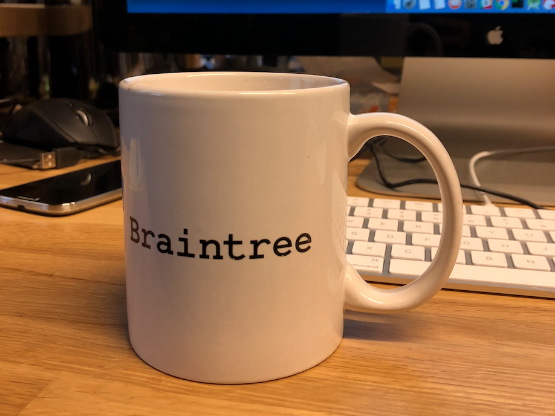
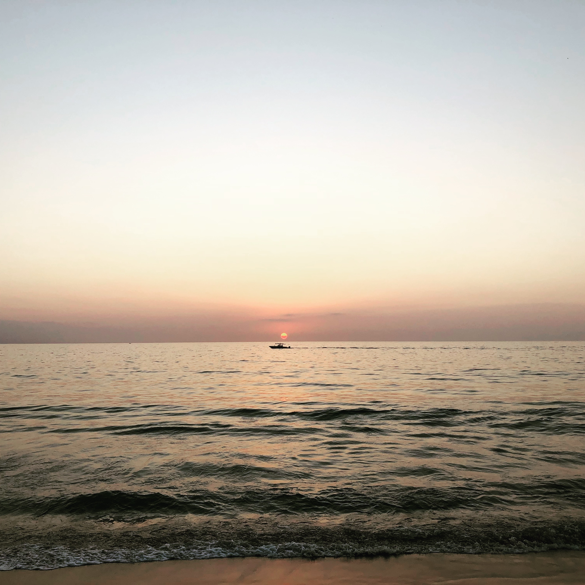
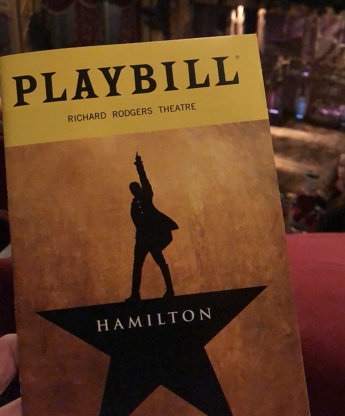

Here are a few things I did during this year and some goals for the coming year.

## Work

I interned at Braintree Payments in San Francisco over the summer. It was an
amazing experience and I'll be starting full time in February next year. I
learnt a lot of new things in my internship but it definitely felt like a
knowledge dump. I hope to get a more in-depth understanding of the things I've
learnt in my internship once I start working full-time next year.

## College

I left the last semester of college for all the courses that I really wasn't
into but were a required part of the curriculum. A bunch of electrical courses
are required as part of the Computer Engineering coursework at UIUC. For senior
design my team ended up making a barely working prototype of a vest for the
visually impaired that uses ultrasonic sensors to detect where an obstacle is
and uses positional tones to provide feedback to the user. It looks like a mess,
but it definitely worked!

I also worked on a full stack side project called [Ballot](/ballot) which is
basically a polling application written in React & Node.

`youtube:https://www.youtube.com/embed/UsVOjNbTrYs`

## Running

I didn't run a lot. **251.79** KM in total. The last 6 months I only ran **24.46** KM.
I need to be consistent throughout the year.

<iframe src="https://runstats.netlify.com/2018"
        class="runstats"
        frameBorder="0"
        scrolling="no"></iframe>

I plan to run 600 KM this coming year - basically 50 KM every month. I also want
to be able to run a 10 K. The max distance I've been able to do comfortably so
far is 5 KM and I definitely want to increase that.

## Travel

I've traveled to a few countries this year.

-   Mexico
-   [Sweden](/visit-to-stockholm)
-   [Italy](/short-trip-to-tokyo)
-   [Turkey](/layover-in-istanbul)

Also a bunch of places within the US and India. After graduation, I plan to
travel to Japan for a few days and hopefully more places.  

## Movies

I love watching movies and these are a few of the ones I really loved this year.

-   [Capernaum](https://www.imdb.com/title/tt8267604)
-   [Hereditary](https://www.imdb.com/title/tt7784604)
-   [Shoplifters](https://www.imdb.com/title/tt8075192)
-   [Spider-Man: Into the Spider-Verse](https://www.imdb.com/title/tt4633694)
-   [Beautiful Boy](https://www.imdb.com/title/tt1226837)

## Misc

This year I saw Hamilton the musical at the Richard Rodgers Theatre in New York.
It was spectacular!

Next year will be vastly different than the last 4 years of college and I hope
to make productive use of my time in the coming year.
