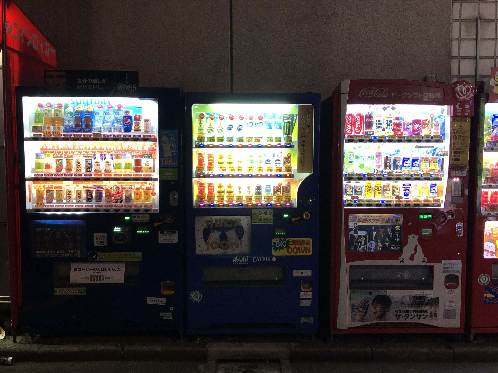

After graduating from college and before starting work full-time I decided to travel a bit. On my way to San Francisco to start the job, I decided to take a layover in Tokyo for a few days. This was my first ever experience traveling alone.

The very first night, I decided to stay in a capsule hotel to experience what that is like. (Also, I was going to arrive at about 9 PM and didn't feel like spending a whole lot on a hotel to just sleep.)

This place is called 9Hours and its in Shinjuku's Korea town. After I lugged my huge overweight bag from HND on two different trains and a couple of stations with no escalators, I was very glad to have a quick and easy check-in. I stuffed my things in the lockers, showered, and went out for a walk.

I saw a bunch of vending machines just lying outside and that was interesting. I also got a bunch of snacks from 7 Eleven and most of it was amazing. I then called it a night and that was about it for day 1.

The next day I moved to the Hyatt Regency in Shinjuku and I asked for a room on a higher floor. The receptionist was very nice and gave me a room on the 19th floor. After settling in I decided to get some lunch. It is always daunting to go out and eat alone but I was in Tokyo and there was no way I was going to order in.

I went to a Tonkatsu restaurant called [Katsukura](https://www.yelp.com/biz/%E5%90%8D%E4%BB%A3%E3%81%A8%E3%82%93%E3%81%8B%E3%81%A4-%E3%81%8B%E3%81%A4%E3%81%8F%E3%82%89-%E6%96%B0%E5%AE%BF%E9%AB%98%E5%B3%B6%E5%B1%8B%E5%BA%97-%E6%B8%8B%E8%B0%B7%E5%8C%BA). It had almost an hour of waiting time. I guess that feels like a norm with good Japanese restaurants. The food was amazing. I couldn't do much after that lunch so I came back to the room and napped for a bit.

In the evening I had an _Airbnb experience_ booked to walk around in Shibuya. The tour was fun and very informative. I got to see the busiest crosswalk which apparently wasn't as busy as it usually is because it was some public holiday. I also went to one of the biggest Don Quixote. There are a bunch of Kit-Kats. Japan is famous for its different Kit-Kat flavors. Apparently, Kit-Kat coincidentally translates to "You'll surely win" in Japanese.

I decided to go to Akihabara and see what the fuss was about. I never got into Anime but that place was highly recommended. I went into a Pachinko parlor and I started playing the game. I definitely didn't plan it out because there wasn't a way to switch language on it so I was just randomly pulling levers. Suddenly the machine started blaring and I freaked out. What freaked me out, even more, was that no one batted an eyelid to even look up what the confused Indian kid did to the machine to make it scream so loudly. I kept a pachinko ball as a keepsake. I hope that is allowed.

I roamed around a little bit more and got back to my room a little late so I just decided to order some room service. That ends day 2.

The next day I woke up early in the morning and walked to the park near the hotel. Shortly after I had a Sushi making class and it is safe to say that I am going to attempt to make it again on my own when I get back.

Later in the evening, I went on a Sake and Ramen tour. I tried a bunch of
different ones and I think I found my new favorite - Dassai 50. The ramen was absolutely delicious and I can't wait to eat more.

I also was raiding the 7 eleven at the ground floor of the hotel for new and different snacks and I think I found a new favorite coffee-flavored candy.

The next day I went to a park in the morning and then went to see the Sensoji Shrine. It was really peaceful in spite of tourists like me swarming the place.

After that, I went to Ginza and this part of town definitely feels like it is from the future. I bought some high-end chopsticks that I hope to use with the Sushi I plan to make when I get back. Hopefully, that happens.

Another thing I wanted to see was a spot where The Killers shot the
'Read My Mind' music video. I found this street in Shinjuku that looks like
the video albeit 10 years later.

And here's the [original](https://www.youtube.com/watch?v=zc8hbSM1zVo). Looks the same, right?

I also wanted to go see this place in Odaiba. It was a really interesting
building that I had seen pictures of and I really wanted to see it in person.
I only had a rough location so it took some effort to find the
exact place. It is apparently a co-working space and it is absolutely
spectacular.

Later I met a friend who is working in Tokyo and went to the New York Bar atop the Park Hyatt in Tokyo. I loved [_Lost in Translation_](https://www.imdb.com/title/tt0335266/) and I really wanted to go to that bar. The view from the top was spectacular.

The next day, I concluded my short trip to Tokyo and headed to the airport to fly to San Francisco to start my new job at Braintree.
