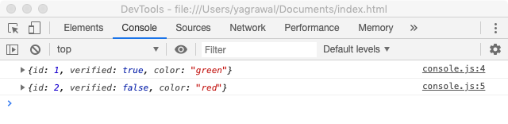
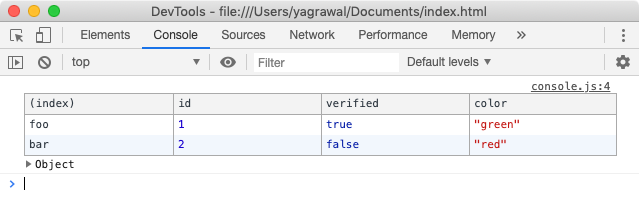
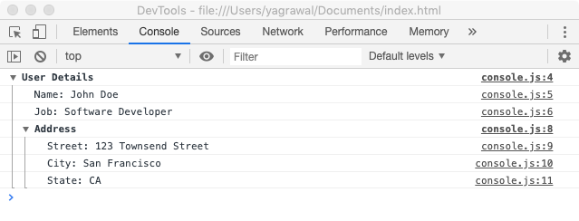
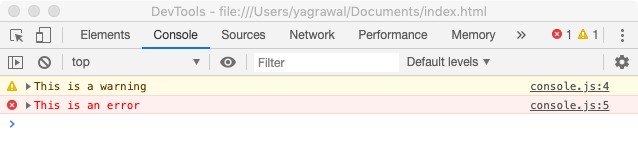
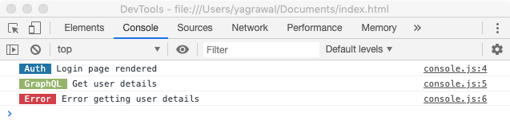
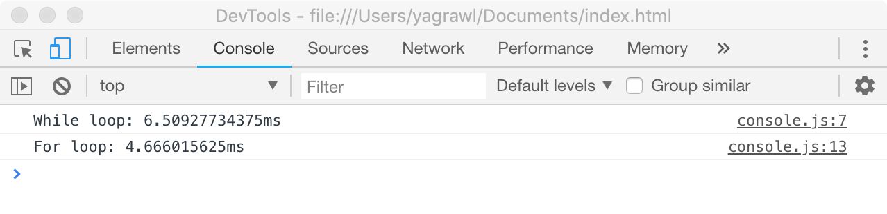

One of the easiest ways to debug anything in JavaScript is by logging stuff
using `console.log`. But there are a lot of other methods provided by the
console that can help you debug better.

Let’s get started.

The very basic use case is to log a string or a bunch of JavaScript objects.
Quite simply,

```js
console.log('Is this working?');
```

Now, imagine a scenario when you have a bunch of objects you need to log into
the console.

```js
const foo = { id: 1, verified: true, color: 'green' };
const bar = { id: 2, verified: false, color: 'red' };
```

The most intuitive way to log this is to just `console.log(variable)` one after
the other. The problem is more apparent when we see how it shows up on the
console.



As you can see, no variable names are visible. It gets extremely annoying when
you have a bunch of these and you have to expand the little arrow on the left
to see what exactly the name of the variable is. Enter computed property names.
This allows us to basically club all the variables together in a single
`console.log({ foo, bar });` and the output is easily visible. This also
reduces the number of `console.log` lines in our code.

## console.table()

We can take this a step further by putting all of these together in a table to
make it more readable. Whenever you have objects with common properties or an
array of objects use `console.table()`. Here we can use
`console.table({ foo, bar})` and the console shows:



## console.group()

This can be used when you want to group or nest relevant details together to be
able to easily read the logs.

This can also be used when you have a few log statements within a function and
you want to be able to clearly see the scope corresponding to each statement.

For example, if you’re logging a user’s details:

```js
console.group('User Details');
console.log('name: John Doe');
console.log('job: Software Developer');

// Nested Group
console.group('Address');
console.log('Street: 123 Townsend Street');
console.log('City: San Francisco');
console.log('State: CA');
console.groupEnd();

console.groupEnd();
```



You can also use `console.groupCollapsed()` instead of `console.group()` if you
want the groups to be collapsed by default. You would need to hit the
descriptor button on the left to expand.

## console.warn() & console.error()

Depending on the situation, to make sure your console is more readable you can
add logs using `console.warn()` or `console.error()`. There’s also
`console.info()` which displays an ‘i’ icon in some browsers.

    

This can be taken a step further by adding custom styling. You can use a `%c`
directive to add styling to any log statement. This can be used to
differentiate between API calls, user events, etc by keeping a convention.

Here’s an example:

```js
console.log('%c Auth ',
            'color: white; background-color: #2274A5',
            'Login page rendered');
console.log('%c GraphQL ',
            'color: white; background-color: #95B46A',
            'Get user details');
console.log('%c Error ',
            'color: white; background-color: #D33F49',
            'Error getting user details');
```

You can also change the `font-size` , `font-style` and other CSS things.

    

## console.trace()

`console.trace()` outputs a stack trace to the console and displays how the
code ended up at a certain point. There are certain methods you’d only like to
call once, like deleting from a database. `console.trace()` can be used to make
sure the code is behaving the way we want it to.

## console.time()

Another important thing when it comes to frontend development is that the code
needs to be fast. `console.time()` allows timing of certain operations in the
code for testing.

```js
let i = 0;

console.time("While loop");
while (i < 1000000) {
  i++;
}
console.timeEnd("While loop");

console.time("For loop");
for (i = 0; i < 1000000; i++) {
  // For Loop
}
console.timeEnd("For loop");
```

  

Hopefully, the article provided some information on various ways to use the
console.
