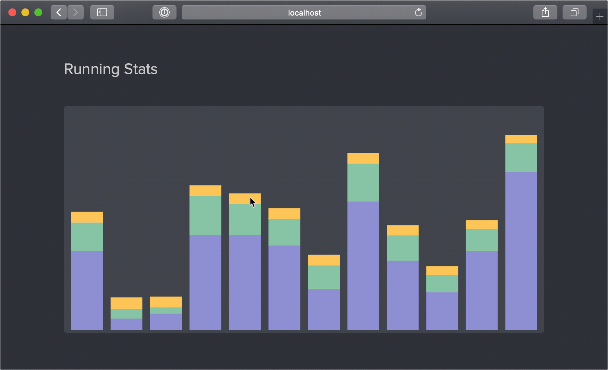

Here are a few things I did during this year and some goals for the coming year.

## Work

This year has been significantly different than any other in all of my 23 years.
I started my first full-time job this February after graduating college. Working
full-time is a very different experience as compared to college. There are clear
pros going for the working routine but it does take away some amount of freedom.
I could very easily stay up till 3 AM on a Tuesday night, hanging out with my
friends in college but I can't really do that now because well, I have to go to
work on Wednesday. I do however appreciate the weekends free of worrying about
deadlines.

I started working at Braintree as a Software Developer on the Bank Payments
team. I've learnt a lot of new things about how full stack development works at
a level much higher above my personal projects. I feel like the knowledge I have
about these systems is still very superficial and I aim to get more depth in the
coming year.

I worked on a couple of side projects but kind of left them halfway. I tend to
do this quite a bit. Next year, I want to make one side project but see it
completely to the end (or something that can be used by at least one person
  other than me).

## Running

I have run consistently throughout the year and completed 585.1 KM. My pace has
improved steadily and even the distance that I can run has increased. I can run
a 10K without feeling dead afterwards.

I plan to run a 1000 KM this year and hopefully the [San Francisco Half Marathon](https://www.thesfmarathon.com/)
in late July.

## Travel

I've been to a few places this year. Mostly before starting full-time work.

-   Thailand
-   Maldives
-   Japan

Also a bunch of places within the US and India. This year I have already planned
to travel to South Africa and a couple other countries (hopefully).

## Reading

I didn't get a lot of reading done over the year but I really liked the ones I
did end up reading.

-   **Shortest Way Home** by _Pete Buttegieg_
-   **Shoe Dog** by _Phil Knight_
-   **The God Delusion** by _Richard Dawkins_
-   **Sapiens: A Brief History of Humankind** by _Yuval Noah Harari_

I have a lot of books that I want to read this year already shortlisted and I
aim to spend some of the binging time on completing those books.

## Movies

I love watching movies and these are a few of the ones I really loved.

-   [Midsommar](https://www.imdb.com/title/tt8772262)
-   [Uncut Gems](https://www.imdb.com/title/tt5727208)
-   [Parasite](https://www.imdb.com/title/tt6751668)
-   [Ford V. Ferrari](https://www.imdb.com/title/tt1950186)
-   [Shoplifters](https://www.imdb.com/title/tt8075192)
-   [Good Boys](https://www.imdb.com/title/tt7343762)

This year I plan to collect data about my viewing activity on [trakt.tv](https://trakt.tv/).

## Music

According to Spotify, I've listened to **44,321** minutes of Music this year. It of
course does not include the time spent on YouTube and on my Vinyls.

`youtube:https://www.youtube.com/embed/Odn-T9UgqZw`

## Misc.

I like collecting data about myself and this year I've tracked all my spendings
to the last cent and my weight every day to the last gram. I want to continue
doing it and build my own web applications to store my data. I also tried to
learn Spanish on DuoLingo for about a couple of months. I understand a little
bit now and I would love to get better at it.

I also want to focus more on my work and get a deeper/clearer understanding of
the work I am doing and frontend development in general.

This year turned out to be very productive and I hope to continue and improve
on this trend in the coming year.
