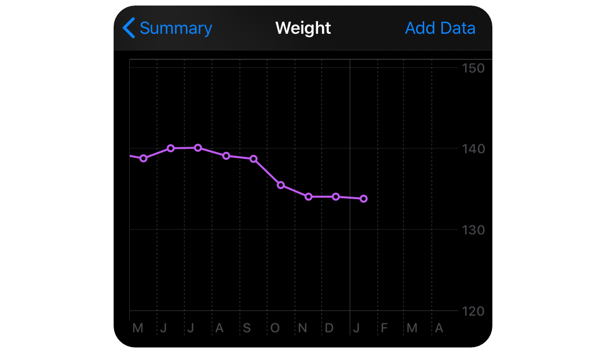
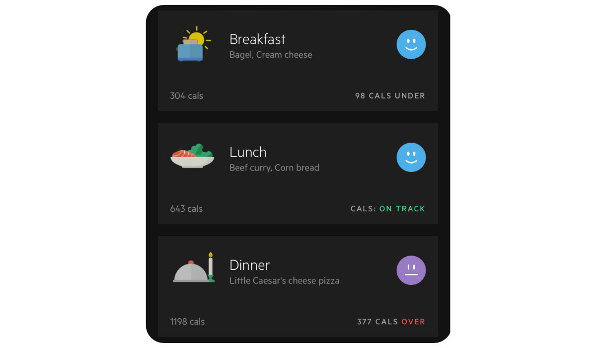
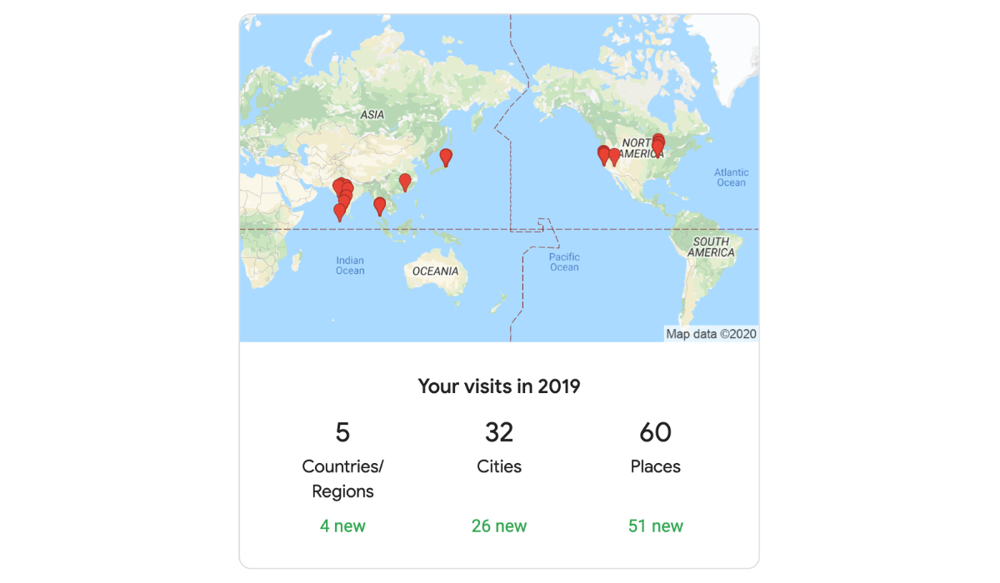
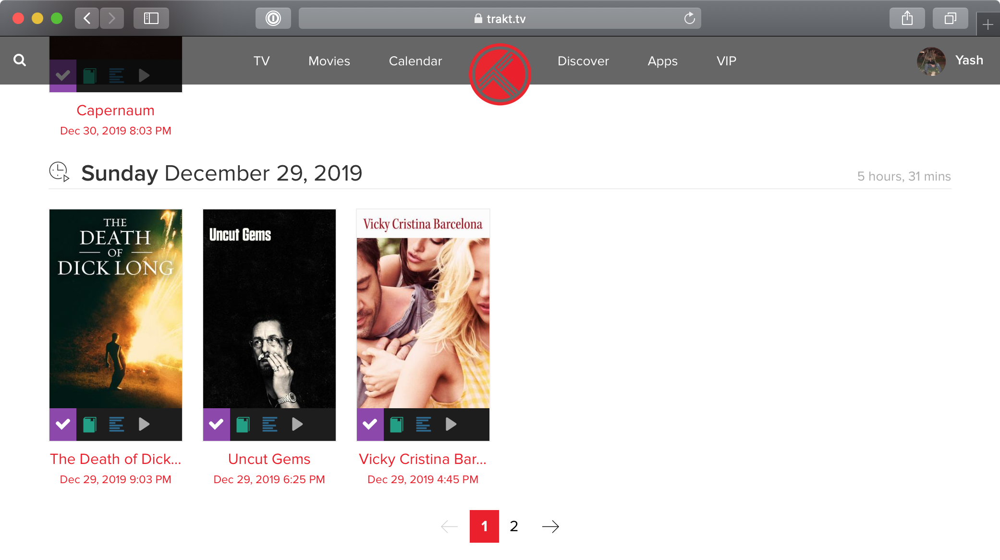

There is no denying that data is well on its way to become the most valuable
commodity in the history of the world. Big corporations try to capture, even buy
as much data on their users as possible. The simple reason behind that is - it
lets them gauge their audience's interests. It has become almost impossible to
escape this phenomenon. Even your [Airbnb Messages](https://www.nytimes.com/2019/11/04/business/secret-consumer-score-access.html) and Food Orders on delivery apps aren't safe.

Unless you renounce everything and live off the land in the woods, it is
next to impossible to avoid your data being collected and targeted by these
corporations. I've decided to lean into it and collect as much data on myself as
possible so that at least I could personally benefit from it.

I've been tracking data about myself for about 4 years now. I don't claim that
this data reads like an open book version of myself. In most cases, it is
nothing more than mildly interesting but every now and then it shows a
non-obvious change that significantly improves my day to day life. That makes
all of this worth it for me. Collecting data has also instilled in me a certain
discipline that is required to stick with a not entirely undemanding activity.

## Data I Collect

Here's a list of the major categories I collect data in :

-   Health (obviously)
-   Places
-   Finances
-   Entertainment
-   Work

That pretty much covers everything I need to know and everything I do.

## Health

Health data has undoubtedly been the most helpful to me since I've started
collecting data. I log my weight every morning on the iOS [Health App](https://www.apple.com/ios/health/).
It also keeps tab on the steps I take everyday (when I have the phone on me, of
  course) but it isn't something I actively do or want - still, nice to have.

I also like running and I collect my running data on the [Nike Run Club](https://apps.apple.com/us/app/nike-running/id387771637) App. I would not recommend this app if you are just
starting out. The application itself is pretty great and does what its supposed
to, but the API is closed and there is no way available to export your own data.
[Strava](https://www.strava.com/) is a better option. I used to live in Illinois and it gets extremely cold
you have to run on the treadmill for half a year and for some reason Strava
doesn't track runs on the treadmill. Another workaround for this is to track
everything on Nike Run Club and use an app called [RunGap](https://www.rungap.com/) and
export it to Strava or wherever you want.

I have a somewhat complicated workflow wherein I record my runs on Nike Run Club, then use
RunGap to Export it to Strava and finally, use Strava's public API to feed data to a
personal React application I built to see stats that I want.

<iframe src="https://runstats.netlify.com"
        class="runstats"
        frameBorder="0"
        scrolling="no"></iframe>

I also track my food habits with an app called [LifeSum](https://lifesum.com/).
They have a very extensive database of ingredients and also support Barcodes.

I've read about people collecting data about their mental health in apps where
you kind of rate your mental state during the day. I've heard promising things
about it but I personally like a more detailed account of the day, so I maintain
a journal. I originally use to host it on [Evernote](https://evernote.com/) but
I've since moved it to [Notion](https://www.notion.so/). I've also tried to do
Intermittent Fasting for a few months and I used [Zero](https://www.zerofasting.com/)
to track the fasts.

I've been able to see direct correlations between what I eat and how I run the
next day, how my diet affects my productivity (recorded in the Journal) and how
intermittent fasting helped me lose weight. Data reassures you if you are doing
something right and gives you pause to reconsider and re-evaluate your day to
day activities if you are doing something wrong.  

## Places

This stems from the obsession to collect data. I've not seen this be too useful
to me other than being able to recommend a restaurant in New Orleans to a
friend who's visiting. I use [FourSquare](https://foursquare.com/city-guide) to
add the places I've been to - restaurants, hotels, tourist attractions, etc.

Google Maps is always recording in the background anyway and while it is creepy,
I like being able to see that data about myself.  

## Finances

I have yet to come across a perfect solution for this issue which is again an
important category to track. I've tried several applications - [Clarity Money](https://www.marcus.com/us/en/clarity-money), [Mint](https://www.mint.com/), [Spendee](https://www.spendee.com/)
and a smattering of others. The automated ones don't always get the category of
the expense correctly and it becomes a hassle to go back and fix it. Also, the
descriptors provided by many banks are just outright incorrect and that is
extremely annoying. It is quite a challenge to automate this process, so while an
actual working app shows up, I simply track it manually on an application called
[Buddy](https://apps.apple.com/us/app/buddy-easy-budgeting/id936422955). It has
a clean no-bullshit UI and doesn't have any features that kind of work. I can
always export the data as a CSV and do use that data to see whatever I want.

For other details I use services like [Wealthfront](https://www.wealthfront.com/), [Credit Karma](https://www.creditkarma.com) and [Robinhood](https://robinhood.com/).
They have to maintain data for legal reasons and well its, good enough for me.

## Entertainment

This is mostly for fun. I don't think I've gotten too much out of it except for
maybe - how much time I spend watching movies. I use [Trakt.tv](ttps://trakt.tv)
to monitor TV shows and Movies that I watch. It has to be entered manually and
I've been religiously following it for a while now. I would be able to answer
what my favorite genre is and it is nice to know that data agrees. I also
maintain a list of movies I want to watch on an [IMDB](https://www.imdb.com/)
list and move it once I do.

I mostly listen to music on Spotify and I use [last.fm](https://www.last.fm/) to
keep track of the artists I often listen to, the song that I've played the most
number of times. Sometimes, it is pretty interesting when you discover non-obvious
things like, you prefer music coming out of a specific country to others.

[Goodreads](https://www.goodreads.com/) is an obvious choice for tracking books.

[Screen Time](https://support.apple.com/en-us/HT208982) tracks my app usage
satisfactorily but I hoped for the mac app to not include background apps in
that time because well, I am not really using it. I am currently working on a
chrome extension that would log browsing details locally.

## Work

Apart from JIRA boards and commit logs, I personally like to keep a version
controlled weekly account of things I've completed. It helps in framing the
year-end review and gives you time to reflect back upon the week.

Personal projects are also all version controlled and a good old to-do list
does the rest. I use [Todoist](https://todoist.com/).

## Conclusion

I have personally experienced the benefits of tracking data and I would highly
recommend others to give it a shot. Stick with it for a month and watch it
become a part of your daily routine. I am right at the brink of being obsessive
about collecting personal data - just enough to actually learn and grow with it
and not spend too much time collecting it. I should also mention that I pay for
premium models of most of these services and I've personally felt they are worth
it. I hope to stick with this for as long as I can and on the way, build my own
systems so I don't keep sharing **my** data with the corporations.    
