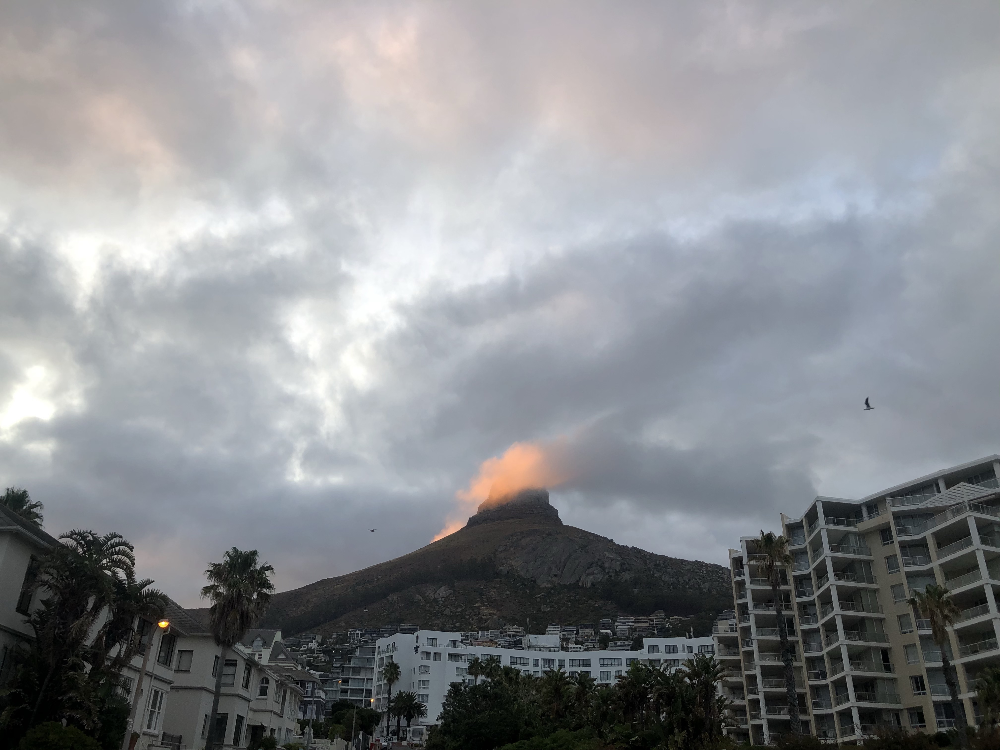

I went to South Africa for a week to celebrate my parents' 25th Wedding
Anniversary. My flight from San Francisco was delayed because of a technical
issue and I had to reschedule my connection to Johannesburg. According to our
itinerary, I was supposed to land at 7 in the morning and drive down to
Kruger National Park. The Orpen Gate apparently closes at 5 and my rescheduled
flight reaching at 12 PM was not going to cut it. After I landed at Johannesburg, I
took another domestic flight to [Hoedspruit](https://www.eastgateairport.co.za/)
and then headed over to Kruger National Park.

We were booked on a [night safari](http://greater.krugerpark.co.za/Kruger_Park_Game_Viewing_Activities-travel/kruger-night-game-viewing.html). Unfortunately, we didn't see any of
the big cats but I really enjoyed the ride through the Night sky. Also, the
safari had small spotlights on both sides, which definitely felt like
something that shouldn't be legal.

The next day we just drove around the park and saw the usual suspects -
Elephants, Giraffes, Zebras, Deer, Hyenas, Honey Badgers and some spectacular
views of the forest.

<iframe src="https://www.youtube.com/embed/pbqF0b9fN6A" frameborder="0" allow="accelerometer; autoplay; encrypted-media; gyroscope; picture-in-picture" allowfullscreen class="responsive-iframe"></iframe>

The following day we went to [Lions Park](http://www.lionandsafaripark.com/) near
Johannesburg. It is essentially a reverse zoo where you sit inside a car and
drive inside enclosures. Then you also get to play with the cubs. I don't particularly think this is something that should be allowed to exist because the Cubs were clearly sedated. This cannot possibly be good for them.

Next stop was Cape Town. Its a short 2 hour flight from Johannesburg. The very
first place we went to in Cape Town was the Table Mountain. It is highly weather
 dependent and one of the must visit places in South Africa. The Gondola ride up
 the mountain is quite an experience in itself - it rotates around its axis
 giving you a complete 360° view. From the top of the mountain you can
 essentially see the entire city.   

Another interesting place in Cape Town is the Lion's Head Mountain, named so
because apparently it looks like a Lion's head. Honestly, I don't see it.
Nevertheless, it looks beautiful.

The next morning I ran across the Beach Road and it is absolutely stunning.

Shortly after breakfast we left for Boulders Beach commonly famous for
inhabiting Penguins. I had never actually seen a penguin in the 'wild' before
so this was quite an experience for me.   

Next stop was Cape Point -- also my favorite of all the places I've seen in
South Africa. Cape Point is the south western tip of the African Continent.
Our guide claimed that Cape Point was the place where the two oceans - the
Indian Ocean and the Atlantic Ocean met. On further research, I found that the
guide was misinformed and the official geographic divide is defined by
Cape Agulhas which is about a 100 miles South East of the Cape Point.
Nevertheless, it is simply breathtaking.

The lighthouse atop the Cape Point was originally erected in 1860 and its white
flashing light could be seen by ships 67 kms out to sea. Since it was often
covered by cloud and mist, it was eventually destroyed by the Portuguese liner
'Lusitania' in 1911. This 'new' lighthouse was subsequently erected on a higher
ground.

Near Cape Point, another spot to visit is the Cape of Good Hope. I do not have
strong sources to cite on this but apparently the first ever explorer to see
the Cape, Bartolomeu Dias, named it _Cabo das Tormentas_ or 'Cape of Storms' but
 later changed it to _Cabo da Boa Esperança_ or 'Cape of Good Hope' at King
 John II's suggestion since it optimistically opened up a sea route to the East.

The next day after another 5K run, we went to a spot called 'Maiden's Cove' which
has a great view of the Twelve Apostles. The day we went, it was outrageously
windy (outrageous even for the locals). I was quite literally being pushed back.
It was all fun and games till the sand from the beach started hitting my face.
The view made the entire thing worth it.

Another recommended spot was 'Seal Island'. We took a boat out there and it was
probably the worst hour of the entire trip. I was extremely sea sick and
couldn't be bothered to look at the Seals.

The day after, we visited a few wineries in Constantia Valley and Stellenbosch.
It is hard to pick a favorite but I really liked [Steenberg Farm](https://www.steenbergfarm.com/)
because of how knowledgeable the servers were. One of the best wines I tasted
there is 'The Black Swan'. The story behind the name is actually quite interesting.
The Steenberg Farms were established in 1682 by Catherina Ustings Ras, a German
immigrant to the Dutch Cape Colony. It was originally named _Swaaneweide_ or
'Feeding place of the swans', probably because of her hometown of Lubeck,
Germany. Her first five husbands died mysteriously and this wine was dedicated
to her -- 'The Black Witch' but negative names don't play too well from a
marketing standpoint so they changed it to 'The Black Swan'. I really loved the
taste even though my palette isn't mature enough to pick up notes of lime,
gooseberry, blackcurrant and the coat of cold mountain-side breeze on the grapes.

Other beautiful wineries worth checking out include -
[Meerlust Estate](http://www.meerlust.co.za/) and [Spier Wine Farm](https://www.spier.co.za/).

On the last day in Cape Town, we visited a neighborhood called 'Bo - Kaap'
which is known for its brightly colored homes and cobbled stone streets.  

We couldn't get tickets to visit Robben Island which, according to over tour guide,
is another highly recommend spot to visit because of its historical importance.
Apart from the places above, we also saw the Grand Parade, Nelson Mandela's
statue at the City Hall, the V & A Waterfront, Two Oceans Aquarium
(which I felt was a waste of time) and some grocery stores to pick up some South
African snacks. _NikNaks Chilli Cheese_ is absolutely delicious.

We then flew back to Johannesburg. I only had half a day before I needed to be at
the airport to fly back to San Francisco, so we went to a place called
'Chameleon Village' to buy some souvenirs. Calling the sales' practices within
this flea market 'aggressive' would be an understatement. Based on an account of
ten stores within a span of 2 hours: they essentially pull you in their store
and assure you that you don't need to buy anything and invite you to just
'come in and look'. Next, they would try to 'gift' you something for
visiting their country. I politely declined but they essentially forced me to
take it. Then they want you to 'support' them in return. It got to a point where
I had to tell them that I'm willing to just give them the money and not get
anything in return because I didn't have enough space in my luggage to take
anything back. Of course I didn't want to disrespect them by just handing them
money so I just end up paying for the 'gift' that I never wanted.

Another tactic is basically when you actually buy something from one store, the
salesman would hand it over to someone else to wrap it up. They take you to
their store to 'come in and look' while they wrap it up and the whole cycle
continues. I find it hard to say 'No' to things and the entire enterprise feels
exploitative to people like me. I appreciate that it is hard to make a living by
selling souvenirs but the 'gift' approach makes the entire experience feel
deceiving and exhausting.

Apart from the very last experience, South Africa was amazing and the people
were extremely friendly and chilled out. Definitely one of the best places for
a family vacation!
