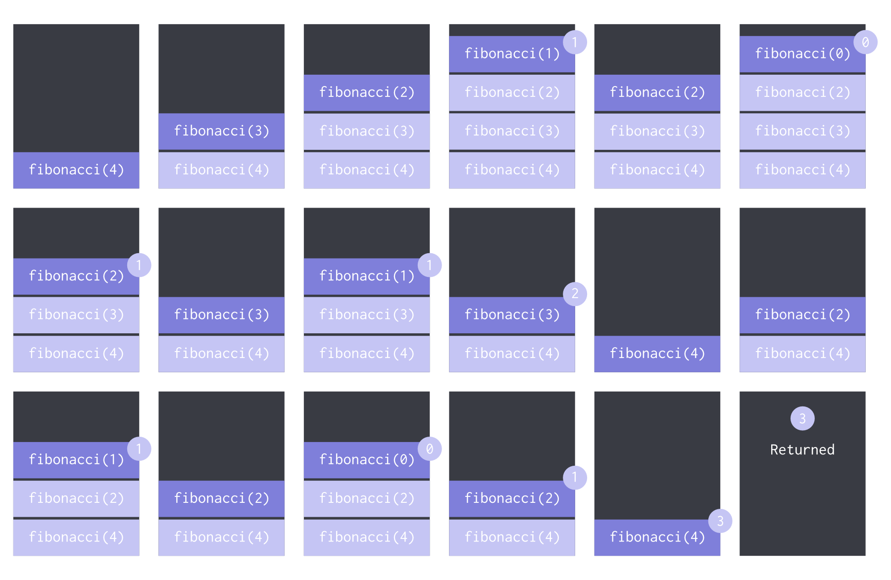
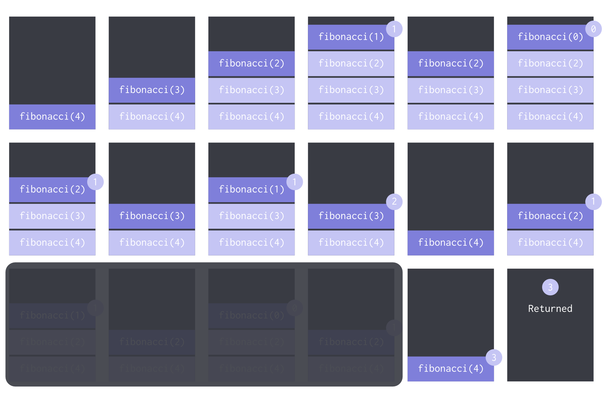
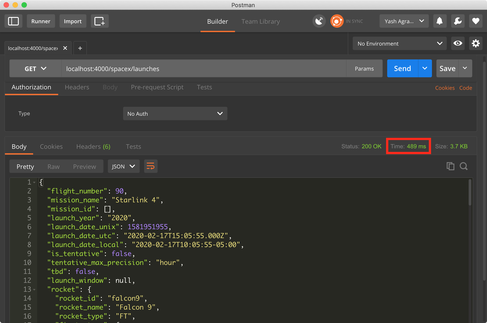
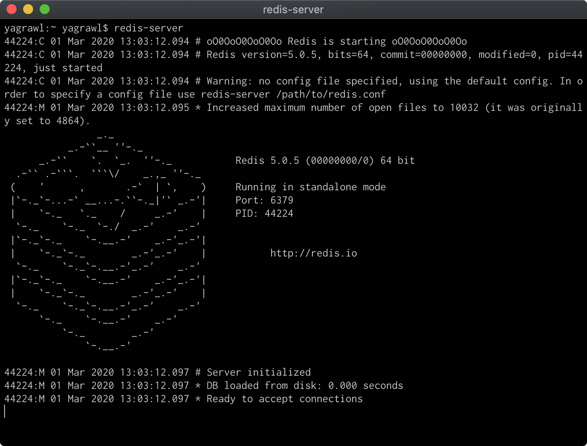
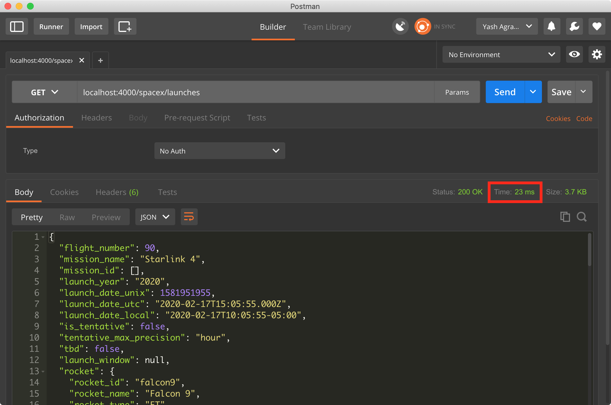

More often than not, your backend server needs to talk to downstream services, third party APIs and the database. These calls are expensive both in terms of time and money. Consider for example, your API fetches popular movies from a movie API which charges you based on each call you make or, you need to get a user's joining date to your app to display on their profile. The list of popular movies is not likely to change in a span of few hours while the user's joining date is not bound to change at all.

For fetching the popular movie data, each time you'd call the third party API to get the same information that you got a minute ago. This would add noticeable performance issues and higher costs to your application. Similarly, for a profile that is being accessed frequently, the database is repeatedly being queried for the same data and would definitely rack up heavy bills.

There is a simple solution to this issue -- Caching.

## Caching

Caching is the process of storing data in a high-speed data storage layer (cache). The cache is generally stored in fast access hardware and is more efficient than fetching data from the primary data store that the application uses.

Here's a very basic example of Caching -- memoization. Note that memoization is a very specific form of caching which deals with storing the return value of a function based on its parameters.

Calculating the n<sup>th</sup> number in the [Fibonacci sequence](https://en.wikipedia.org/wiki/Fibonacci_number).

```js
const fibonacci = (n) => {
  if (n < 2) return n;

  return fibonacci(n - 1) + fibonacci(n - 2);
}
```

Basically, the snippet above recursively calls our method for (n - 1) and (n - 2) and adds it together. Let's break it down for n = 4.

Here's what the call stack would look like:



As you can see, we compute `fibonacci(2)` which can be thought of as a relatively resource consuming operation, multiple times. We could have essentially stored the value for `fibonacci(2)` somewhere when we calculated it the first time and used the store's value the second time to speed up the process.

```js
const fibonacci = (n, cache) => {
  cache = cache || {};

  if (cache[n]) return cache[n];
  if (n < 2) return n;

  return cache[n] = fibonacci(n - 1, cache) + fibonacci(n - 2, cache);
}
```

Here's the updated call stack with the memoization process:



As you can see, we were able to reduce some compute time with memoization which is just a form of caching. Now, let's use this technique to cache responses from a third party API service using Redis.

## Redis

[Redis](https://redis.io/), according to its website,

> [Redis] is an open source, in-memory data structure store, used as a database, cache and message broker.

Find the instructions to download it on your local machine [here](https://redis.io/download).

## Demo

Let's set up a simple node project to test this out. In your project directory,
run `npm init` to start the node project. Answer all the prompts appropriately and then create a new file called `index.js` within the project directory.

Install all dependencies we will use for this demo:

```bash
npm i express redis node-fetch
```

We have a simple endpoint that provides details about SpaceX's latest launches.

```js
"use strict";

const express = require("express");  
const fetch = require("node-fetch");

const app = express();
const PORT = process.env.PORT || 4000;

app.get("/spacex/launches", (req, res) => {  
  fetch("https://api.spacexdata.com/v3/launches/latest")
    .then(res => res.json())
    .then(json => { res.status(200).send(json) })
    .catch(error => {
      console.error(error);
      res.status(400).send(error);
    });
});

app.listen(PORT, () => console.log(`Server up and running on ${PORT}`));
```

After you run the server using `node index.js`, it should start up at `localhost:4000`.
I'm using [Postman](https://www.postman.com/) to test my API.

    GET localhost:4000/spacex/launches

results in,



Notice the time in the red box on the screengrab above. It is `489ms`. Now let's add caching using Redis. Make sure you have Redis running on your local machine. Run:

```bash
redis-server
```

on a new terminal window. It should look something like this.



Now, add middleware to check if the key exists in the cache, if not then get it from the third party API and update the cache.

```js
"use strict";

const express = require("express");  
const fetch = require("node-fetch");
const redis = require("redis");

const PORT = process.env.PORT || 4000;
const PORT_REDIS = process.env.PORT || 6379;

const app = express();
const redisClient = redis.createClient(PORT_REDIS);

const set = (key, value) => {
   redisClient.set(key, JSON.stringify(value));
}

const get = (req, res, next) => {
	let key = req.route.path;

    redisClient.get(key, (error, data) => {
      if (error) res.status(400).send(err);
      if (data !== null) res.status(200).send(JSON.parse(data));
      else next();
 	});
}

app.get("/spacex/launches", get, (req, res) => {
  fetch("https://api.spacexdata.com/v3/launches/latest")
    .then(res => res.json())
    .then(json => {
    	set(req.route.path, json);
    	res.status(200).send(json);
    })
    .catch(error => {
      console.error(error);
      res.status(400).send(error);
    });
});

app.listen(PORT, () => console.log(`Server up and running on ${PORT}`));
```

After you try GET on `localhost:4000/spacex/launches`, it would still take about the same time it did the first time we ran before adding Redis. This is because the cache doesn't have that key present and has now updated it. On running it a second time, you'll be able to see the difference.



One very obvious pitfall in this implementation is that once we add it to the cache, we will never fetch the updated value from the third party API. This probably isn't the expected behavior. One way to counter this is to use `setex` which takes an expiry argument. It essentially runs two atomic operations. `SET` and `EXPIRE`. After the set expiry period, we fetch the data again from the third party api and update the cache.

## Conclusion

Caching is a powerful tool when used properly. Considering the type of data and how important the latest value is, cache can be added to improve performance, reliability and bring down costs.
