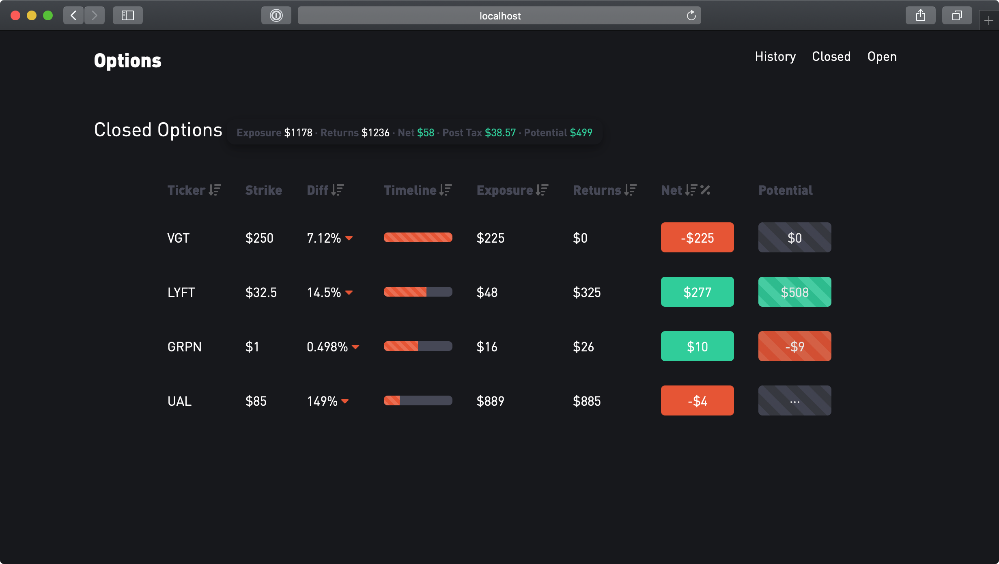
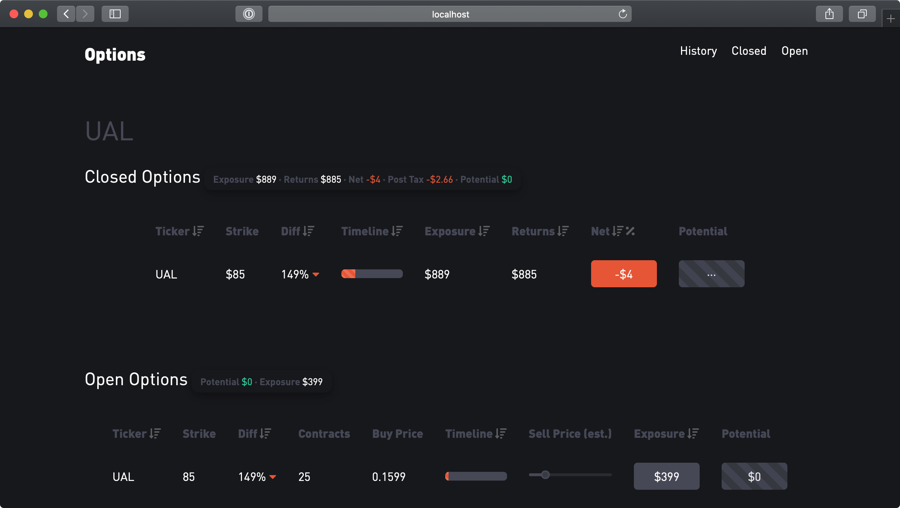

I had been aware of options as a trading instrument for quite some time and it always seemed fascinating. I very recently started trading options on Robinhood (Millennial's 'broker' of choice, despite all of its shortcomings). Robinhood clubs all the option positions together with the equity positions and it becomes hard to keep track of the returns on a particular instrument type. I have a long position on the stocks that I hold so I don't really care much for a combined view of my equity and options positions. Options by their very nature are time sensitive and I wanted to know if there was a vague co-relation between the types of options I buy and the returns I get on them. Also, this would be a fun project to work on during lockdown.

## Expectations

I wanted this application to be able to do the following things:

-   Consolidate all the trades made on a particular option to show the exposure, return and the net earnings for all positions that have been closed.

-   A simple UI to see potential returns on a currently open position, if the price of the option either goes up or down.

-   Notify if an open option is close to its expiry.

-   Be able to see the difference between the price of the underlying stock on the day of the option buy and the strike price.

-   Be able to sort options based on a variety of metrics to see if there are any obvious trends.

-   Import data from Robinhood by either scraping the web application or parsing the monthly statement report.

## Implementation

The very first challenge was a complete block. Scraping Robinhood's statements tab is non-trivial and parsing the monthly statement sort of defeats the purpose so to get it rolling, I manually entered the data. I decided to use a `json` file and it is modeled as follows:

```json
{
   "id": 19,
   "ticker": "UAL",
   "strike": 85,
   "type": "CALL",
   "expiry": "09/18/2020",
   "events": [
     { "eventid": 1, "action": "BUY", "date": "03/17/2020", "contracts": 1, "price": 1.00 },
     { "eventid": 2, "action": "BUY", "date": "04/03/2020", "contracts": 10, "price": 0.16 },
     { "eventid": 3, "action": "BUY", "date": "04/03/2020", "contracts": 20, "price": 0.12 },
     { "eventid": 4, "action": "SELL", "date": "04/29/2020", "contracts": 1, "price": 0.15 },
     { "eventid": 5, "action": "SELL", "date": "04/29/2020", "contracts": 20, "price": 0.16 },
     { "eventid": 6, "action": "BUY", "date": "04/29/2020", "contracts": 5, "price": 0.17 }
   ],
   "close": "",
   "high": 38.14,
   "low": 30.05
 }
```

Since this application is going to be specifically for options, this modeling made the most sense to me. The constants in an option -- `ticker`, `strike`, `type` of the option and `expiry` define the entry. There can be multiple buy and sell `events` on the same option without following a pattern so I added an events attribute which is an array that contains details on the buy/sell. Finally, `close`, `high` and `low` were added to build new features.

Also, I was making this mostly for personal use so I decided to just keep it on my local machine and built it out in React.

Here is what it looks like (sample data):



## Features

A slider that updates the potential return on an open option if the price goes up or down.


See all orders on a particular ticker:



Sorting options based on different parameters.


Additionally, the `Difference` is the percent difference between the strike price of the option and the average of the high and low for the day the option was bought. The red arrow signifies 'Out of the money' and green arrow represents 'In the money'. I hoped this would help me with gauging which options yield a better return and if the premium is actually worth it.

Timeline is the red progress bar that shows the days to expiry. When it gets to 75% on any option it would start blinking.

## Insights

Frankly, I didn't trade enough volume to draw any conclusions. I did see a pattern -- lower `Difference` results in higher `Returns`. This is pretty obvious because if the `Difference` is low, the option is bound to expire in the money (if the trend is in the favor). The main 'strategy' I went with was to not lose money so the potential range selector on the open options feature helped me set limit orders without being greedy. They are of course pretty optimistic but they have been making me decent returns so far. In essence, it feels like in options trading you win some, you lose some -- just need to make sure that you win more than you lose.
