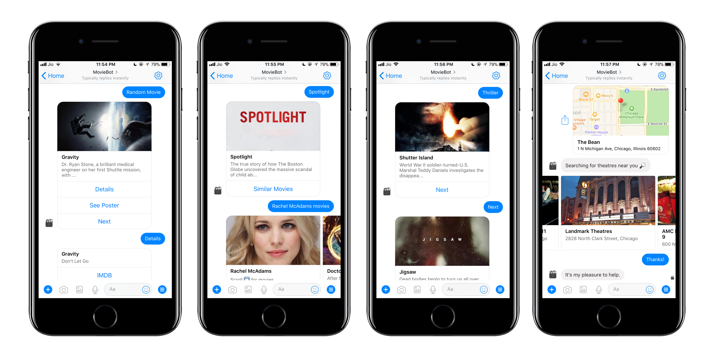

About four years ago, I started working on a simple project — a Messenger bot that 'recommends' movies. I called it '[moviebot](/moviebot)'. It was written in JavaScript (node) and hosted on Heroku. At the time, Messenger bots seemed like an interesting avenue to explore and I was simply following a tutorial to set it up. I made none of the choices, from the language to the deployment platform. It did a variety of things like recommending a movie, displaying all movies by a particular person, genre-based search, and even showed theaters near a provided location.

I thought I had done a pretty good job simply because it worked. I actually had 500+ unique users at the time. In reality, it was a complete mess. It was a single file consisting of 1000+ lines, with no discernible order of methods. I had a lot of code duplication, no proper error handling, terrible commit history with a bunch of API keys all pushed upstream to public GitHub (All the API keys in the git history have now expired. It's all good). It was littered with whitespace and the comments were written more from the convention point of view than them actually being helpful. I was importing a bunch of libraries that I wasn't using and I did the same with a lot of variables. Simply put, anyone looking at it could easily point out how crappy it was.

Fast forward two years, I received an email from Facebook saying that they were sunsetting their original API for messenger bots and that all v1 bots would stop working if they weren't updated. I hadn't looked at this code in a while, but I decided to go ahead and refactor it — using what I had learnt since then. I actually improved a lot on the existing code. I modularized the code into different files, each with a specific purpose. I removed as much code duplication as possible and trimmed it down to 400 lines from 1000+ while keeping all the features from the first iteration. The variable names were much more informative and all the things that I wasn't using were now gone. I added some decent error handling so if something went wrong, it wouldn't crash the entire application. I was pretty happy with this iteration.

Two more years passed by. I picked it up again out of the blue. I had started to get into TypeScript and I wanted to start a new project to get some practice. I decided to just refactor my existing code and make it better. Now that I look at it with a fresh set of eyes and with some experience working as a full-time developer, I see a lot more issues.

The most important one — there were no tests. None at all. Generally when people work on a personal project, they don't tend to write tests, which is understandable. But I've started seeing tests as an important part of development, than an afterthought. The bot relies entirely on an external API called TMDb and if TMDb were to change their response structure at any point, my bot would start failing and I won't find out for a long time. On top of that, when I added a change, it was untested and I would deploy it to 'production' and see if it was working. If it wasn't then I would look at the logs in 'production' and push the fix and the cycle continued. This accounts for a bunch of commits all with the same message in the first two iterations. That is a terrible way to develop anything. I added integration tests and unit tests.

I was repeatedly making the same request to the TMDb API again and again. Rate limiting wasn't really an issue since the traffic on the bot is pretty low, but it definitely made it slower. I added a caching layer to make it faster. I then improved upon the existing modeling, added more extensive error-handling, implemented a better approach to the product itself, cleaned the whitespacing, made it more readable and a numerous other things. I am pretty happy with this (for now). From this trend, I can safely say that it is going to change in the future.

From this exercise, I learnt a few things:

-   There is so much more to learn. After each iteration, I felt like I had written the best possible solution to the problem at hand but in reality every refactor was suboptimal compared to the next. There are so many things I've learnt in the last two years and there is so much more to learn in the next two.  

-   I have made progress as a developer. At no point while I was working on this project did I take this lightly. I thought I was writing clean code at each iteration. This gave me an objective insight into my growth in the last four years and I hope to continue the trend.

-   Helped me in understanding the value of writing clean & maintainable code. If the application I chose to begin with was complicated or indecipherable, the first refactor itself would have never happened — even though it was written by me. In a professional environment with multiple people working on the same piece of complicated code over a span of years, things are bound to get dicey. This refactoring exercise serves as another real-world example of the importance of clean code in action.

-   (Psychological) Tunnel vision is very real. While most of the things I oversaw in the prior iterations stem from a lack of experience, tunnel vision also had a part to play. Once I thought I knew what the problem was, I kept focusing on it without ever stopping and considering if I had even understood the problem correctly. While it isn't always practical to keep stepping away from the problem at hand, it is definitely worth a shot whenever possible.

I would highly recommend trying this with your own old projects. It is certainly a rewarding experience.
