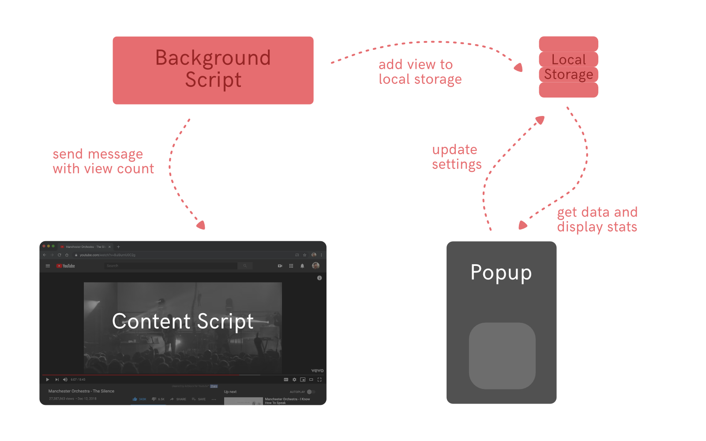
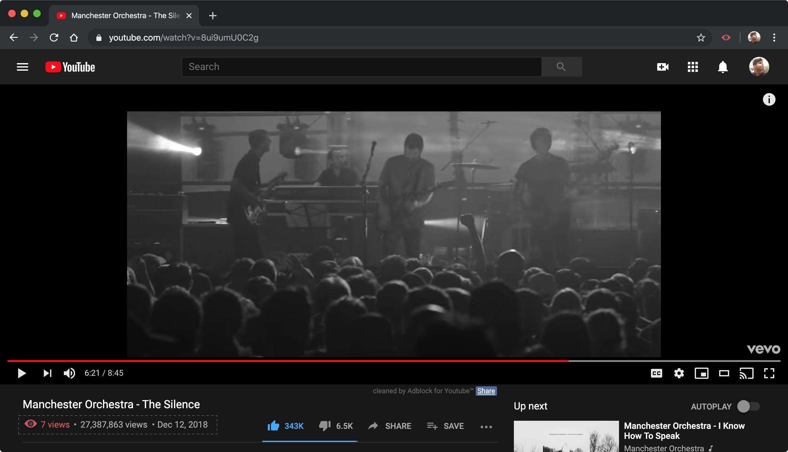
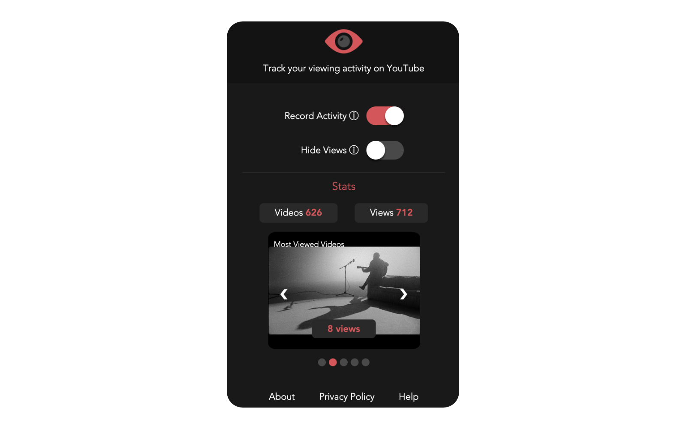

I am a firm believer in 'Quantified Self' but my motivation behind it isn't just improving myself. It could just be something interesting about myself that I can find out. I've written about some of the the things I use to track data about myself in this [post](/quantified-self).

I enjoy watching videos on YouTube (mostly music videos, movie trailers and video essays on various topics) and I realized that a lot of times, I keep rewatching the same videos. For other streaming platforms like Netflix, Hulu, HBO, etc. a service like [trakt](https://trakt.tv) does a good job but for YouTube, there is no way to keep track of your personal viewing activity.

After researching for an existing solution for a while, I realized there was nothing available. YouTube does have a searchable playlist of your viewing 'History' but it seems unreliable. A lot of my viewing history doesn't seem to get added and I can't do much with that list. It is just there. Other solutions don't really exist so I decided to build something for myself.

### Expectations

I wanted this tracker to do the following:

-   Track how many videos I have watched on YouTube -- both unique views and rewatched views.

-   A running list of my most rewatched videos.

-   Make it focused for the browser because that is my primary way of accessing YouTube.

-   Be able to see my personal view count next to YouTube's view count.

-   Not be another application that sends data somewhere else (keep data on the client if possible, or end-to-end encryption).

-   Some control over pausing/unpausing the tracker.

-   If possible, de-couple it from a YouTube/Google account.

### Research

There were a few different things I attempted to do which could cover most of my expectations. I quickly realized that there isn't a perfect solution available because no one really seems to care about this (which is fair), and YouTube's api on personal viewing history is non-existent.

I considered parsing the 'history' that YouTube provides but that didn't satisfy most of the expectations I had with this tracker. To be able to see the personal view count next to YouTube's count, there was only one possible solution (without having to create my own application that embeds YouTube videos) -- creating a Chrome Extension.

A chrome extension would be a lightweight addition which won't need to be tied down to a YouTube account to collect data and it could also modify the DOM of the page to add the view count. That seemed like the best solution in this particular case.

### Implementation

To describe the architecture of how chrome extensions should be written is a whole other post. I'll keep this one focused to how my YouTube tracker was made.



The background script uses the `tabs` API to track each time a YouTube video has finished loading on a tab. Once the tab url matches this regex:

```regex
/(?:https?:\/{2})?(?:w{3}\.)?youtu(?:be)?\.(?:com|be)(?:\/watch\?v=|\/)([^\s&]+)/
```

a listener first checks the localStorage (`storage` API) to see if this particular video was watched before. If the video was, the background script updates the view count, otherwise it adds the video to localStorage and sets the view count to 1.

The background script also sends a message to the content script which essentially runs in the context of the tab.The content script then modifies the DOM and adds individual view count next to YouTube's view count.



The `popup.html` serves as the UI for the extension and provides the user some control over the tracker. You can pause the tracker or hide the count on the DOM. It also shows the top five most watched videos and their count on the carousel and also the total count of unique and re-watched videos. These are computed by iterating over the localStorage for all the videos watched so far.



### Insights

This project was another experience in -- 'There is no perfect answers' and it is about trade-offs and choosing the best possible solution. There are issues with this approach -- these are tied to a browser because of the localStorage. There is an option that chrome provides where you can sync localStorage throughout all devices with Chrome logged in on the same id, but then that ties it to the account. I picked the one that would retain all data on-device. Similarly, one thing that proved complex was to figure out the replay that comes up after a YouTube video ends, because the controls to access/modify the DOM of the video player wasn't possible.

Nevertheless, I am happy with how it turned out and that it keeps on working in the background providing me with some interesting data about myself when I choose to see it.

## Try it out

[Chrome Webstore](https://chrome.google.com/webstore/detail/youtube-views/nnhlpinbmbjmoofeifjibiipnbopahmg)  
[Github](https://github.com/yagrawl/youtubeviews)  
