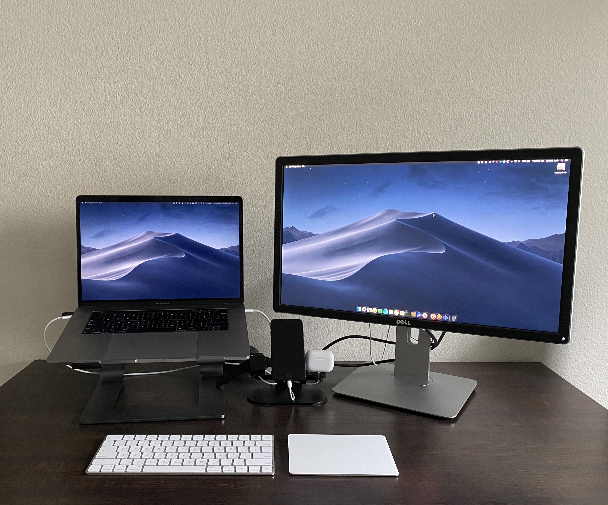
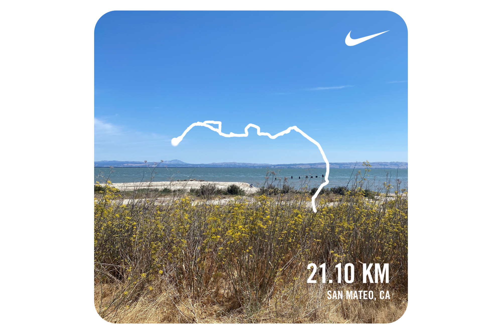
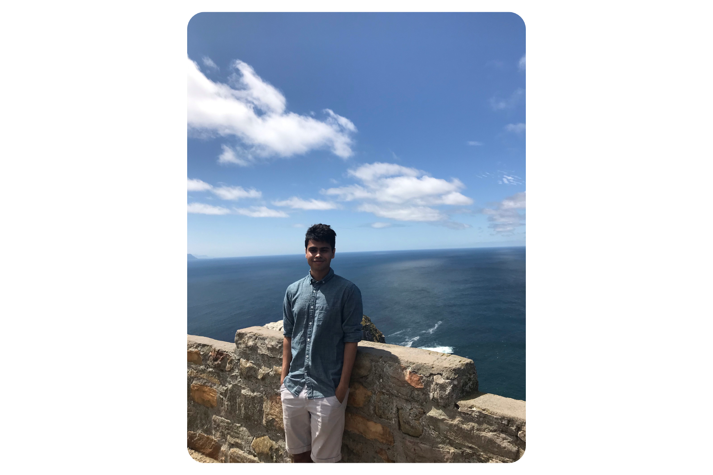
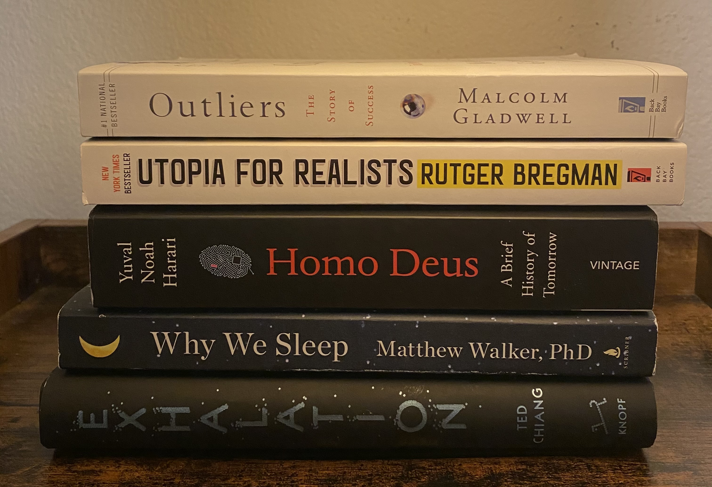

Here are a few things I did during this year and some goals for the coming year.

## Work

This year, like many other software developers, I worked from home. I like working from home and [Braintree](https://www.braintreepayments.com/) had plenty of systems already in place to seamlessly allow that.

I felt an increase in my level of confidence and my productivity as an engineer. I think I understand the product a lot better now and I feel comfortable designing/building significant features to it. Onboarding new teammates and mentoring an intern over the summer helped me be more responsible and it also solidified my understanding of the architecture as I attempted to do my best to answer their questions. Braintree was also interviewing heavily during the pandemic and that afforded me the chance to learn how things worked at other companies.

Finally, I was also involved in dealing with a couple of significant production incidents over the year. There is no such thing as perfect code and things are bound to go wrong. Handling people's money is sensitive work and when something goes wrong, there is pressure to reconcile the situation as quickly as possible. Working through those incidents taught me how to stay calm and collected and work towards a solution no matter how tense the situation is.

I worked on a couple of projects that I am moderately proud of -- A portal to manage [options](/options) and a chrome extension that logs [YouTube views](/a-chrome-extension-to-track-youtube-viewing-activity). For the next year, I hope to utilize my "side project time" to read some technical books, write as I learn on this blog, and work on building a portal to collect all my data (re: [Quantified Self](/quantified-self)) and analyze it.

## Running

The target I had for this year was to run **1000 KM**. I had also planned on running the [San Francisco Half Marathon](https://www.thesfmarathon.com/)
in late July. Both of those things did not end up happening.

In the first couple of months, I was on track towards the goal but then the lockdown started and I ended up taking a two-month-long break. I finally got back on track in May and continued to make progress until about mid-October. I suffered an [IT Band Injury](https://en.wikipedia.org/wiki/Iliotibial_band_syndrome) and I could barely run 2 KM before it started to feel like my knee caps would collapse. It was hard to take a long enough break to give my body some time to rest because I needed to finish my target.

<iframe src="https://runstats.netlify.com/2020"
        class="responsive-iframe"
        frameBorder="0"
        scrolling="no"></iframe>

In the end, saner minds prevailed and I did take a month and a half long break. As of today, I have completed **708.9 KM**. That is of course nowhere close to my original goal of **1000 KM**. I also did not get to run the San Francisco Half Marathon but I did run a half-marathon on my own.

For the next year, I don't want to chase a mileage target because that forces me to run when I shouldn't and while I did improve my mileage, I haven't gotten particularly better at running itself. At the moment, I want to target a 25 minute 5K. I could have aimed higher -- a 20 min 5K, but I am aware that my body is not built for that.

In addition, I plan to try using [Moov Now](https://welcome.moov.cc/moovnow) or [Nurvv Run](https://www.nurvv.com/en-us/) to receive better feedback on my form.

## Travel

Travel was basically out of question this year. Early in the year when we didn't quite understand the seriousness of the COVID situation, I traveled to [South Africa](/south-african-vacation). I had plans to travel to Portugal in late April but that obviously didn't pan out as expected.

I did take some short trips within California to catch a break every now and then from the WFH life.

-   Santa Barbara
-   Joshua Tree
-   Monterey
-   Sonoma
-   Santa Cruz

At the moment, it is hard to comment on the next year and I can't even imagine things going back to the way they were anytime soon. I hope that it gets better soon.

## Reading

At this point, I am convinced that buying books and actually reading them are two different hobbies. This year, I found a lot of books that I was very excited to read but I just never got around to reading them. The books I did read were very enlightening. Some of my readings were tough to finish because either I lost interest in the material or simply got distracted. Here are the books I did end up reading:

-   **Exhalation : Stories** by _Ted Chiang_
-   **Homo Deus** by _Yuval Noah Harari_
-   **Outliers** by _Malcolm Gladwell_
-   **Utopia For Realists** by _Rutger Bregman_
-   **Why We Sleep** by _Matthew Walker_

I had convinced myself that reading a book required _finishing_ the book and now I think that it is counterproductive and inefficacious. For the next year, I simply plan to _read_. The basic philosophy will be to keep reading and if I get bored, I will move on to some other book. I might end up finishing a book, or I might not and that is okay.

## Movies

With movie theaters closed for the majority of the year, most of the good movies were never released. I did discover a few incredible movies that I had missed in the past:

-   [Calibre](https://www.imdb.com/title/tt6218358)
-   [Hillbilly Elegy](https://www.imdb.com/title/tt6772802/)
-   [The Guilty](https://www.imdb.com/title/tt6742252)
-   [The Tale](https://www.imdb.com/title/tt4015500)
-   [Private Life](https://www.imdb.com/title/tt5536610)

I am also a big fan of [A24 Movies](https://a24films.com/films) and since we were all in lockdown, I decided to watch every movie A24 has ever released. I didn't get through the entire movie library, but I did find many that I absolutely loved. In addition to [Midsommar](https://www.imdb.com/title/tt8772262), [Uncut Gems](https://www.imdb.com/title/tt5727208), and [Hereditary](https://www.imdb.com/title/tt7784604) that I had already included it in the previous years: [Waves](https://www.imdb.com/title/tt8652728/), [The Lighthouse](https://www.imdb.com/title/tt7984734), [The Farewell](https://www.imdb.com/title/tt8637428/), [The Killing of a Sacred Deer](https://www.imdb.com/title/tt5715874), [The Florida Project](https://www.imdb.com/title/tt5649144), [Good Time](https://www.imdb.com/title/tt4846232), [A Ghost Story](https://www.imdb.com/title/tt6265828), [Green Room](https://www.imdb.com/title/tt4062536), [The Witch](https://www.imdb.com/title/tt4263482), [Locke](https://www.imdb.com/title/tt2692904), are some of the A24 movies that I thoroughly enjoyed.

Simply based on my tracking, it is very clear that I watched a lot of mindless TV. I did enjoy watching (& rewatching) [Succession](https://www.hbo.com/succession) but other than that, TV was mostly something that played in the background while I did something else. I gave myself a pass, taking into consideration that there is nothing better to do in lockdown, but I hope to be better about this in the coming year.

## Music

According to Spotify, I've listened to **13,553** minutes of Music this year. Here are my top songs from 2020:

<iframe src="https://open.spotify.com/embed/playlist/37i9dQZF1EM8U79D4evWNK" width="300" height="80" frameborder="0" allowtransparency="true" allow="encrypted-media"></iframe>

## Misc.

This year has been an onslaught of unprecedented events. I was very fortunate to have been able to keep my job during the pandemic even though my health suffered both in terms of physical and mental. In the coming year, I intend to do a better job of making health a priority.

I have maintained a journal for every day this year and it has been going on for the past 7 years now. I usually describe the day and the things that happened, but because of the lockdown, most of the days have the same monotonous journal entry. For the next year, I plan to answer prompts that would capture the uniqueness of the day instead of -- "I woke up, I worked, I went to sleep". I also plan to continue collecting the data that I do already and maybe look into gathering some more data points.

Despite all of the issues of this year, I believe that I discovered faults in the way I did things -- for eg, chasing the distance as the paramount metric for improvement in running, reading to finish books rather than simply enjoying the activity of reading, watching mindless TV, eating unhealthy food, unhelpful journaling habits, and a host of other things. Knowing what is wrong is half the battle, the next part now is to work on fixing it and that is what I hope to achieve in the coming year.
