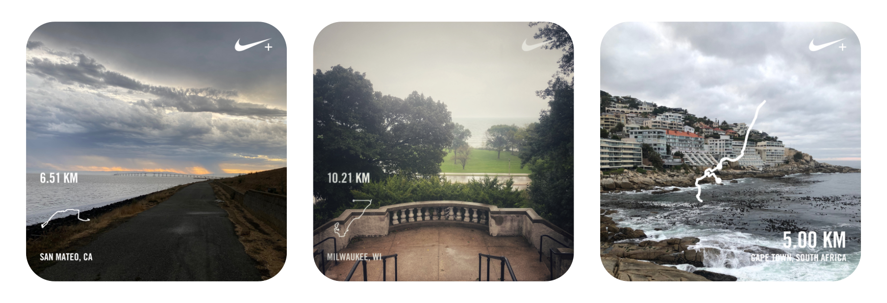

A quick search on "running in the rain" yields all sorts of articles on how to take precaution (which is fair) or how to run despite it. That to me is completely strange because running in the rain is one of my absolute favorite things to do. When I don't run on one of the infrequent rainy days in the Bay Area, it feels like a lost opportunity.

I have noticed that when I run in the rain, my stats are significantly higher than my average for the runs before and after it.

## Statistics

To back up the hypothesis, I looked at a few rainy day runs and compared it to 2 runs before and 2 runs after to see how the data stacks up.

A run in the rain that I remember as if it was yesterday was in Milwaukee, WI back in Sept, 2020. I was running regularly during that month and my mileage was higher than it usually is in any other month. Even then, the rain helped me boost my stats.

There are plenty other examples showing the same trend and surprisingly there are no outlier rainy days where my stats were worse than the neighboring runs.

## Why?

So what exactly is it that makes me run easy in the rain? I tried reading more into it but there are no obvious reasons that would explain it. It doesn't even seem like a pattern most runners see.

I do know that I remember every rainy day run I've ever had. To be fair, there haven't been that many but each one of them was memorable in its own different way.

When I run in the rain, it feels like I can go on forever. I only stop because it is the responsible thing to do in order to make sure I don't injure myself. When it rains there is barely anyone outside. I get to own the entire track,  enjoy my music and take in the views.

I would highly recommend giving it a try (while taking the necessary & sensible precautions). Maybe you'll enjoy it too!

Here's hoping for many rainy day runs in the future! 🤞
